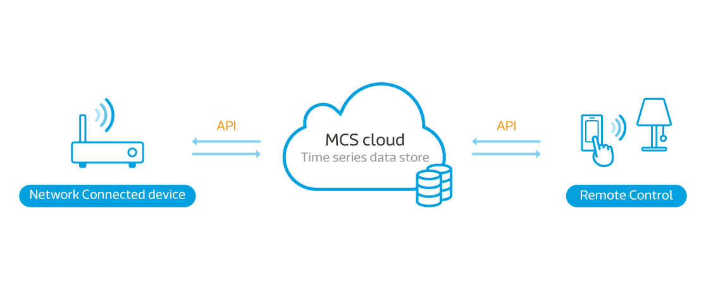
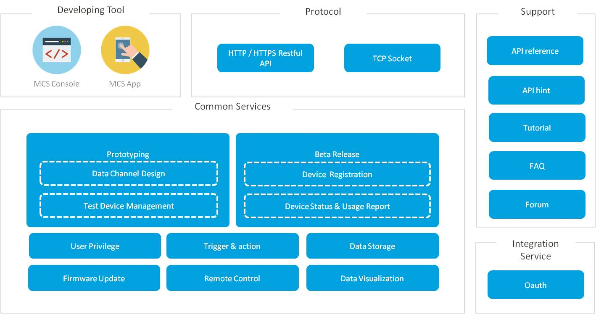

# MediaTek Cloud Sandbox introduction

MediaTek Cloud Sandbox (MCS) provides free cloud-based data and device management services used in the development and pre-commercial testing of Wearable and IoT devices. It frees you from having to develop your own cloud infrastructure to support such prototype development.

Use RESTful APIs to collect data from the devices and view the data on a powerful web-based dashboard that offers a range of display and graphing options as well as the ability to issue commands to control your Wearable and IoT devices. In addition, a complementary smartphone app lets you review collected data and control your devices anytime and anywhere.

With MediaTek Cloud Sandbox you can:

- Define Wearables and IoT prototype profiles and individual devices within a profile
- Push and Pull data points between a device and the MCS such as geo-location, temperature, humidity and more
- Remotely control your devices using state data points, such as switch-state and more
- Visualize data points graphically
- Receive email or Mobile Push notifications when data points are collected or changed
- Manage device’s life cycle, in the same manner as in a live implementation
- Manage and control devices remotely, using the complementary mobile app
- Create reports about the prototypes, devices and collected data
- Perform FOTA (Firmware Over the Air) updates
- Control access to data and devices with granular security control

As part of MCS member support, MediaTek Cloud Sandbox provides an API sandbox, an API reference, FAQ and a set of tutorials to help you get up to speed using MCS features and facilities.

## Prerequisites for Use

To make use of MediaTek Cloud Sandbox, you must:

1. [Register as a member of MCS] (https://mcs.mediatek.com/oauth/en/signup) or [sign in with MediaTek Labs account] (https://mcs.mediatek.com/oauth/en/login).
2. Verify and complete the registration process by clicking the sent to your email address. 
3. Create your own prototypes, data channels and devices and start to manage your devices and data via MCS web console, mobile App or RESTful APIs. 

