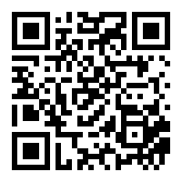

# FAQ

**1. What kind of device can be connected to MSC platform?**

Almost any device that has an internet connection can be connected to MCS, as long as it can work with RESTful or TCP Sockets.

**2. What can I develop with MCS?**

The MCS developer platform and RESTful API allow you to quickly develop a prototype and connect the device to it to be utilized.

**3. How do I get started with MCS?**

We provides tutorials with detail steps by steps and screen capture assists you to quickly develop your first prototype. Click on the Resource on the upper navigator bar and select the Tutorial you would like to start with.

**4. Can I transfer or share my prototype and device to other users?**

Controlling access rights for your prototypes and devices is made simple in the Development or My device User privilege section provided with MCS. You can choose what kind of access level each user may have, eg, viewer access to only read the data, or administrator access to co-develop.

**5.Can I change my prototype and device's time zone?**

Currently, the time-zone is bind to your user profile timezone. Youcan change your timezone by clicking your name on the right upper pannel, and select profile where you can change your timezone there.

**6. Where can I download the mobile app? **

Please click [here](http://mcs.mediatek.com/iot/mobile/android) or scan the QR code below to download the APK:

The mobile app currently offers for Android only.

**7. I have an account with Labs@mediatek.com, can I single-sign-on to the MCS? **

Yes, you can. Simply click "Login with Labs@mediatek.com" you shall have access to our MCS without furhter signup forms.

**8. What browser does the MCS support?**

We strongly recommand you to use the Chrome, Safari, and Firefox to browse the MCS site.

**Don't have the answer you are looking for? send us a [mail](mtkcloudsandbox@mediatek.com) **
