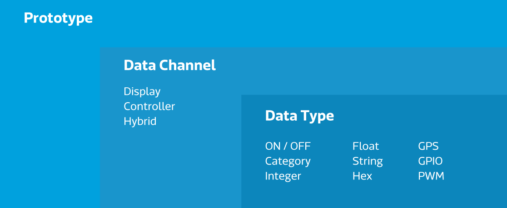
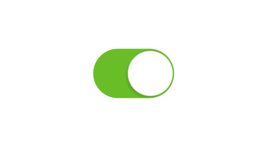
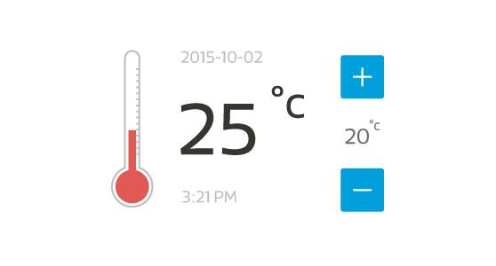

# Key concept

This section describes the 3 key components that make up a Wearable or IoT project in MediaTek Cloud Sandbox. First is the **Development** pages of  MediaTek Cloud Sandbox, all project activities take place within this page. Second is, the **Management** page which enables you to view all the released devices you have created or have access to. And third, the **Dashboard** page, where you can find the overview of your prototype and test device status and get to know all related recent activity and platform usage information.


# Dashboard

Upon sign in to the MCS console, the landing is the dashboard page. The **Dashboard** contains the following information:

* **Quick Start Guide** Assist you in getting started with the MCS platform.
* **Overview** Shows the latest updated prototype and test device information.
* **Number of Usage** Displays the platform usage frequency.
* **Quick Resources** Provides the most popular resource links.
* **Recent Activity** Shows the related activities of the prototypes and test devices.


# Development

In the **Development** page you can create one or more **Prototypes** and define a number of physical devices based on that prototype. Each prototype may contain:


- **Data Channels**, each kind of channel with its particular **Data Type**
- **Trigger & Action**, sends notifications when the data received from or sent to a device meets the trigger criteria. 
- **User privileges**, enables team members or collaborators to view or edit prototypes details.
- **Firmware**, includes versions that can be pushed to the devices.
- **Test device**, represents each physical device based on the prototype.

Once you’ve defined a Prototype, you can add devices as needed throughout your project.

## Prototype




A prototype is the blueprint of the device you’re developing. Each prototype has a unique prototype ID and prototype key.

### Data Channel

A data channel represents the following:

- Data generated by a component of a device that will be stored in the MediaTek Cloud Sandbox 

or

- A command that can be sent from the MediaTek Cloud Sandbox to the device.


#### Data Channel Type

The data channels are implemented in the MCS using the following types:

##### Display


This data channel type is used to store and display the data generated from a device component. For example, data from a temperature sensor that is pushed to the MCS and stored as a sequence over time.


##### Controller



This data channel type is for data generated in the MCS and sent to the device to control the setting of a logical or physical component in the device. For example, a switch to turn a light on or off.


##### Hybrid



This data channel enables a Display and Controller data channel to be combined, when there is a logical relationship between the two. For example, the data from a temperature sensor and the control settings for an air conditioning unit.


#### Data Types

Each data channel can hold one of following types of data:

- **ON/OFF** — this data type represents a switch and enables you to activate or deactivate a component of the device, such as turning a light on or off.

- **Category** — this data type represents an arbitrary category. You’re free to define the category and its content as you wish. For example, you can store weekday, month, fan settings (off, slow, medium and fast) and things alike.

- **int** — this data type represents an arbitrary integer, such as the number of steps a user has taken.

- **float** — this data type represents an arbitrary floating point number, such as the temperature.

- **string** — this data type represents a string, such as a message issued by the device.

- **HEX** — this data type represents a hexadecimal value, such as the color used in an LED display.

- **GPS** — this data type represents a geo-location identified by longitude, latitude, elevation and related attributes.

- **GPIO** — this data type represents a digital signal for a specific GPIO pin, such as HIGH on Pin 4.

- **PWM** — this data type represents a PWM signal delivered to a specific GPIO pin, such as level 15 on Pin 3.

- **Analog** — this data channel represents an integer within a range of two values defined by you. An analog slider that allows you to fine tune the settings, such as music volume controls.

- **Gamepad** — this data channel represents a direction contorller with four-way digital buttons. You can control your robot or remote contorl car easily with this data channel.

- **Image** — this is a display type of data channels for images. The images will be stored in PNG format after uploaded.

- **Video Stream** — this is a display type of data channels for video streaming application, such as a home surveillance camera.


### Trigger & Action

This function enables you to define criteria that trigger an email or cloud-based notification sent to target users including additional users  — you as the prototype owner receive notifications by default.

Notifications are sent when a updated data point of a data channel is equal to, greater or less than a specified value, or between two specified values. 


### User Privileges

This feature enables you to give other MCS users various privileges to access the Prototype, such as the ability to view the Prototype settings, create a device and alike.


### Firmware

You can upload and manage the firmware for a specific prototype using this feature. Once a device is created from the Prototype, the MCS will detect compatible devices and offer their users the option to update the device’s firmware over the air.


## Test Devices

You can create test devices under each Prototype. Each device you create is given an unique **Device ID** and **Device Key**, which you'll use in the MCS APIs to identify which device the data is pushed to and pulled from. Device details, along with their ID and key, are displayed in your **Test Devices** page under **Development**.

You can use the test device to test the prototype that you're developing before officially releasing it to the end users. Please be noted that the data channels, trigger and action rules will chanege with the inherited prototype. You can make use of this feature to test your prototype anytime during your development stage.

In this page, you can see the data channel, trigger and action configurations defined in the device’s prototype as well as device ID and key. You can modify the trigger and action settings for any specific device on this page. 

In addition to listing all devices created for your prototype, this page also shows devices from other prototypes that you’ve been given access to. The actions you can do to the devices vary depending on the privileges granted to you. For example, if you are a viewer of the device, you can only see the data but can‘t make any changes to the device.


# Management

After your prototype is sufficiently tested and you are ready to create device for a real trial, you can beta-release your prototype and start to create devices for it. The **Management** page enables you to track the device status for each prototype including the device activation ratio, device online time, and data point uploads.

## Beta-release

Beta-release enables you to share your prototype idea with an small group of makers. Use this function to simulate real scenario and collect feedback before you officially commercialize your prototype.

Once you beta-release your prototype, the prototype will be frozen, which means you can no longer make any modifications to the prototype including the prototype detail, data channels, and trigger and action rules. However, you can still add other developers to join this prototype or continue to upload firmware to upgrade the test device.


## Device

A device is different from a test device. Test devices inherits the changes made to the prototype; A device doesn’t. You can only create a device after the prototype is beta-released and frozen. You can choose to create devices all at once or separately based on your needs.
After the devices are created, user can manage them in the **Management** page, where devices are categorized by prototype. Each device will have a unique activation code and the device will only be available after it's been activated.


# Command Server

Command server is for you to give command to the device from MCS. If you wish not only to upload data to MCS but also need to control your device using the MCS console, you have to connect the device to the command server in order to give command to device through MCS.

Here is the steps to connect your device to MCS:
1. Build a TCP long connection between command server and device.
2. Maintaining heart beat.
3. Give command through MCS console.


## Build a TCP long connection

To set up TCP long connection between the device and the command server, the device will need to first send a REST API getConnection to request a set of ip and port to build a TCP connection. The MCS will respond with its IP address and a port to the device.

Use **HTTPs GET** to  set up connections between device and command server.

```
https://api.mediatek.com/mcs/v2/devices/:deviceId/connections

```

## Maintaining heartbeat

Once get the server ip and port to connect, the device need to send a heartbeat to the command server to be identified. The device also need to sent heartbeats to the server every 120 seconds to stay connected, or the server will disconnect the device.

Heartbeat format:

```
deviceId,deviceKey,timestamp

```
The timestamp is optional, if you do not want to send the timestamp, just put 0 in the timestamp field.


## Give command through MCS console

After the TCP long connection is built, the user can give command to the device via the MSC console.

The command format will be parse in the following format:

```
deviceId,deviceKey,timestamp,dataChnId,commandValue

```

For more detail, please refer to the [command server format](https://mcs.mediatek.com/resources/latest/api_references/#get-connection).
