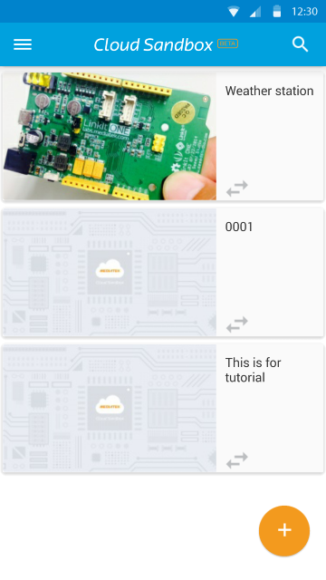
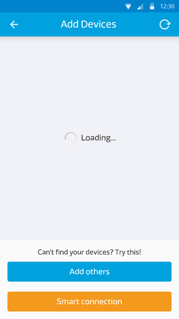

# Mobile application

Please use [Google Play](https://play.google.com/store/apps/details?id=com.mediatek.iotcloud) or scan the QR code below to get our latest mobile application.

**(Please be noted that due to system upgrade to enhance security, the old version of mobile app is not working anymore. Please download the latest version of the mobile app in the Google play store to continue using our MCS mobile app. Also, please update the firmware of your 7681 devices to the latest version. Detailed update steps are listed in **[7681 Firmware Update Instruction](../7681_firmware_update/)**)**

Or, you can [download the apk](https://s3-ap-southeast-1.amazonaws.com/mtk.linkit/mcs-2.5.0-production-release.apk) directly.

The mobile app currently offers for Android only.

To install the app, you must have android v4.0 or above version, and open the above download link in your mobile browser

Once installed at first launch you will see the screen below:

**Please note:**

Do not use login using labs@mediatek.com option. This feature is still under developement. When you first sign-on with MCS using Labs@mediatek when accessing MCS website, in the background we have created your new account in MCS using the email address as your account ID. Therefore, the current fix is, you can go back to web site and  click "forgot password" and enter your email address, a forgot password reset email will send to your mailbox. You can then set a new password and come back and login by using your email and the new password. You can then be able to login to the Moble App in the same fashion.

Once logged in, you will be able to see devices that are created and belongs to you

You can also click on any of your devices to see the device detail:

For controller data channel you can fire commands, for data channel it shows the last datapoint. Mobile does not support for viewing history record in charts. For this current version, you will need to manually refresh the display by click on the upper right corner drop down menu and select "refresh"

There is a Plus-in-circle icon allows you to add new devices. Please note, the new devices funcion is currently not available. For Smart Connection you can use this feature to add LinkIt Connect 7681. For full instruction please refer to [2.Tutorial 2.7 Implementing using Linkit Connect 7681 development board](https://mcs.mediatek.com/v2console/supports/implementing_using_mt7681_development_board)

