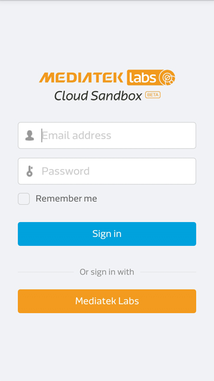
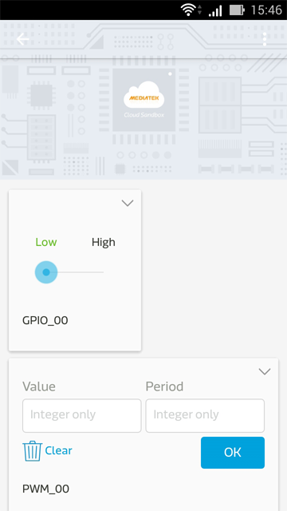
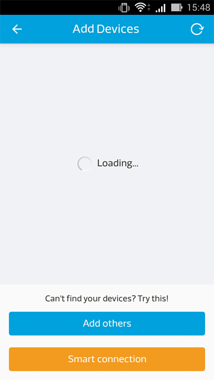

# Mobile application

This tutorial illustrates how to install the MCS mobile application to view and manage devices.

Please use [Google Play](https://play.google.com/store/apps/details?id=com.mediatek.iotcloud) or scan the QR code below to get our latest mobile application.

**(Please note that due to enhanced security system upgrade, old version of the mobile app is not supported anymore. Please download the latest version from the Google play store. If you’re using a LinkIt Connect 7681 device, please also update the firmware using the latest version. Detailed update steps are described in **[7681 Firmware Update Instruction](../7681_firmware_update/)**)**

Or, you can also [download the apk](https://s3-ap-southeast-1.amazonaws.com/mtk.linkit/mcs-latest-production-release.apk) directly.

The MCS mobile app supports Android only at the time of writing.

To install the app, you must have android v4.0 or above. Open the above link in your mobile browser.

After the app is installed and launched,  you’ll see the screen shown below:

After you’ve signed in, you’ll be able to see devices that are created and belongs to you.

You can also click on any of your devices to see the device details:

You can send commands to control your devices in controller data channels and see the latest data points in each data channel.  

The **Plus-in-circle** icon allows you to add new devices. For Smart Connection you can use this feature to add LinkIt Connect 7681 devices. For detailed instruction please refer to [Tutorial: Develop with LinkIt Connect 7681 development board](http://mcs.mediatek.com/resources/latest/tutorial/implementing_using_mt7681_development_board)

