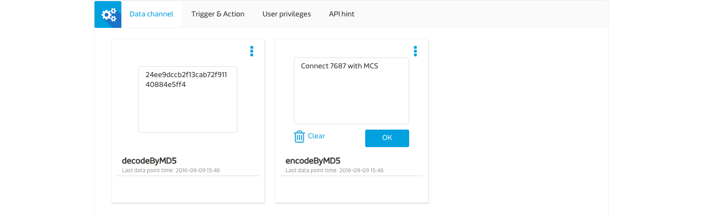

# Generate a MD5 Hash String on LinkIt 7687 with C Language

This MD5 hash example demonstrates the use of String data channel on MCS to publish a string to LinkIt 7687 development board and LinkIt 7687 development generates corresponding MD5 hash and sends it back to MCS. 

## Create a prototype and test device on MCS

1. Download the [sample prototype](https://iamblue.gitbooks.io/mt7687-on-linkit-rtos-ebook-for-community/content/zh-TW/cloud/device.json) we prepared in advance.

2. Create a prototype on MCS by importing the file you just downloaded in previous step. Read more about [how to create a prototype on MCS](https://mcs.mediatek.com/resources/latest/tutorial/getting_started#create-your-first-prototype).
3. Create a test device under this prototype. Read more about [how to create a test device on MCS](https://mcs.mediatek.com/resources/latest/tutorial/getting_started#create-your-first-test-device).

## Build your own project for LinkIt 7687 development borad
### Connect with MCS TCP command server

1. Clone or download [**mcs\_encode\_string**](https://github.com/Mediatek-Cloud/mcs_encode_string_example) project from Github to your computer.
2. Copy **mcs\_encode\_string** folder to **{SDK_Root}/project/mt7687\_hdk/apps/mcs\_encode\_string**.

3. Replace the following variables in **{SDK_Root}/project/mt7687\_hdk/apps/mcs\_encode\_string/src/main.c** with real values of your test device. The **host** variable specifies which MCS site you are going to connect with. **com** stands for MCS global and **cn** stands for MCS China.

	```
	#define deviceId "Input your deviceId"
	#define deviceKey "Input your deviceKey"
	#define Ssid "Input your wifi ssid"
	#define Password "Input your wifi password"
	// If you are connecting to MCS China, use "cn" instead of "com"
	#define host "com" 
	```
5. Build the binaries of LinkIt 7687 for this example by running the following command under **SDK root** directory:

	```
	./build.sh mt7687_hdk mcs_encode_string
	```
6. The output binaries are in **{SDK_Root}/out/mt7687\_hdk/mcs\_encode\_string/** folder.

### Connect with MCS MQTT broker
1. Clone or download [**mcs\_encode\_string\_mqtt**](https://github.com/Mediatek-Cloud/mcs_encode_string_mqtt_example) project from Github to your computer.
2. Copy **mcs\_encode\_string_mqtt** folder to **{SDK_Root}/project/mt7687\_hdk/apps/mcs\_encode\_string_mqtt**.

3. Replace the following variables in **{SDK_Root}/project/mt7687\_hdk/apps/mcs\_encode\_string/src/main.c** with real values of your test device. The **host** variable specifies which MCS site you are going to connect with. **com** stands for MCS global and **cn** stands for MCS China.

	```
	#define deviceId "Input your deviceId"
	#define deviceKey "Input your deviceKey"
	#define Ssid "Input your wifi ssid"
	#define Password "Input your wifi password"
	#define topic "mcs/{Input your deviceId}/{Input your deviceKey}/+"
	// If you are connecting to MCS China, use "cn" instead of "com"
	#define host "com"
	#define server "mqtt.mcs.mediatek.com"
	#define port "1883"
	#define clientId "mt7687" 
	```
5. Build the binaries of LinkIt 7687 for this example by running the following command under **SDK root** directory:

	```
	./build.sh mt7687_hdk mcs_encode_string_mqtt
	```
6. The output binaries are in **{SDK_Root}/out/mt7687\_hdk/mcs\_encode\_string\_mqtt/** folder.

## Download the binaries to the LinkIt 7687 development board.

1. Set the board to **Flash Recovery** mode.
2. Connect LinkIt 7687 to your computer.
3. Locate the **mt7687\_mcs\_encode\_string.bin** or **mt7687\_mcs\_encode\_string\_mqtt.bin** file and copy this file to the MT76x7 mass storage device.
4. The on-board LED **U6001** will start to blink, indicating flash memory update.
5. Wait for the mass storage device to disappear and re-appear again and the download process is completed.
6. Set the board back to **Flash Normal** mode and press **RST** button to reboot the system. 

## Start to interact with your development board on MCS

Go to MediaTek Cloud Sandbox and use the String control data channel to publish a string to LinkIt 7687 development board. Once LinkIt 7687 receives this data, it will calculate its MD5 hash and sends it back to MCS. 

You should be able to see its MD5 hash displayed on the String display data channel if everything works well.


