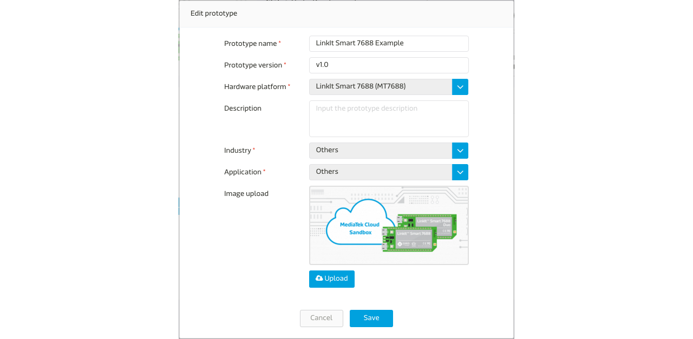
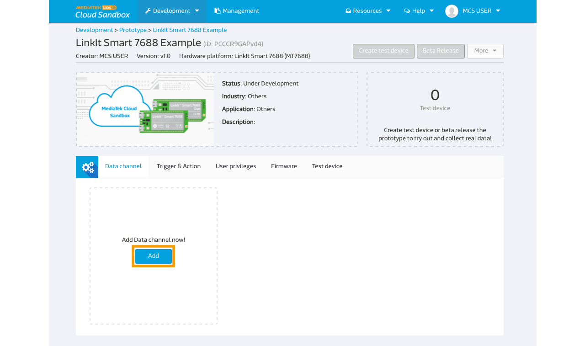
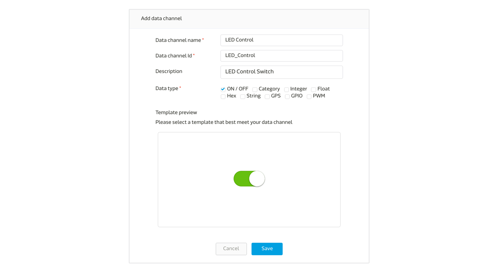
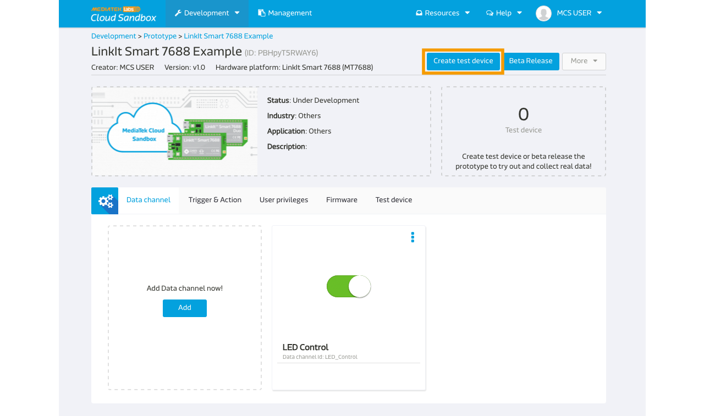
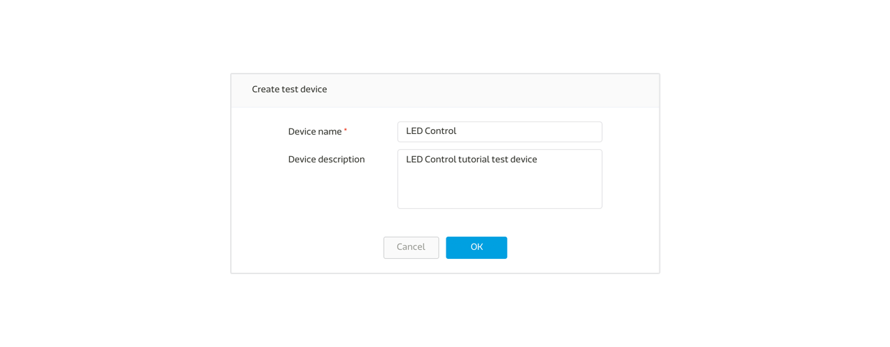
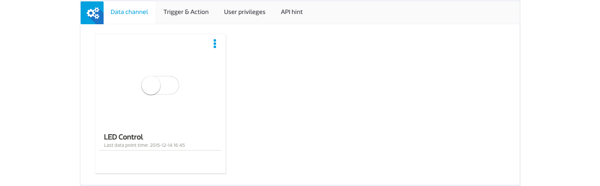
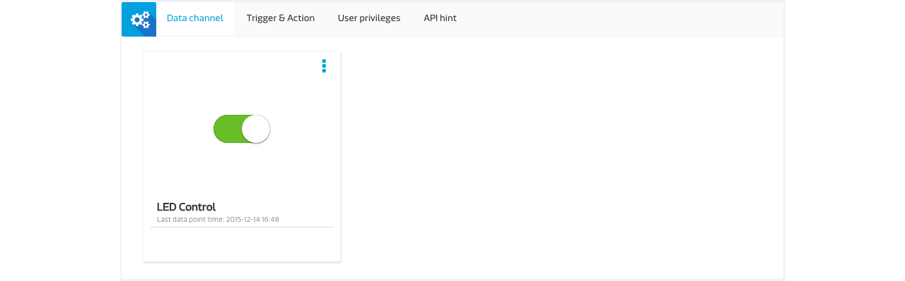

# Simple Switch Tutorial For Microlattice and LinkIt 7687

In this guide you’ll learn the steps to create a simple remote switch that allows you to turn on and off the on-board Wi-Fi LED from the web console of MCS using Node.js and Microlattice package.

## Creating a new prototype for LinkIt Smart 7687

### Step 1. Create a new Prototype with Switch-Type data channel

a. After login, select "Prototype" under Development at the navigator bar, click "Create" to create a new prototype or [import from json](http://cdn.mediatek.com/tutorial/7688/7688_switch_EN.json). If you import the prototype from json, you can skip Step 1 and start from Step 2.


b. Fill in the detail information as per screen to give a basic profile of this prototype:



c. Click "Detail" for the prototype created


d. In the prototype Detail Page, select "Data Channel" TAB and click "Add" to create new Data Channel:




We are going to create two Data Channel for this tutorial, one is a Display Data Channel to reflect the status of the LED light on the board; one is a Controller Data Channel that issues command to the board to switch the LED light:


e. Select "Controller" Data Channel and key in the following information




Please take note of the Data Channel Id, this is the unique identifier when calling API later in the tutorial.


### Step 2. Create Test Device

a. Click "Create Test Device" on the right upper corner of the page



b. Fill in the name and description of the test device:



c. After Test device is created, click "Go to detail" to open the created device detail page:




Please take note of the deviceId and deviceKey for calling API later in the tutorial.

### Step 3. Obtain Device ID, Device Key, Data Channel ID
Here is the summary of the neccessary information we have obtained in interacting with this test device. You can find the information in the test device detail page.

| Name | Value | Remark |
| --- | --- | --- |
| deviceId | Dsre1qRQ | Unique Identifier for this Test Device, copy your own deviceId in the device detail page. |
| deviceKey | DFbtsNWg4AuLZ30v  | Unique API Key for this Test Device, copy your own deviceKey in the device detail page. |
| dataChannelId | LED_Control | Data Channel Id for LED control |

Note 1: The deviceId and deviceKey shown here will be differet to yours, please use your obtained value instead.

Note 2: The deviceId are case sensitive.


# Creating a program to connect to MCS and run the application

MCS supports node.js and python. You can choose node.js or python base on your preference.

## Install the microlattice package

In order to develop LinkIt 7687 using Node.js, you need to install the microlattice package first.
To install the package for this simple switch tutorial(using GPIO data channel), please follow the steps:

1. Open the command line tool and input:
```
npm install ml-gpio
```

2. Add the following line in **featureConfig.json**:
```
"ml-gpio": ture
```


## Creating a Node.js program to connect to MCS

Here is the Node.js example code that listens for commands from MCS web console.

### Connect Using Command Server or MQTT


MCS provides two kinds of communication between the device and MCS, the **Command Server** and the **MQTT**. Please only choose one to implement on your device.

#### Connect using Command Server
* Type **i** and Copy/paste the following code in the editor.

```
?????

```
#### Connect using MQTT
* Edit the **index.js** file and add the followng:

```
  __pinmux(35, 8);

  __wifi({
    mode: 'station', // default is station
    auth: 'PSK_WPA2',
    ssid: 'Input your ssid',
    password: 'Input your password',
  });

  global.eventStatus.on('wifiConnect', function() {
    __mcs(
      "mqtt.mcs.mediatek.com",                  // string
      "1883",                                   // string
      "mcs/{your deviceId}/{your deviceKey}/+", // string
      '7687client',                             // string
      0,                  // number: Qo0: 0, Qo1: 1, Qo2: 2
      function(data) {
        print(data);
        if (data.indexOf("switch,1") === 14) {
          __gpioWrite(35, 1);
        } else if (data.indexOf("switch,0") === 14) {
          __gpioWrite(35, 0);
        }
    });
  });

```

Next, run the Node.js example program.

### Run your application
You are now ready to execute the Node.js program. In the system console, type the following command:


```
npm run build
```

Go to MediaTek Cloud Sandbox and use the controller panel to flip the button on and off and watch the Wi-Fi LED on LinkIt 7687 HDK.





