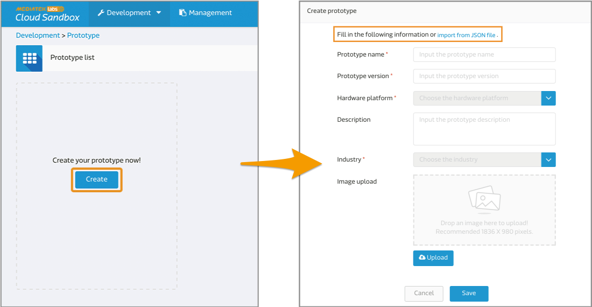

# Light Switch on LinkIt 7687

In this example, we will show you how to connect LinkIt 7687 HDK to MCS with GCC. Then, you can remotely turn on and off the on-board LED of the LinkIt 7687 HDK from MCS web console and upload the current timestamp to MCS.

## Getting Started
1. Download the [example code package](https://github.com/Mediatek-Cloud/mcs.c-examples/archive/master.zip). The project we are going to demonstrate is **mcs\_gpio\_interrupt\_mqtt**, so please decompress the downloaded folder and place this project under **app** directory. 

	```
	{SDK_Root}/project/mt7687_hdk/apps/mcs_gpio_interrupt_mqtt
	```

2. Create the prototype and data channels on MCS. You can achieve this simply by importing **mcs\_gpio\_interrupt\_mqtt\_prototype.json** file, which is included in **mcs\_gpio\_interrupt\_mqtt** project.

	```
	{SDK_Root}/project/mt7687_hdk/apps/mcs_gpio_interrupt_mqtt/mcs_gpio_interrupt_mqtt_prototype.json
	```
	There are 2 data channels in this prototype.

	* Switch controller with data channel ID "switch".
	* String display with data channel ID "message".
	
	
	> **Please refer to [Create Your First Prototype](https://mcs.mediatek.com/resources/latest/tutorial/getting_started#create-your-first-prototype) if you need more detailed instruction on prototype creation.**
	
3. Create the test devices under this prototype on MCS.

	
	> **Please refer to [Create Your First Test Device](https://mcs.mediatek.com/resources/latest/tutorial/getting_started#create-your-first-test-device) if you need more detailed instruction on test device creation.**
	
4. Update the device ID and key of your test device created in previous step into **mcs.h** file.

	
	
	```
	/* Modify mcs_gpio_interrupt_mqtt/inc/mcs.h according to your MCS configuration */ 
	
 	#define DEVICEID "DbH****"
 	#define DEVICEKEY "TPJVm3Dy********"
 	#define HOST "com"
	```
	
5. Modify **main.c** according to your environment setting.

	* The network setting of LinkIt 7687 development board:
		* AP_SSID: SSID of the current Wifi access point.
		* AP_PWD: Password of the current Wifi access point.

	* The data channels information:
		* GPIO_ON: "switch,1" (switch is the data channel ID created in Step 2)
		* GPIO_OFF: "switch,0" (switch is the data channel ID created in Step 2)

	```
	#define AP_SSID "your_SSID"  
	#define AP_PWD "your_pwd"
	#define GPIO_ON "switch,1"
	#define GPIO_OFF "switch,0"
	```
	
6. After modifying **mcs.h** and **main.c** file, you can now compile and build this project via GCC ARM Embedded command line tools. 

	* Change directory to the example project's GCC sub-folder.
		
		```
		$ cd <sdk_root>/project/mt7687_hdk/app/mcs_gpio_interrupt_mqtt/GCC
		```
	* Run the make command.
		
		```
		$ make
		```
	* The output sub-folder is in the build folder:
		
		```
		<sdk_root>/project/mt7687_hdk/app/mcs_gpio_interrupt_mqtt/GCC/build  
		```
		
	> **Please refer to [Build an example project](https://docs.labs.mediatek.com/resource/mt7687-mt7697/en/get-started-linkit-7687-hdk/gcc-arm-embedded-command-line-tools-free/build-an-example-project) if you need more detailed instruction on how to build a project on LinkIt 7687 HDK.**
	
7. You can now download the output files to the LinkIt 7687 HDK. The necessary scatter and binary files are all in the build folder generated in previous step.

	> **Please refer to [Download a pre-built binary example](https://docs.labs.mediatek.com/resource/mt7687-mt7697/en/get-started-linkit-7687-hdk/gcc-arm-embedded-command-line-tools-free/download-a-pre-built-binary-example) if you need more detailed instruction on how to download a binary to LinkIt 7687 HDK.**

After all these steps are complete, you can go to your browser and use the switch on MCS > Test device detailed page to turn on/off the **D12** LED light on LinkIt 7687 HDK. 

You can also press the **EINT (External Interrupt Button)** on the LinkIt 7687 HDK to trigger a data pull up event and upload the current timestamp to MCS.


