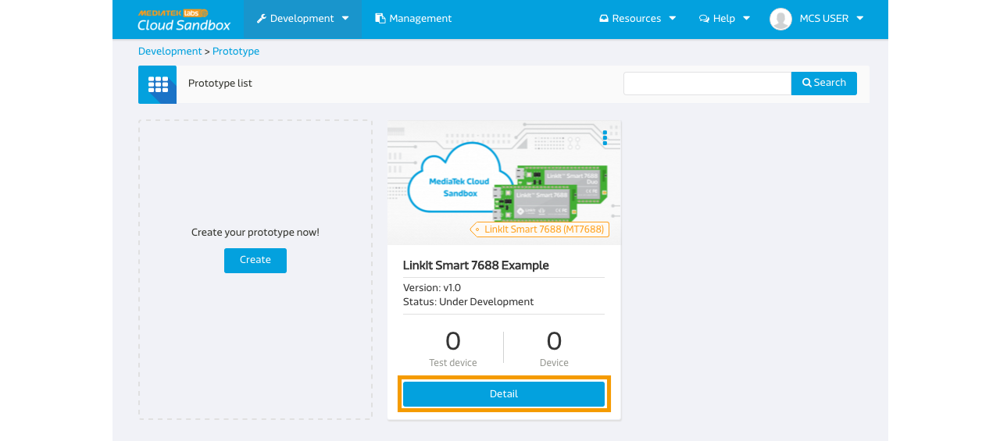
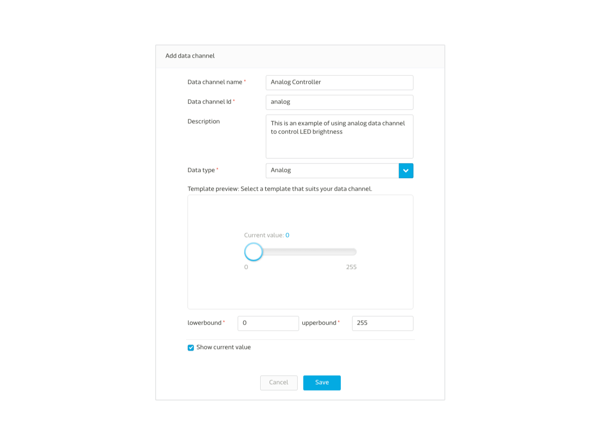

# Analog Controller Tutorial

In this guide you’ll learn the steps to create a analog controller that allows you to turn on and off the on-board Wi-Fi LED from the web console of MCS using Node.js. Please note that to run this example, you will need a **LinkIt Smart 7688 Duo** board.

## Creating a new prototype for LinkIt Smart 7688

### Step 1. Create a new prototype with analog controller type data channel
a. After login, select "Prototype" under Development at the navigator bar, click "Create" to create a new prototype or [import from json](http://cdn.mediatek.com/tutorial/7688/7688_analog_EN.json). If you import the prototype from json, you can skip Step 1 and start from Step 2.
.


b. Fill in the detail information as per screen to give a basic profile of this prototype:


c. Click "Detail" for the prototype created



d. In the prototype Detail Page, select "Data Channel" TAB and click "Add" to create new Data Channel:


We are going to create one **Analog** controller type data channel for this tutorial which will issues command to the board to control the brightness of the LED light.


e. Select "Controller" Data Channel and key in the following information




Please take note of the Data Channel Id, this is the unique identifier when calling API later in the tutorial.

### Step 2. Create Test Device

a. Click "Create Test Device" on the right upper corner of the page


b. Fill in the name and description of the test device:


c. After Test device is created, click "Go to detail" to open the created device detail page:


Please take note of the deviceId and deviceKey for calling API later in the tutorial.


### Step 3. Obtain Device ID, Device Key, Data Channel ID
Here is the summary of the neccessary information we have obtained in interacting with this test device:

| Name | Value | Remark |
| --- | --- | --- |
| deviceId | Dsre1qRQ | Unique Identifier for this Test Device, copy your own deviceKey in the device detail page. |
| deviceKey | DFbtsNWg4AuLZ30v  | Unique API Key for this Test Device, copy your own deviceKey in the device detail page. |
| dataChannelId | analog | Data Channel Id for LED brightness |

Note 1: The deviceId and deviceKey shown here will be differet to yours, please use your obtained value instead.

Note 2: The deviceId is case sensitive.

# Creating a program to connect to MCS and run the application

LinkIt Smart 7688 supports node.js and python. You can choose node.js or python base on your preference.

## Creating a Node.js program to connect to MCS

Here is the Node.js example code that listens for commands from MCS web console. Here in the example, we will use the firmata module to contol the analog data channel in the 7688 board. The following steps includes how to install the firmata module into the board.

1. Use Arduino to upload this [code](https://gist.githubusercontent.com/edgarsilva/e73c15a019396d6aaef2/raw/60941ec6981a1cb79609daf8441a52a6e7345c63/StandardFirmataForATH0.ino) into the **LinkIt Smart 7688 Duo** board. For more information about how to install the LinkIt Smart 7688 Duo port driver, please refer to the [MediaTek Labs website](http://labs.mediatek.com/site/global/developer_tools/mediatek_linkit_smart_7688/get_started/7688_duo/arduino/index.gsp).

2. Download the firmata.tar file [here](http://cdn.mediatek.com/tutorial/7688/firmata.tar). For users in China, you can download the firmata.tar file [here](http://cdn.mediatek.cn/tutorial/firmata.tar).

3. Connect to the console of 7688 development board through `ssh` command on your computer.

```
ssh root@mylinkit.local
```
4. Create app folder under root.

```
mkdir app && cd app && npm init
```

5. Create node_modules foder in app directory under root.

```
mkdir node_modules
```

6. Open the command line tool **in your computer** and copy the firmata.tar file into the 7688 board.

```
scp ./firmata.tar root@mylinkit.local:/root/app/node_modules/
```

7. Go back to **7688 terminal**, and go to `/root/app/node_modules/` directory.
8. Unzip the `firmata.tar`.

```
tar -xvf ./firmata
```
9. Go back to `/root/app/` directory.
10. Create a file app.js using an editor, vim is used in this example:

```
vim app.js
```

11. Type **i** and Copy/paste the following code in the editor

```
var ledPin = 13;
var firmata = require('firmata');
var mcs = require('mcsjs');
var board = new firmata.Board("/dev/ttyS0", function(err) {
if (err) {
 console.log(err);
 board.reset();
 return;
}
console.log('connected...');
console.log('board.firmware: ', board.firmware);
board.pinMode(ledPin, board.MODES.OUTPUT);

var myApp = mcs.register({
 deviceId: 'Input your deviceId',
 deviceKey: 'Input your deviceKey',
 host: 'api.mediatek.com'

});
myApp.on('analog', function(data, time) {
 if(Number(data) != NaN) {
   board.analogWrite(ledPin, Number(data));
 } else {
   board.analogWrite(ledPin, Number(data));
 }
});
});
```

Next, run the Node.js example program.

### Run your application
You are now ready to execute the Node.js program. In the system console, type the following command:# is command prompt and is not part of command.

```
# node app.js
```

Go to MediaTek Cloud Sandbox and use the controller panel to flip the button on and off and watch the Wi-Fi LED on LinkIt Smart LinkIt Smart 7688 HDK.


