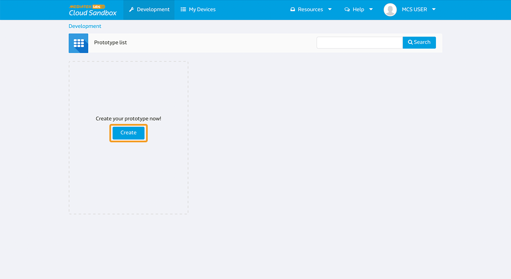
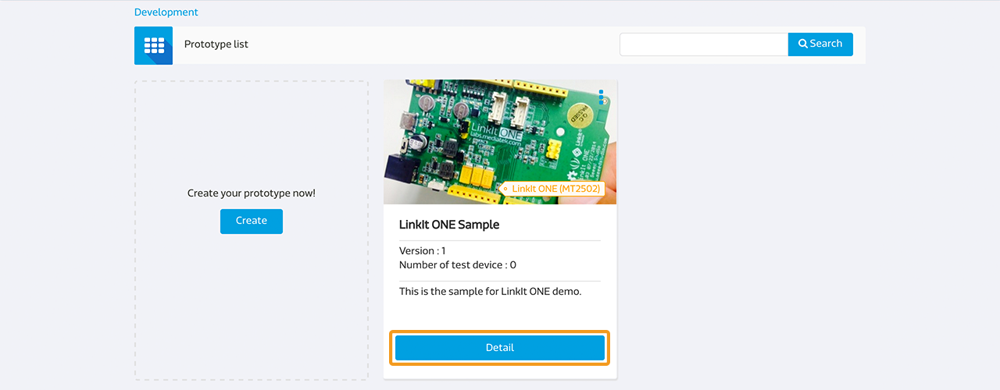
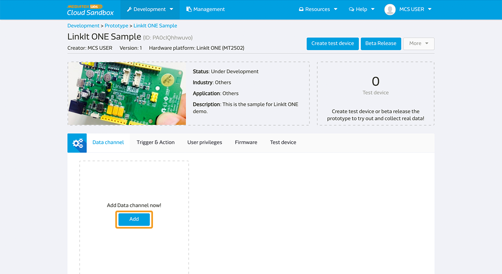
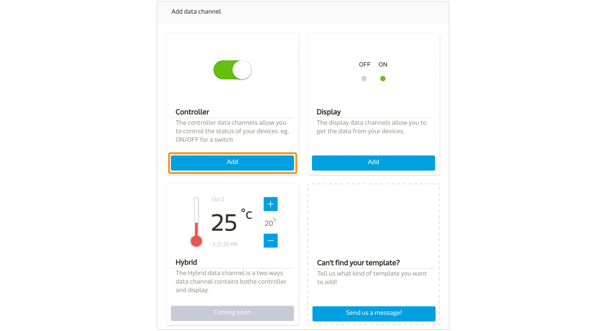
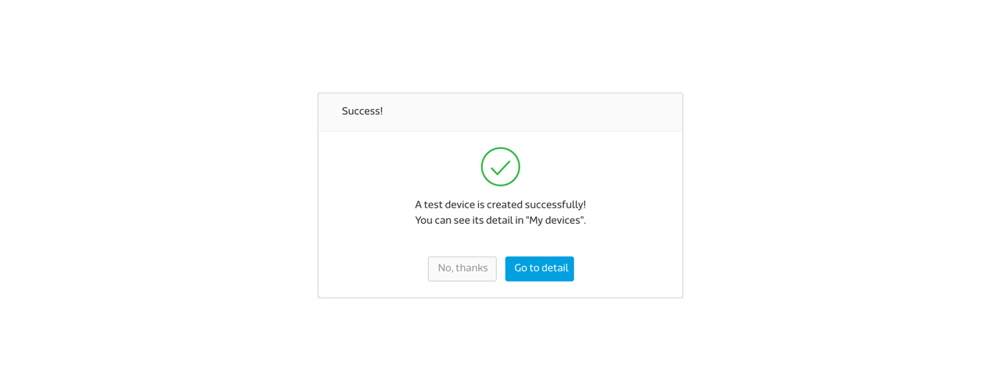
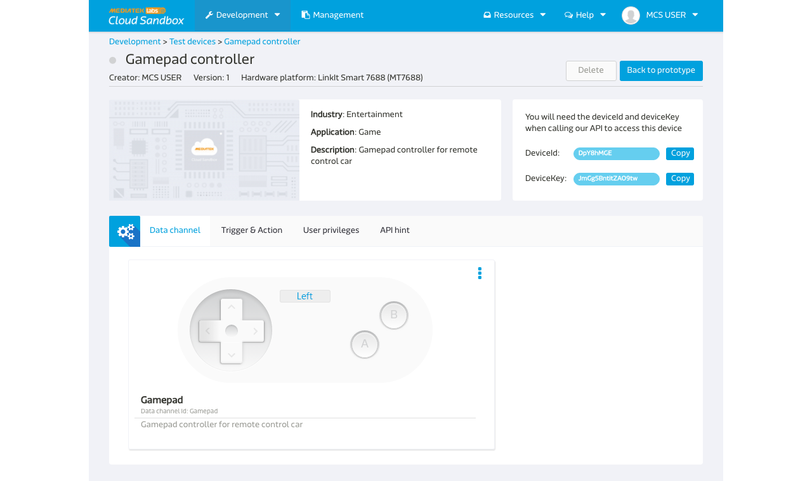

# Gamepad controller tutorial

Here is a simple example demonstrating how to use gamepad data channel controller on a LinkIt ONE development board.


## Creating a new prototype for LinkIt Smart 7688

### Step 1. Create a new prototype with gamepag controller type data channel
a. After login, select "Prototype" under Development at the navigator bar, click "Create" to create a new prototype.



b. Fill in the detail information as per screen to give a basic profile of this prototype:


c. Click "Detail" for the prototype created



d. In the prototype Detail Page, select "Data Channel" TAB and click "Add" to create new Data Channel:



We are going to create one **Gamepad** controller type data channel for this tutorial which will issues command to the board to control the direction of the remote control car.


e. Select "Controller" Data Channel and key in the following information




Please take note of the Data Channel Id, this is the unique identifier when calling API later in the tutorial.

### Step 2. Create Test Device

a. Click "Create Test Device" on the right upper corner of the page


b. Fill in the name and description of the test device:


c. After Test device is created, click "Go to detail" to open the created device detail page:




Please take note of the deviceId and deviceKey for calling API later in the tutorial.

### Step 3. Obtain Device ID, Device Key, Data Channel ID
Here is the summary of the neccessary information we have obtained in interacting with this test device:

| Name | Value | Remark |
| -- | -- | -- |
| deviceId | Dsre1qRQ | Unique Identifier for this Test Device |
| deviceKey | DFbtsNWg4AuLZ30v  | Unique API Key for this Test Device |
| dataChannelId | Gamepad | Data Channel Id for gamepad controller |

Note 1: The deviceId and deviceKey shown here will be differet to yours, please use your obtained value instead.

Note 2: The deviceId is case sensitive.


# Creating a program to connect to MCS and run the application

MCS supports node.js and python. You can choose node.js or python base on your preference.

## Creating a Node.js program to connect to MCS

Here is the Node.js example code that listens for commands from MCS web console.

1. Create a file app.js using an editor, vi is used in this example:
```
vim app.js
```

2. Type **i** and Copy/paste the following code in the editor
```
var ledPin = 13;
var firmata = require('firmata');
var mcs = require('mcsjs');
var board = new firmata.Board("/dev/ttyS0", function(err) {
  if (err) {
    console.log(err);
    board.reset();
    return;
  }
  console.log('connected...');
  console.log('board.firmware: ', board.firmware);
  board.pinMode(ledPin, board.MODES.OUTPUT);
  var myApp = mcs.register({
    deviceId: 'Input your deviceId',
    deviceKey: 'Input your deviceKey',
  });
  myApp.on('analog', function(time, data) {
    if(Number(data) != NaN) {
      board.analogWrite(ledPin, Number(data));
    } else {
      board.analogWrite(ledPin, Number(data));
    }
  });
});
```

Next, run the Node.js example program.

### Run your application
You are now ready to execute the Node.js program. In the system console, type the following command:# is command prompt and is not part of command.

```
# node app
```

Go to MediaTek Cloud Sandbox and use the controller panel to flip the button on and off and watch the Wi-Fi LED on LinkIt Smart LinkIt Smart 7688 HDK.




