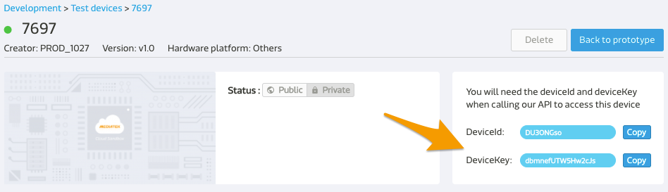
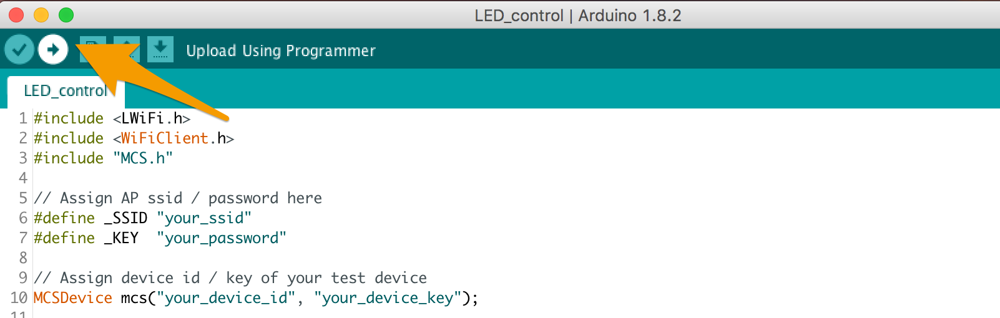

# Control LED on LinkIt 7697
We use an example to show you how to connect to MCS web service. 
This example connects to MCS with MCSDevice class, and allows users to remotely turn on and off the on-board LED of the LinkIt 7697 HDK from MCS web console.

## Create your MCS test device
Visit [MCS web console](https://mcs.mediatek.com) and create your prototype, data channels and a test device. In this example, you need to the following 2 data channels:

1. A **Controller** channel with type **ON/OFF**.
2. A **Display** channel with type **ON/OFF**. 

If you want to know more about how to create prototype, test device and data channels, please refer to [MCS Getting Started](http://mcs.mediatek.com/resources/latest/tutorial/getting_started).


## Use MCS Library to connect to MCS
To connect to MCS, we need to create a **MCSDevice** object with **device ID** and **device key**, and then set the **data channels** accordingly.

1. In your Arduino IDE, select **File**, then **Examples**, click **MCS** then select **LED_control**.


2. We need to access MCS service through the Wi-Fi network, so modify the Wi-Fi **SSID** and **password** of your Wi-Fi network in the example sketch:

	```arduino
	// Assign AP ssid/password here
	#define _SSID "your_ssid"
	#define _KEY  "your_password"
	```
	
3. Set the **device ID** and **device key** to the **MCSDevice** constructor in the sketch:

	```arduino
	// Assign device id/key of your test device
	MCSDevice mcs("your_device_id", "your_device_key");
	```
	
	
4. Assign the **data channel IDs** of your test device:

	```arduino
	// Assign data channel ID 
	MCSControllerOnOff led("your_channel1_id");
	MCSDisplayOnOff    remote("your_channel2_id");
	```
	
	
	
## Run the Sketch
1. Click **Upload** and wait for the **Done Uploading** message to appear.

	

2. Click **Serial Monitor** in the toolbar and adjust the **Baud rate** setting to **9600**.

	

3. You can now operate the **switch controller** on MCS web console to turn on or off the LED light on the development board. It also updates the value back to **switch display channel**.

	

4. Please observe the **LED PIN 7** on the development board. The LED light is on and off according to your operation on the MCS web console. 

	


## Code
In this sketch, we use **MCS library** to deal with the interaction between the physical device and MCS web server. First, include the MCS library.

```arduino
#include <MCS.h>
```

Create instances of **MCSControllerOnOff** and **MCSDisplayOnOff** class which represent the **switch data channels** you created in the prototype on MCS and provide data channel ID as the parameter.


```arduino
MCSControllerOnOff led("your_channel1_id");
MCSDisplayOnOff    remote("your_channel2_id")
```

Associate this physical device to the **test device** on MCS by creating an instance of **MCSDevice** class with device ID and key.


```arduino
MCSDevice mcs("your_device_id", "your_device_key");
```

Attach those data channel instances to the test device and use connect() to initialize the TCP connection to MCS server.

```arduino
  // setup MCS connection
  mcs.addChannel(led);
  mcs.addChannel(remote);
  while(!mcs.connected())
  {
    Serial.println("MCS.connect()...");
    mcs.connect();
  }
```

Call update() in the loop() to check if there is new data point received on physical device for **switch controller** data channel. If yes, then assign the new value to **LED_PIN** setting to either turn on or off the LED.

```arduino
if(led.updated())
  {
    Serial.print("LED updated, new value = ");
    Serial.println(led.value());
    digitalWrite(LED_PIN, led.value() ? HIGH : LOW);
    if(!remote.set(led.value()))
    {
      Serial.print("Failed to update remote");
      Serial.println(remote.value());
    }
  }
```


