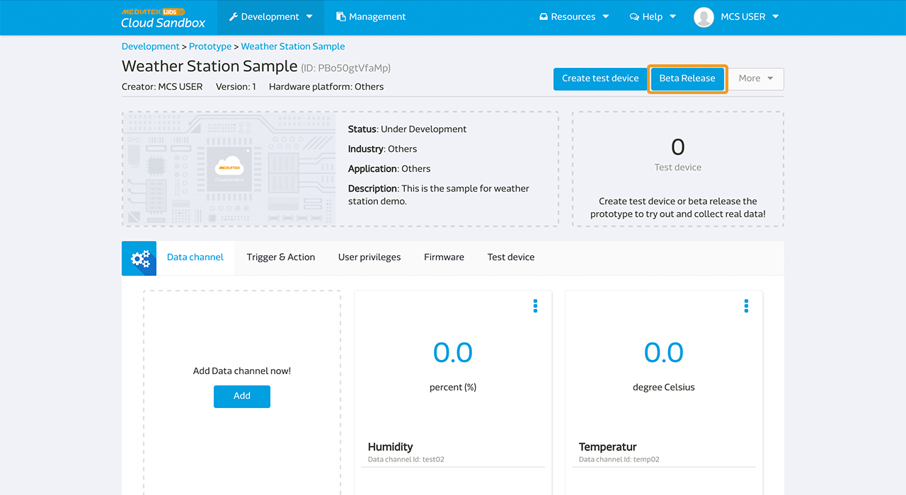
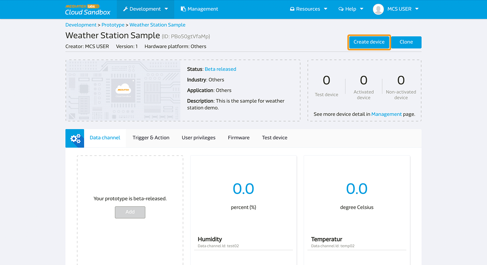
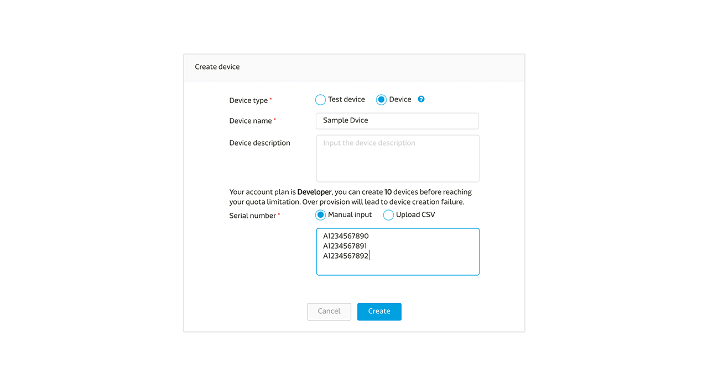
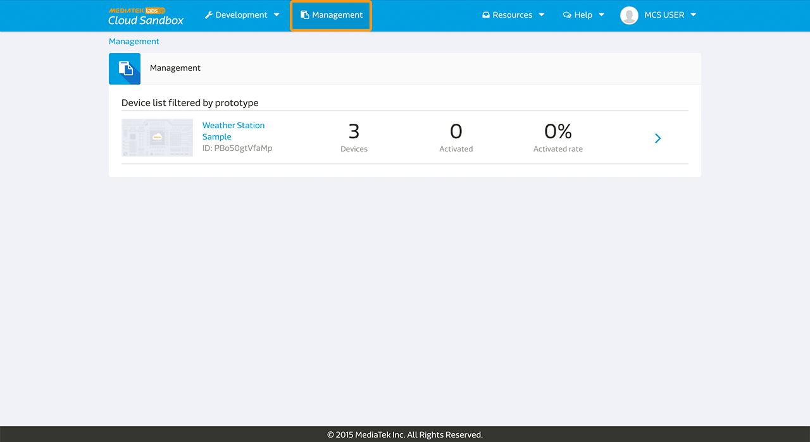
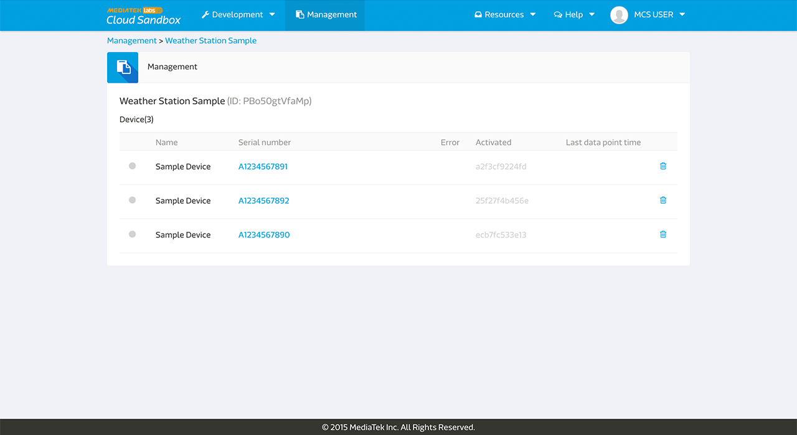

# Beta-release Your Prototype

When your prototype is sufficiently tested and you are ready to release it to a small group of user for trial run, you can beta-release the prototype.

Once you've beta-released your prototype, it will be frozen and you can't make any modification to the prototype including the prototype detail, data channels, and trigger & action rules. However, you can still add other developers to join this prototype or continue to upload firmware for the test device or device for upgrade.

## How To Beta-release Prototype

To beta-release the prototype, click **Beta-release** button on the upper right in the prototype detail page.

# Create Device

YOu can only create devices after the prototype is beta-released and frozen. You can choose to create devices all at once or separately based on your needs.

After devices are created, you can manage them in the **Management** page, where devices are categorized by prototype. Each device will have a unique activation code and a device needs to be activated to become available. 

## How To Create Device

You can choose to create devices all at once or separately. You can also choose to enter the serial number manually or by using a pre-defined csv file.

Step 1. Click **Create Device** on the upper right in a beta-released prototype page.

Step 2. Enter the device name and description.

Step 3. Enter the serial number for the devices. The serial number format is limited to A-Z, a-z, 0-9, and must be less than 50 characters.

Step 4. Click **Create**.

When a new device is created, it's in inactive and has a unique activation code. The device will only become available after being activated. After it's activated, it will get a unique deviceId and deviceKey, like the test device, and it's ready to work.

You can find the activation code and all other device related information in the **Management** page.

# Device Management

After the prototype is beta-released and you've created several devices for it, you can find all the devices in the **Management** page.

You can see the device count and activation rate for each prototype in the **Management** page. You can also check the devices for each prototype by clicking on the specific prototype in that page.

The following information will be disclosed:
* Device online status
* Device Serial number
* Device activation code
* Device activation date
* Device last data point time

Please note that all test devices and devices will be counted toward your account limit regardless of their activation status. Please note that you can only delete a device when it's not been activated.

## How to Activate a Device

When a device is created, you can find its activation code in the **Management** page. Each device can only be activated once using the activation code.

MCS provides API to activate a device. Please find the **Device activation** in API reference page [here](../api_references/). You can also design your own method to activate the device by calling the MCS API.

After the device’s activated, device detail including the device ID, device Key, data channel value, trigger and action rules, and firmware version will be listed in the device **Detail** page.
