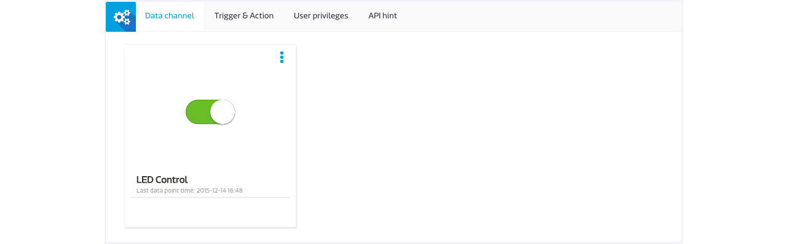

# Simple Switch Tutorial For C and LinkIt 7687

Here in this tutorial, we will illustrate how to build a simple switch using the GPIO data channel in MCS using C and LinkIt 7687.

## Create the prototype and test device in MCS

1. Download this [sample prototype](https://iamblue.gitbooks.io/mt7687-on-linkit-rtos-ebook-for-community/content/zh-TW/cloud/device.json).
2. Create a prototype by import the one you've gor in previous step.
3. Create a test device in this prototype.

## Code your development board

1. Copy **mcs_gpio_tcp** to your **{SDK_Root}/project/mt7687_hdk/apps/mcs_gpio_tcp**.
2. Edit the **{SDK_Root}/project/mt7687_hdk/apps/mcs_gpio_tcp/main.c** as the following:

** Connect Using Command Server**

```
#define deviceId "Input your deviceId"
#define deviceKey "Input your deviceKey"
#define Ssid "Input your wifi"
#define Password "Input your password"
#define host "com" // If you are using MCS China, use cn instead of com
```

** Connect Using MQTT**

```
#define deviceId "Input your deviceId"
#define deviceKey "Input your deviceKey"
#define Ssid "Input your wifi Ssid"
#define Password "Input your wifi password"
#define topic "mcs/{Input your deviceId}/{Input your deviceKey}/+"
#define host "com" // If you are using MCS China, use cn instead of com
#define server "mqtt.mcs.mediatek.com"
#define port "1883"
#define clientId "mt7687"
```

3. Build the Simple switch image by input the following command in **SDK root** directory:
```
./build.sh mt7687_hdk mcs_gpio_tcp
```

## Burn the image to the LinkIt 7687 board.

1. Connect LinkIt 7687 to your computer.
2. Drag and drop the **.bin** file into the 7687 disk.
3. You will see the **U6001** light in the LinkIt 7687 board is blinking which means the image is installing to the board.
4. After the process completed, the LinkIt 7687 disk disconnected and connected again which means the process is completed.

## See it in MCS

Go to MediaTek Cloud Sandbox and use the controller panel to flip the button on and off and watch the LED on LinkIt 7687 HDK.




