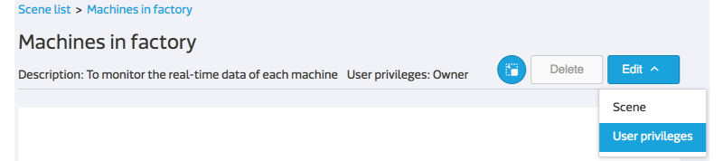

# Create your own scene

In this tutorial, you will learn how to create a scene with selected devices, data channel and customized URL links. 

## Add a scene

In the device detailed page, you can see all data channels under this device. In addition, you can create your own scene to monitor the data channels from multiple devices which are deployed in a specific working area.

Here are the steps:

1. Go to scene list page by clicking the **Scene** item on the navigation bar.

2. Click the **+ Add scene** link under the scene list. 
3. Provide the **Scene name**, **description** and **image** of the scene. The image is the map layout of your working area.
4. The scene is created right after you click **Next**.

5. The page stays in **scene edit mode** for more configuration, or you can click **Back** to go back to scene list page.

## Add the devices and data channels into this scene

You can add devices, which you have permission to access to, into the scene and choose which data channels to display and their display order.

Here are the steps:

1. Enter into **scene edit mode** by

	* adding a scene.
	* clicking **Edit** -> **Scene** in the scene view page.
	

2. Click **Test device** or **Device** button on the left panel.
3. Choose the test device or device you need from the drop-down list.
4. Modify the **Display name** if you want a different one from the original device name. 
5. The **scene-compatible data channels** of this selected device are listed below and you can select one by one according to the order you want to present. The scene-compatible data channels include:

	* all display data channels except video streaming and image.
	* control switch data channel.

6. Click **Save** and you will see this device on the top-left corner of scene.

7. Click and hold on the device tile to **drag and drop** it to wherever you want on the scene.
8. The setting is saved simultaneously, so you can click **Back** to go back to view mode anytime.
9. You can also **Edit** or **Delete** this device tile from the scene.

## Add the customized URLs into this scene

Here are the steps:

1. In the **scene edit mode**, click **URL** button.
2. Provide the **Display text** and **URL link**. The URL link must include the protocol name as prefix, for example **http://**mcs.mediatek.com or **https://**mcs.mediatek.com
3. You can also **Edit** or **Delete** this URL link from the scene.

## Share this scene to other MCS users

You can share your scene to other MCS users and grant either **Administrator** or **Viewer** privilege to them. You also need to pay special attention to the **device privileges**. Because scene privileges only work at scene level and you have to grand the device privileges to the scene coordinators one by one. Otherwise, they cannot see the devices which they don't have permission to access to.

Here are the steps:

1. Enter into **privileges edit mode** by clicking **Edit** -> **Privileges** in the scene view page.

2. Click **+ Add user** link under the user list. 
3. Provide the **Email** that user registered in MCS.
4. Select the **Role** you want to grant to that user.
5. Click **Ok** and you are all set.
6. If you haven't grand the device permission to that user, please go to device detailed page -> **User privileges** to configure it one by one.

**Scene user privileges**

| Role | View scene | Update scene | Delete scene| Set privileges |
|:---:|:---:|:---:|:---:|:---:|
|**Administrator**|Yes|Yes|No|Yes|
|**Viewer**|Yes|No|No|No|

## View the scene and monitor the devices 

All the scenes which you have permission to access to are listed in the scene list page. You can click on the scene name to go to specific scene view page directly and it provides an overview of the devices in your working area.

In the scene view page, you can

1. view the real-time data of selected devices.
2. view the online/offline status of selected devices.
3. operate the control switch data channel. 
4. visit device detailed page by simply clicking on the device display name.
5. visit the other websites by simply clicking on the URL link.

