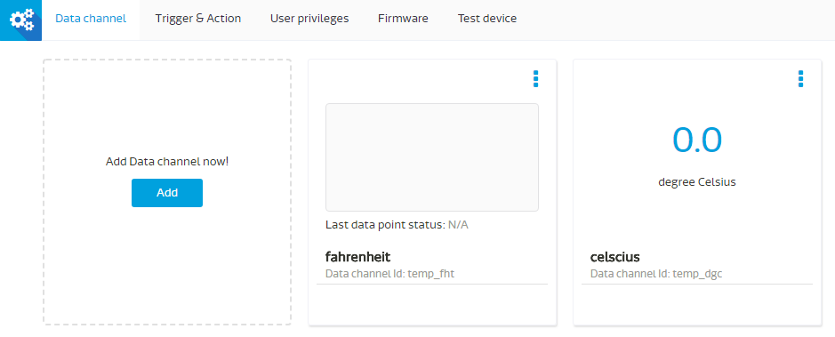

# Function Data Channel tutorial

Function Data Channel allows you to execute your own JavaScript code snippet whenever a datapoint is uploaded to this Data Channel, allowing code snippet to perform simple computation to this datapoint and be able to pass-out the processed value to other data channels within the same MCS device. This feature enables IoT device developers to delegate some of on-device computation to MCS Function Data Channel that may be useful in the following use cases:

1.	To conserve power for the battery powered IoT device
2.	To perform customized calculation for different sensor data collected by the IoT device.
3.	To make update of the code on MCS Function Data Channel instead of FOTA to the device.

Here is a quick tutorial illustrates a data channel taking in temperature sensor value in Fahrenheit then leveraging Function Data Channel to convert to Celsius and forward this value to another data channel:

##Define Function Data Channel

After creating a prototype, by clicking “Add” button you can add a Function Data Channel by clicking the left lower corner icon:

 

In the “Add data channel” form, you can then fill the Data channel name and Data channel Id as shown in the screenshot, the lower half is the code editing area where you can expand it to full screen by clicking the blue square icon on the right hand side.

 

There is a description in the mid-section of the form describing how you can return the calculated value to other data channels within the same device. By clicking the question mark you will be shown the constrains of using this code block

 

Append the JavaScript code into the code block then click "Save"

 

Below is the code block for the tutorial:

```
//Use context.value to get uploaded data point.
//Following is an example of temperature conversion:

var fahrenheit = context.value;
var celsius = Math.round(((fahrenheit - 32) / 1.8)*100,2)/100;
console.log("This message goes to console log, the calculated value is" + celsius);
 return {
  temp_dgc: celsius
   };
```
Please note:

1.	Datapoint being uploaded to this data channel can be refered as contex.value as in line 1
2.	Line 2 is the calculation of the temperature in Fahrenheit into Celsius
3.	You can make a output to console log as example in line 6
4.	Forward the temperature in Celsius to temp_dgc data channel

##Create Floating Data Channel & Create test device

Once saved you should also create a display data channel of floating type with data channel id as temp_dgc separately as shown below:

 

Once completed, the prototype should have two data channels as shown below:

 

You will then create a test device out of this prototype for testing.

##Upload datapoint for testing

Now let’s try to upload a datapoint to the function data channel using POSTMAN as below:

 

You will observe a value “42” arrived in the function data channel, beneath with a “Last data point status: OK” suggesting this data point has been processed by the code block successfully. The value in the Celsius data channel is displayed as “5.56” also assured that the code block was executed and the return value was successful.
If somehow the code block wasn’t executed successfully, a “FAILED” message will be shown instead.

 

You can click the hamburger on the upper right corner of the data channel and click “Show History” to see detail of this data point process:

 

You will see an entry of value of “42” is displayed, by click the down arrow on the right hand side to expand for detail where you can see Console log tab displaying a message composed in line 6 of the code. System log will be shown in System log tab should system related error message was generated during the code execution.

 

This concludes the simple tutorial for using function data channel.
