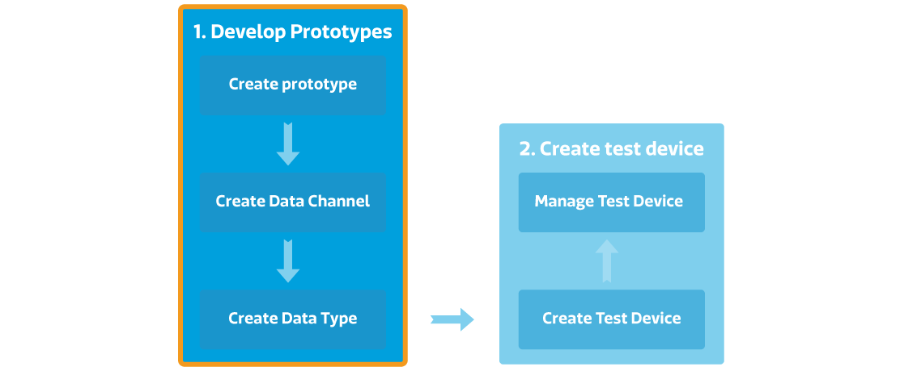
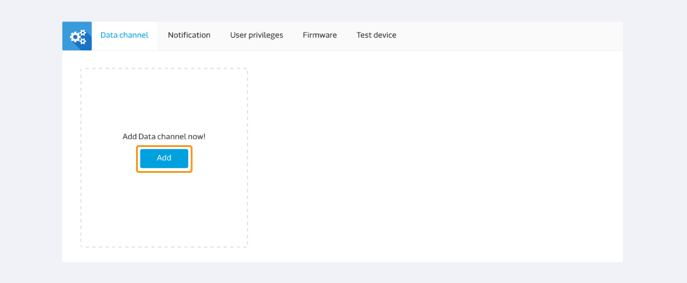
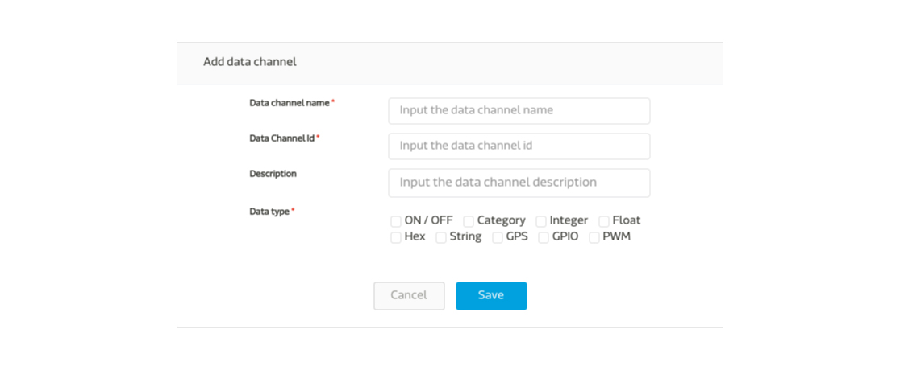
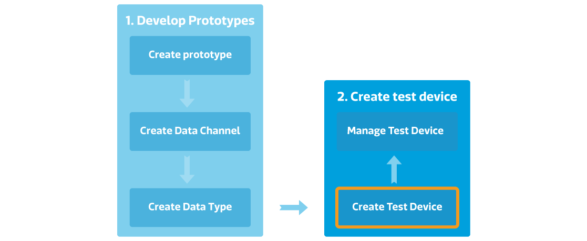
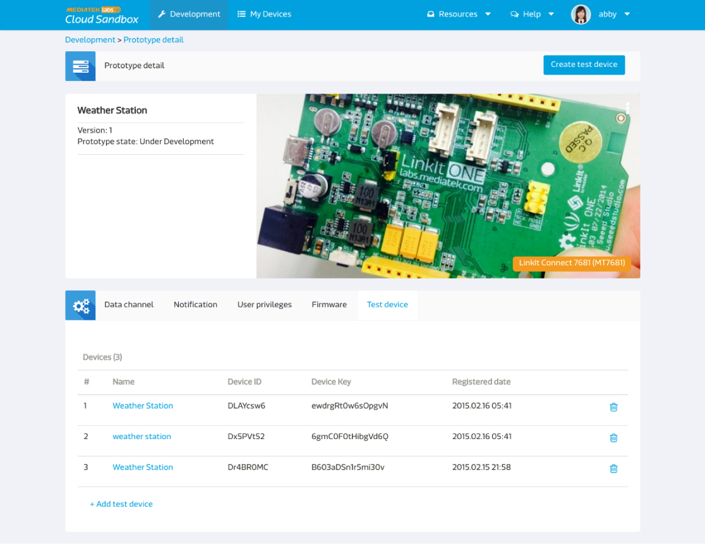
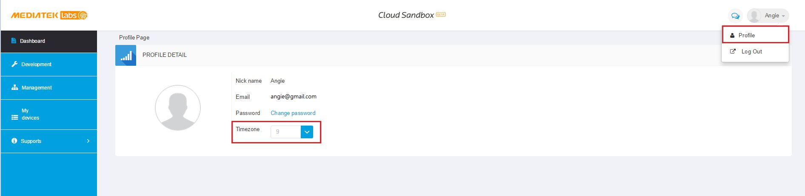

# Getting started

Here are the four steps to connect MediaTek Cloud Sandbox to your development and prototype lifecycle:

1. Develop Prototype
2. Create Test Device
3. Managing deployed test devices
4. Manage your Profile

[Develop Prototype]

The developer develop a prototype by first create a prototype in the Development console. A prototype may have several data channels which take different datapoint types.

[Create Test Device]

AFter creating a prototype, the developer can create a test device to test and control his device. The developer can also use the my device console to visually view the simulated result for his prototype or to control the devices.

[Managing deployed test devices]

The developer can monitor all the test devices under each prototype in the Development console, the developer can also view all the test device in the My device console which he has the access for.

In the future, when the prototype is release to the end user, the end user can manage and configure the device in the My device console as well to view the data, set trigger and action, and share the device to other users.

[Manage your profile]

You can always change the setting of your user profile by clicking on your name on the upper right panel, and click Profile. You can change the password for your account and change the timezone by selecting your current country. All your prototypes and test devices will use the timezone you have set here.

# Create your first protptype

## How to create a prototype step by step

Step 1. Click Development on the top menu bar.

Step 2. Click Create button to create a new prototype.

Step 3. Enter the Prototype name, version, and select chip type, industry and Click Save button. Your Prototype is created.

Step 4. Click Detail button of the prototype just created.

After your prototype is created, you can start to set the data channel, trigger and action, user privilege, create and view test devices in the prototype detail page.

Step 5. Click Add in the data channel tab.

Step 6. Select the Data Channel type. eg, Controller, Display, or Hybrid. And Click Add button.

Step 7. Enter the Data Channel name, Id, description and select Data type.

Step 8. Click Save button. And now your data channel is created. You will find the data channel Id under the data channel name. You will need this information when calling the device to retrieve data or push command to the data channel of the test device.

For more Data Channel and Data Type information and concept, please refer to the Key concept section for more detail.

# Create your first device

## How to create a test device step by step

[Prerequisites] Create your first prototype

Step 1. Go to the Prototype Detail Page you just created.

Step 2. Click Create Test Device button on the upper right.

Step 3. There will be a create test device dialog asking for Device name and description. Enter the device name and description and click OK button.

Step 4. You will get a message of creating test device successfully. You can go to the test device detail directly.

Step 5. Or you can also check the test device in **Test Device** tab too.

Please be noted that the data channels in the test device are inherited and synchronized with the prototype. If you update the data channel in the prototype, the data channels in the test device will change accordingly.

## How to get deviceId and deviceKey

After creating the test device, the developer can view and control the device to make sure its functionality before release the prototype in the future.

You will find the Device Id in two places:

1. **Test Device** tab in prototype detail page.

2. Test device detail page under My device.

The deviceId and devicekey will be needed when calling our API to access this device. In the test device detail page, click on the copy button next to the Id and key to copy to your copy board.

Also, you will also need the data channel id when access the data channel of specific test device. In the test device detail page, you can find the data channel Id under each data channel name. Once your device is connected and starting to send data. The Id field will disappear and be substituted with the last updated data point time.

# Manage test device

## How to manage deplyed test devices

The developer can manage the test devices in the Prototype detail page, or in the device detail page under My device. In the future, when the device is released, the end user can view and configure his devices in the My Device console.

### From Developer's view point

In the Development or My device page, the developer can do several configurations:

1.  View Data channel stautus
2.  Set Trigger and action
3.  Set User privileges
4.  Check Firmware information and update information
5.  Manage test device

### From End User's view point
In the future, when the prtotyp is released to the market, the end user can view and configure his device under My device by register the end user account on the MCS platform to access his devices.

The user can manage his devices by:

1.  View Data Channel stautus
2.  Set Trigger and action
3.  Set User privileges
4.  Check Firmware information and upgrade

# Manage your profile

The user can always change the setting of the user profile by clicking on his own name on the upper right panel to edit.

The user can also change your password and the time zone here.

Your device data channel time-series chart will be based on your time-zone setting.

