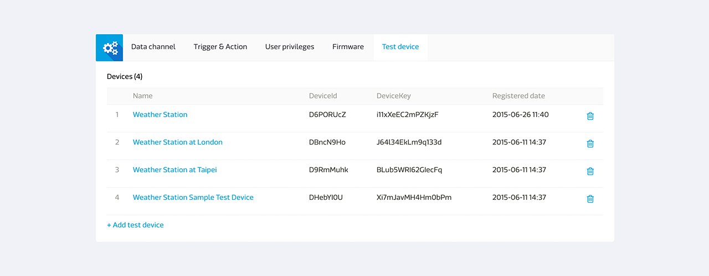

# Getting Started

The steps to connect MediaTek Cloud Sandbox to your prototype for your IoT development are as follows:

1. Develop the Prototype
2. Create the Test Device
3. Manage the Test Device
4. Beta-release & Device Management
5. Configure the User Profile

# Create Your First Prototype

You can create a new prototype in the Development console page. A prototype may have several data channels that can take different data point types.

## How To Create a Prototype Step by Step

Step 1. Click **Prototype** under **Development** on the top menu bar.

Step 2. Click **Create** button to create a new prototype.

Step 3. Enter the Prototype name, version, and select the chip type, industry and Click **Save**. Your Prototype is created.

Step 4. Click **Detail** of the prototype you've just created.

After your prototype is created, you can set the data channel, trigger and action, user privilege, and create and view test devices in the prototype detail page.

Step 5. Click Add in the data channel tab.

Step 6. Select the Data Channel type, such as Controller, Display, or Hybrid. And Click **Add**.

Step 7. Enter the Data Channel name, ID, description and select the Data type.

Step 8. Click **Save**, your data channel is created. You'll find the data channelId under the data channel name. You will need this information when calling the device to retrieve data or push command to the data channel of the test device.

For more Data Channel and Data Type information, please refer to the key concept section for details.

## How to create a prototype by importing a JSON file

In addition to ceate a prototype by your own, you can also choose to import an existing prototype that shared by other users. You can also export your prototype for other users as well.

### How to export the existing prototype

Here is the step by step guide to export he existing prototype:

Step 1. Go to the Prototype Detail Page you would like to export.

Step 2. Click More button and select **Export**.

Step 3. Save the prototype JSON file.

### How to create prototype by importing JSON file

Here is the step by step guide to import a prototype:

Step 1. Go to the Prototype list Page.

Step 2. Click **Create** prototype button.

Step 3. Select create prototype by importing JSON file.

Step 4. Paste the JSON code or upload the JSON file.

# Create Your First Test Device

After creating a prototype, you can also create a test device to perform test and control operations as wll as to view the simulated result of the prototype and to control the devices in the test device detail page.

## How to Create a Test Device Step by Step

[Prerequisites] Create Your First Prototype

Step 1. Go to the Prototype Detail Page you've just created.

Step 2. Click **Create Test Device** on the upper right.

Step 3. There will be a create test device dialog asking for the Device name and description. Enter the device name and description and click **OK**.

Step 4. You'll get a message showing test device's created successfully. You can go to the test device detail page to check information.

Step 5. Or you can check the test device in **Test Device** tab.

Please note that the data channels in the test device are inherited from and synchronized with the prototype. If you update the data channel in the prototype, the data channels in the test device will be updated accordingly. The purpose of this feature is to provide flexibility for developing and testing your prototype before it's officially released to the end user.

## How To Get eviceId and deviceKey

After creating the test device, you can view and control the device to ensure its functionality before releasing the prototype.

You will find the DeviceId in two places:

1. **Test Device** tab in the prototype detail page.

2. Test device detail page under **Development**.

The deviceId and devicekey is needed when calling MCS API to access the device. In the **Test devices**, **Detail** page, click **Copy** next to the deviceId and deviceKey to copy the information onto your copy board.

You'll also need the data channel ID when accessing the data channel of a specific test device. In the test device detail page, you can find the data channel ID under each data channel name. Once your device is connected and sending data, the data channel ID field will be replaced by the last updated data point timestamp.

# How To Manage Test Devices

You can monitor all test devices for each prototype in the **Test Device** tab in the Prototype detail page. You can also view all test devices that you have access to in the Test device page under Development.

## In Development Stage

In the Development stage, you can do several configurations to the test device, they are:

1.  View data channel status
2.  Set trigger and action
3.  Set user privileges
4.  Check firmware and update information
5.  Manage test device

To ensure flexibility in the development stage, any modification made to the prototype will be updated in the test device as well. While after the prototype is released, you can no longer make change to the prototype data channel and trigger and action rules.

## You're Half Way There

Congratulations! You've successfully finished the getting started tutorial. Please feel free to  use the tips from here and start creating your own prototype!

You can proceed to beta-releasing prototype or skip to configure your user profile.

# Beta-releasing Prototype

When your prototype is sufficiently tested and you're ready to release it to an small group of user for a trial run, you can beta-release the prototype.

For more details about beta-releasing the prototype, please find the tutorial [here](./beta-release).

# Configure User Profile

You can always change the setting of your user profile by clicking on your name on the upper right panel, and click **Profile**.

In the User Profile page, you can:

* Change the password for your account.
* Change the timezone by selecting current country. Your device data channel time-series chart will be based on your time-zone setting.
* Set preferred language and MCS will save the settings whenever you log in.
* Switch the mobile push notification on/off for MCS mobile app.
* Manage your third party OAuth authentication.

