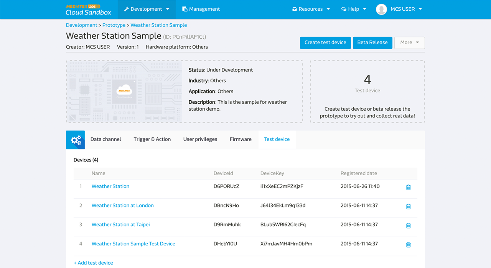

# Getting started

Here are the steps to connect MediaTek Cloud Sandbox to your development and prototype lifecycle:

1. Develop Prototype
2. Create Test Device
3. Manage Test Device
4. Beta-release & Device Management
5. Configure User Profile

# Create your first protptype

The developer develop a prototype by first create a prototype in the Development console. A prototype may have several data channels which take different data points types.

## How to create a prototype step by step

Step 1. Click Development on the top menu bar.

Step 2. Click Create button to create a new prototype.

Step 3. Enter the Prototype name, version, and select chip type, industry and Click Save button. Your Prototype is created.

Step 4. Click Detail button of the prototype just created.

After your prototype is created, you can start to set the data channel, trigger and action, user privilege, create and view test devices in the prototype detail page.

Step 5. Click Add in the data channel tab.

Step 6. Select the Data Channel type. eg, Controller, Display, or Hybrid. And Click Add button.

Step 7. Enter the Data Channel name, Id, description and select Data type.

Step 8. Click Save button. And now your data channel is created. You will find the data channel Id under the data channel name. You will need this information when calling the device to retrieve data or push command to the data channel of the test device.

For more Data Channel and Data Type information and concept, please refer to the Key concept section for more detail.

# Create your first test device

After creating a prototype, the developer can create a test device to actually test and control the device. The developer can also visually view the simulated result for his prototype or to control the devices in the test device detail page.

## How to create a test device step by step

[Prerequisites] Create your first prototype

Step 1. Go to the Prototype Detail Page you just created.

Step 2. Click Create Test Device button on the upper right.

Step 3. There will be a create test device dialog asking for Device name and description. Enter the device name and description and click OK button.

Step 4. You will get a message of creating test device successfully. You can go to the test device detail directly.

Step 5. Or you can also check the test device in **Test Device** tab too.

Please be noted that the data channels in the test device are inherited and synchronized with the prototype. If you update the data channel in the prototype, the data channels in the test device will change accordingly. The purpose for this feature is to ensure you to have the flexibility while developing and testing your prototype before officially release to the end user.

## How to get deviceId and deviceKey

After creating the test device, the developer can view and control the device to make sure its functionality before release the prototype in the future.

You will find the Device Id in two places:

1. **Test Device** tab in prototype detail page.

2. Test device detail page under Development.

The deviceId and devicekey will be needed when calling our API to access this device. In the test device detail page, click on the copy button next to the Id and key to copy to your copy board.

Also, you will also need the data channel id when access the data channel of specific test device. In the test device detail page, you can find the data channel Id under each data channel name. Once your device is connected and starting to send data. The Id field will disappear and be substituted with the last updated data points time.

# How to manage test devices

The developer can monitor all the test devices for each prototype in the Test Device tab in Prototype detail page. The developer can also view all the test device he has the access for in the Test device page.

## In developmemt stage

In the Development stage, the developer can do several configurations to the test device:

1.  View Data channel stautus
2.  Set Trigger and action
3.  Set User privileges
4.  Check Firmware information and update information
5.  Manage test device

In the development stage, to ensure the development flexibility, the test device changes with any modification made to the prototype. While after the prototype is released, the developer can no longer make change to the prototype data channel and trigger & action rules.

## Half way there

Congratulation! You have successfully finished the getting started tutorial. Use the tips here and start to create your own prototype!

You can further continue to beta-release prototype or to configure your user profile setting.

# Beta-release prototype

When your prototype is sufficiently tested and you are ready to release it to a samll group of user for trial run, you can beta-release the prototype.

For more detail about the beta-release the prototype, you can find the tutorial [here](./beta-release).

# Configure User Profile

You can always change the setting of your user profile by clicking on your name on the upper right panel, and click Profile.

In the User Profile page, you can:

* Change the password for your account.
* Change the timezone by selecting current country. Your device data channel time-series chart will be based on your time-zone setting.
* Set preferred language, and MCS will save the seeting whenever you log in.
* Turn on/off the mobile push notification for MCS mobile app.
* Manage your 3rd party oauth authentication.

