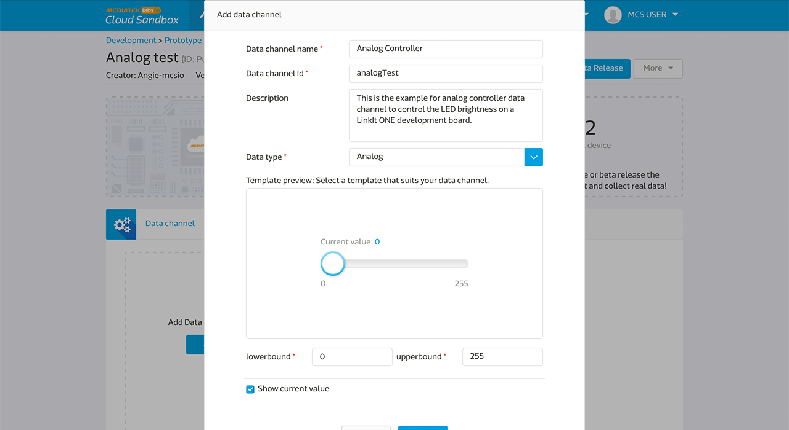
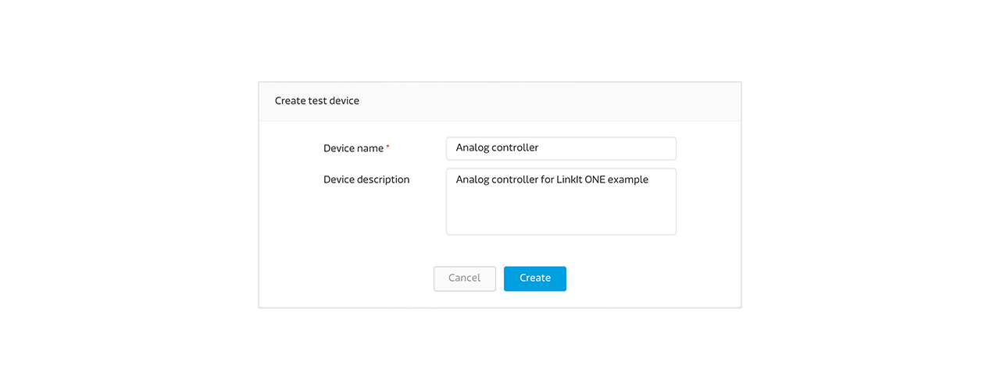
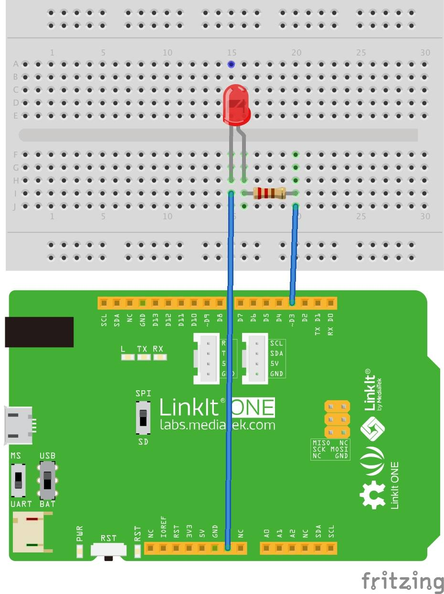
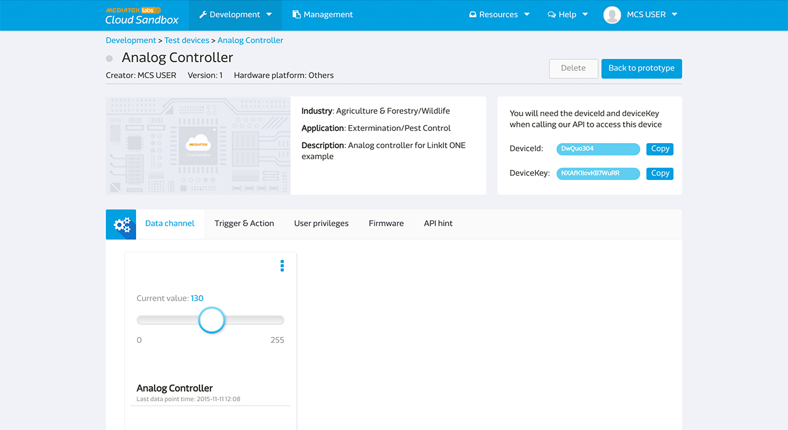

# Implementing Analog Data Channel Using LinkIt One

This example demonstrates how to use analog data channel controller on a LinkIt ONE development board.

## Scenario
The scenario for this tutorial is to create a test device on MCS representing your LinkIt ONE board, then upload an Arduino code to the board and push data points representing the brightness of a LED light (~D3 pin of the board) to MCS using a RESTful API. Lastly, use MCS to remote control the brightness of this LED light using TCP Socket.

** ~D3 is a pin name on LinkIt ONE development board. **

## Tutorial Setup Requirement:

To complete this tutorial, you'll need:

1. A battery pack to power up the development board through the onboard micro-USB connector
2. A Wi-Fi access point to connect with the development board

There's no additional electrical component required to connect the development board.

### Step 1. Create a new prototype using the analog controller type data channel
a. After signing in MCS, select **Prototype** under **Development** at the top navigation bar, click **Create** to create a new prototype.

b. Providing a basic profile for the prototype by filling in the detailed information.

c. Click **Detail** for the prototype created

d. In the prototype Detail Page, select **Data Channel** tab and click **Add** to create a new Data Channel:

In this tutorial, you'll create one **Analog** controller type data channel which will issue command to the board to control the brightness of the LED light.

e. Select **Controller** Data Channel and enter the following information:

Please take note of the Data Channel ID, this is the unique identifier used when an API is called later in the tutorial.

### Step 2. Create Test Device

a. Click **Create Test Device** on the upper right

b. Enter the name and description of the test device:

c. After the test device is created, click **Go to detail** to open the device detail page:

Please take note of the deviceId and deviceKey which will be used for an API call later in the tutorial.

### Step 3. Obtain Device ID, Device Key and Data Channel ID

Summary information obtained from interacting with this test device is shown below:

| Name | Value | Remark |
| -- | -- | -- |
| deviceId | Dsre1qRQ | Unique Identifier for this Test Device |
| deviceKey | DFbtsNWg4AuLZ30v  | Unique API Key for this Test Device |
| dataChannelId | analogTest | Data Channel Id for LED brightness |

Note 1: The deviceId and deviceKey shown may be different from yours, please use your obtained value instead.

Note 2: The deviceId is case sensitive.

### Step 4. Code the development board
The program flow logics are as follows:

a. Call RESTful API:
GET api.mediatek.com/mcs/v2/devices/{deviceId}/connections.csv
To obtain the response value for Socket Server IP and Port

b. Initiate TCP connection to the socket server

c. Upload ~D3 pin (LED) status to MCS once every 5 seconds using the RESTful API:
POST api.mediatek.com/mcs/v2/devices/{deviceId}/datapoints.csv

**Please note when using analog and PWM typea of data channel, you need to use the pins on LinkIt ONE board that starts with "~". For example, the ~D3 pin from this tutorial.**

d. Listen for analog commands issued by MCS through a TCP connection

e. Refresh heartbeat for TCP connection every 90 seconds

For the sample Arduino C source code please click [here](https://raw.githubusercontent.com/Mediatek-Cloud/MCS/master/source_code/AnalogLinkItOneSample)

**Please note:
This source code requires HttpClient that can be downloaded from
[here](https://github.com/amcewen/HttpClient/releases)**

f. Connect your LinkIt ONE development board to a circuit board with the following settings:

### Step 5. Turn on the board and see it in action

Please ensure that the code is loaded to the board and the Wi-Fi AP is online and connected to the board by checking the Serial output message confirmation:

You’re now ready to control the LED brightness. Go to the device page and switch the controller to 255, the LED will turn on to its brightest state. If you turn the controller to 100, the LED will still on but won't be as bright as 255. And if you switch the controller to 0, the LED is off.

Congratulations! You have completed this tutorial.

