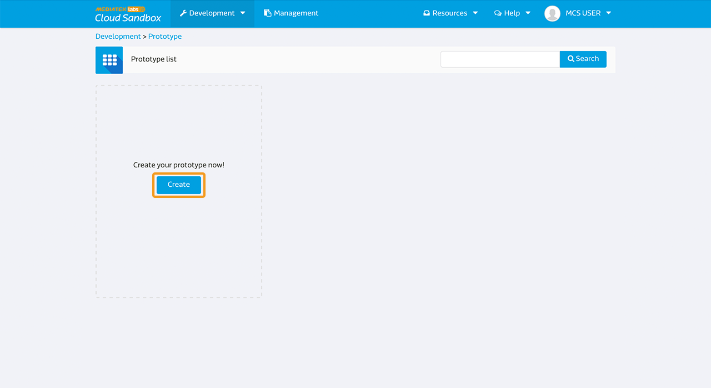
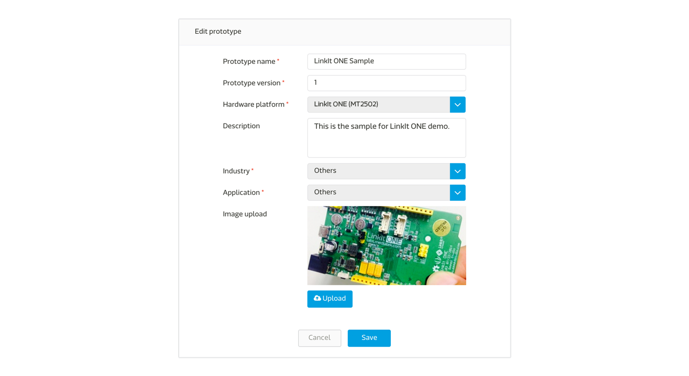
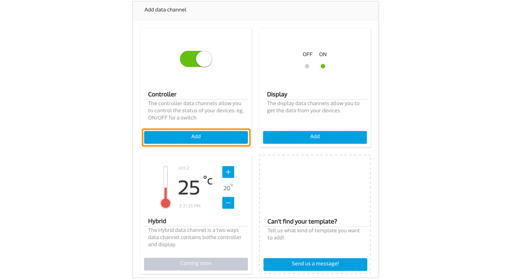
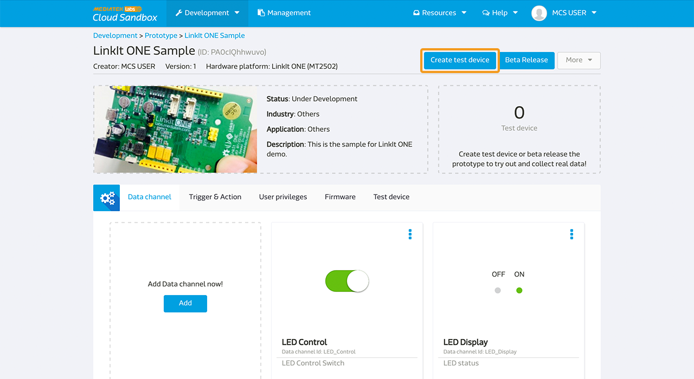

# Implementing analog using LinkIt One

Here is a simple example demonstrating how to use analog data channel controller on a LinkIt ONE development board.

## Scenario
The scenario for this setup is to create a test device on MCS representiong your Linkit ONE board, and to upload Arduino code allowing this board to push data points representing the brightness of LED light at ~D3 to MCS using RESTful API, while MCS is able to remote control the brightness of this LED light using TCP Socket.

## Setup requirement:

To complete this test setup, you will need:

1. Battery Pack to power up the micro-USB of the development board
2. A Wifi access point made available to the development board

There is no additional electrical component required to connect to the development board.

### Step 1. Create a new prototype with analog controller type data channel
a. After login, select "Prototype" under Development at the navigator bar, click "Create" to create a new prototype.

b. Fill in the detail information as per screen to give a basic profile of this prototype:

c. Click "Detail" for the prototype created

d. In the prototype Detail Page, select "Data Channel" TAB and click "Add" to create new Data Channel:

We are going to create one **Analog** controller type data channel for this tutorial which will issues command to the board to control the brightness of the LED light.

e. Select "Controller" Data Channel and key in the following information

Please take note of the Data Channel Id, this is the unique identifier when calling API later in the tutorial.

### Step 2. Create Test Device

a. Click "Create Test Device" on the right upper corner of the page

b. Fill in the name and description of the test device:

c. After Test device is created, click "Go to detail" to open the created device detail page:

Please take note of the deviceId and deviceKey for calling API later in the tutorial.

### Step 3. Obtain Device ID, Device Key, Data Channel ID
Here is the summary of the neccessary information we have obtained in interacting with this test device:

| Name | Value | Remark |
| -- | -- | -- |
| deviceId | Dsre1qRQ | Unique Identifier for this Test Device |
| deviceKey | DFbtsNWg4AuLZ30v  | Unique API Key for this Test Device |
| dataChannelId | analogTest | Data Channel Id for LED brightness |

Note 1: The deviceId and deviceKey shown here will be differet to yours, please use your obtained value instead.

Note 2: The deviceId is case sensitive.

### Step 4. Code the development board
The program flow logics are as follows:

a. Calls RESTful API:
GET api.mediatek.com/mcs/v2/devices/{deviceId}/connections.csv
To obtain the response value for Socket Server IP and Port

b. Initiate TCP connection to the socket server

c. Uploads ~D3 (LED) status to MCS by RESTful API once every 5 seconds:
POST api.mediatek.com/mcs/v2/devices/{deviceId}/datapoints.csv

**Please noted when using analog and PWM type of data channel, you have to use the pins on LinkIt ONE board that start with ~. For exmape, the ~D3 pin we are demonstrating in this example.**

d. listens for analog commands issued by MCS via TCP connection

e. refreshes heartbeat for TCP connection every 90 seconds

Sample Arduino C source code please click [here](https://gist.github.com/iamblue/a66502c817f1124bbb26#file-analog-ino-L28)

Please note:
This source code requires HttpClient that can be download
[here](https://github.com/amcewen/HttpClient/releases)

f. Connect your LinkIt ONE development board with a circuit board with the following setting:

### Step 5. Turn on the board and see it in action!

After the code is loaded to the board and make sure Wireless Access Point is made available to the device, with the Serial output confirming it is live and connected:

You can now goto the device page and be able to control the LED brightness, as you turn the controller to 255, the LED will turn on to its brightest state. If you turn the controller to 100, the LED is still on but not as bright as 255. And if you turn the controller to 0, the LED is off.

Congratulations! You have completed this tutorial!

