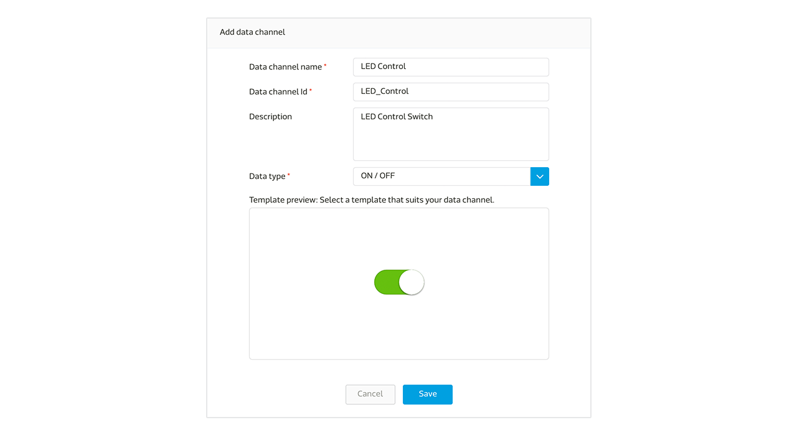

# Develop with Linkit ONE

This guide provides instruction to help you setup your LinkIt ONE development board (Aster 2502) and connect it to MediaTek Cloud Sandbox.

## Scenario

The scenario for this tutorial is to create a test device on MCS representing your LinkIt ONE board, then upload an Arduino code to the board and push data points representing the brightness of a LED light  (D13 pin of the board) to MCS using a RESTful API. Lastly, use MCS to remote control the brightness of the LED light using a TCP Socket.

**D13 is a pin name on LinkIt ONE development board.**

## Setup requirement:

To complete this tutorial, you'll need:

1. A battery Pack to power up the development board through the onboard micro-USB connector
2. A Wi-Fi access point to connect with the development board

There is no additional electrical component required to connect to the development board.

### Step 1. Create a new Prototype using the switch type data channel

a. After signing in MSC, select **Prototype** under **Development** at the top navigation bar, click **Create** to create a new prototype.

b. Provide a basic profile for the prototype by filling in the detailed information.

c. Click **Detail** for the prototype created

d. In the **Detail** page under **Prototype**, select **Data Channel** tab and click **Add** to create a new Data Channel:

In this tutorial, you'll create two Data Channels. First one is a Display Data Channel to reflect the status of the LED light on the board; second one is a Controller Data Channel  to switch the LED light by issuing commands to the board:

e. Select **Display** Data Channel and enter in the following information:

Please take note of the Data Channel ID, this is the unique identifier used for an API that’s called later in the tutorial.

f. Repeat steps e to create the **Controller** Data Channel and enter in the following information:

Please take note of the Data Channel ID, this is the unique identifier used for an API that’s called later in the tutorial.

g. After completing the above steps , you'll see two data channels created as shown below:

### Step 2. Create Test Device

a. Click **Create Test Device** on the upper right

b. Enter the name and description of the test device:

c. After Test device is created, click **Go to detail** to open the device detail page:

Please take note of the deviceId and devicekey which will be used for an API call later in the tutorial.

### Step 3. Obtain deviceId, deviceKey, Data Channel ID
Summary information obtained from interacting with this test device is shown below:

| Name | Value | Remark |
| -- | -- | -- |
| deviceId | Dsre1qRQ | Unique Identifier for this Test Device |
| deviceKey | DFbtsNWg4AuLZ30v  | Unique API Key for this Test Device |
| dataChannelId | LED_ Display| Data Channel Id for LED status |
| dataChannelId | LED_Control | Data Channel Id for LED control |

Note 1: The deviceId and deviceKey shown may be different from yours, please use your obtained value instead.

Note 2: The deviceId is case sensitive.

### Step 4. Code the development board
The program flow logics are as follows:

a. Call RESTful API:
GET api.mediatek.com/mcs/v2/devices/{deviceId}/connections.csv
To obtain the response value for Socket Server IP and Port

b. Initiate TCP connection to the socket server

c. Upload D13 pin (LED) status to MCS once every 5 seconds using the RESTful API:
POST api.mediatek.com/mcs/v2/devices/{deviceId}/datapoints.csv

d. Listen for switch commands issued through MCS via TCP connection

e. Refreshe heartbeat for TCP connection every 90 seconds

For the sample Arduino C source code please click  [here](https://raw.githubusercontent.com/Mediatek-Cloud/MCS/master/source_code/linkit_sample_ino.ino)

Please note:
This source code requires HttpClient that can be download from
[here](https://github.com/amcewen/HttpClient/releases)

### Step 5. Switch the controller and see the LED in action

Please ensure that the code is loaded to the board and the Wi-Fi AP is online and connected to the board by checking the Serial output message confirmation:

You’re now ready to control the LED. Go to the device page and switch the controller by clicking the **ON** state, the LED on the development board will switch on, and a few seconds later, the display type LED data channel will indicate an ON state. Next, click the  **OFF** state, the LED will switch off, and the display type LED data channel state will indicate an OFF state.

Congratulations! You have completed this tutorial.

