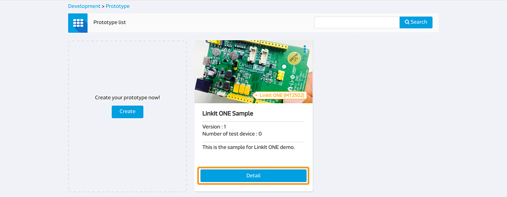
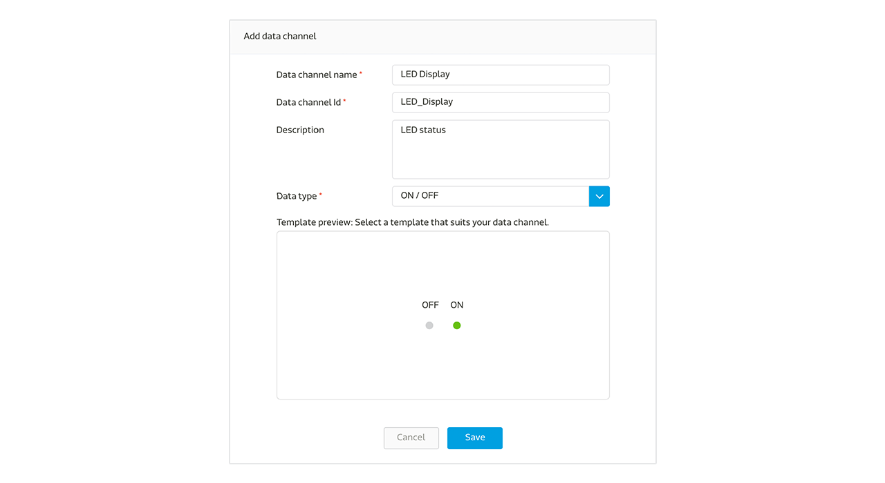

# Develop with Linkit ONE

Here is a simple guide to quickly setup your Linkit ONE development board (Aster 2502) to quickly connect to MediaTek Cloud Sandbox

## Scenario
The scenario for this setup is to create a test device on MCS representiong your Linkit ONE board, and to upload Arduino code allowing this board to push data points representing the state of LED light at D13 to MCS using RESTful API, while MCS is able to remote control the state of this LED light using TCP Socket.

## Setup requirement:

To complete this test setup, you will need:

1. Battery Pack to power up the micro-USB of the development board
2. A Wifi access point made available to the development board

There is no additional electrical component required to connect to the development board.

### Step 1. Create a new Prototype with Switch-Type data channel

a. After login, select "Development" at the navigation bar, click "Create" to create a new prototype

b. Fill in the detail information as per screen to give a basic profile of this prototype:

c. Click "Detail" for the prototype created

d. In the prototype Detail Page, select "Data Channel" TAB and click "Add" to create new Data Channel:

We are going to create two Data Channel for this tutorial, one is a Display Data Channel to reflect the status of the LED light on the board; one is a Controller Data Channel that issues command to the board to switch the LED light:

e. Select "Display" Data Channel and key in the following information

Please take note of the Data Channel Id, this is the unique identifier when calling API later in the tutorial.

f. Repeat the same step in e, except select "Controller" Data Channel and key in the following information

Please take note of the Data Channel Id, this is the unique identifier when calling API later in the tutorial.

g. Once completed, you should be able to see two data channel created as below:

### Step 2. Create Test Device

a. Click "Create Test Device" on the right upper corner of the page

b. Fill in the name and description of the test device:

c. After Test device is created, click "Go to detail" to open the created device detail page:

Please take note of the deviceId and deviceKey for calling API later in the tutorial.

### Step 3. Obtain Device ID, Device Key, Data Channel ID
Here is the summary of the neccessary information we have obtained in interacting with this test device:

| Name | Value | Remark |
| -- | -- | -- |
| deviceId | Dsre1qRQ | Unique Identifier for this Test Device |
| deviceKey | DFbtsNWg4AuLZ30v  | Unique API Key for this Test Device |
| dataChannelId | LED_ Display| Data Channel Id for LED status |
| dataChannelId | LED_Control | Data Channel Id for LED control |

Note 1: The deviceId and deviceKey shown here will be differet to yours, please use your obtained value instead.

Note 2: The deviceId are case sensitive.

### Step 4. Code the development board
The program flow logics are as follows:

a. Calls RESTful API:
GET api.mediatek.com/mcs/v2/devices/{deviceId}/connections.csv
To obtain the response value for Socket Server IP and Port

b. Initiate TCP connection to the socket server

c. Uploads D13 (LED) status to MCS by RESTful API once every 5 seconds:
POST api.mediatek.com/mcs/v2/devices/{deviceId}/datapoints.csv

d. listens for switching commands issued by MCS via TCP connection

e. refreshes heartbeat for TCP connection every 90 seconds

Sample Arduino C source code please click [here](https://raw.githubusercontent.com/Mediatek-Cloud/MCS/master/source_code/linkit_sample_ino.ino)

Please note:
This source code requires HttpClient that can be download
[here](https://github.com/amcewen/HttpClient/releases)

### Step 5. Turn on the board and see it in action!

After the code is loaded to the board and make sure Wireless Access Point is made available to the device, with the Serial output confirming it is live and connected:

You can now goto the device page and be able to click the LED controller, as you click the LED to ON state, the LED on the development board will lid, and moments later the state of the LED data channel will indicate an ON state. As you click the LED to OFF state, the LED on the board will not lid, and moments later the state of the LED data channel will indicate an OFF state.

Congratulations! You have completed this tutorial!

