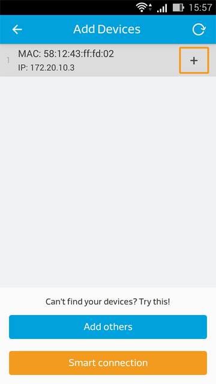
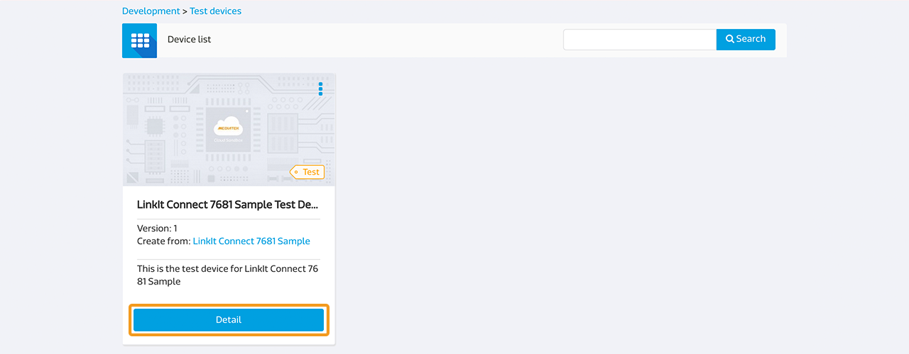
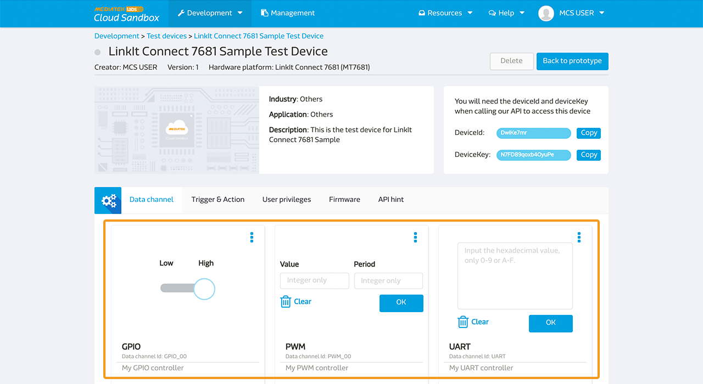

# Develop with the LinkIt Connect 7681 Development Board

This guide provides instructions on setting up your LinkIt Connect 7681 development board and connecting it to MediaTek Cloud Sandbox (MCS).

## Scenario

The scenario is to connect your LinkIt Connect 7681 development board to MCS and receive remote control commands from the MCS console or a mobile app.

## Setup Requirements

To complete this tutorial, you’ll need:

1. A USB power source that’s connected to the development board
2. A Wi-Fi connection that’s available to the development board
3. A MCS mobile app. It’s currently available for Android. Please scan the QR code below to download the APK:


No additional components need to be connected to the development board.

**(Please note that due to system upgrade for enhanced security, you need to update the firmware of your LinkIt Connect 7681 devices to the latest version. Detailed update steps are listed in **[7681 Firmware Update Instruction](../7681_firmware_update/)**)**

## MT7681 controllers list and their corresponding MCS data channel IDs

The MT7681 chipset provides 5 GPIO pins that can implement PWM and 1 UART port. Below is a list of the pins and their corresponding data channel IDs used on MCS.

|  | GPIO | PWM | UART |
| --- | --- | --- | --- |
| 00 | GPIO_00 | PWM_00 | UART |
| 01 | GPIO_01 | PWM_01 |
| 02 | GPIO_02 | PWM_02 |
| 03 | GPIO_03 | PWM_03 |
| 04 | GPIO_04 | PWM_04 |


## Step-by-step

### Step 1. Create a LinkIt Connect 7681 Prototype with GPIO, PWM and UART data channels

a. In the menu navigator, click **Development**.

b. In the **Prototype List** panel, click **Create**, to create a new prototype.


c. Enter a prototype name, version and select your industry. In the **Hardware platform** dropdown box, select **LinkIt Connect 7681 (MT7681)** and click **Save**. Your Prototype is created.


d. Now add GPIO controllers to your prototype. Below is the list of the prototype you created, click **Detail**.


e. In **Data channel** tab, click **Add**.


f. To add a controller, in the **Add Data Channel** popup under the **Controller** panel, click **Add**.


g. For MT7681 prototypes, the Data Channel IDs follow a defined format, such as GPIO_nn, where nn is the pin number starting from 00. Create the channel for the first pin, using GPIO_00. Enter the data channel name (GPIO 00), ID (GPIO_00) and add a description, then select **GPIO** as the data type. Click **Save** to finish creating the Data Channel.


h. To add more GPIO pin controllers, repeat steps e, f, and g using the appropriate data channel ID for each pin (GPIO_01 to GPIO_04).


i. Now add the PWM controllers. Repeat steps e and f to open the **Add Data Channel** popup. Enter PWM_00 as the data channel ID and in **Data type** select **PWM**. Click **Save** to create the Data Channel.


j. To add more PWM controllers, repeat step i using the appropriate data channel ID for each pin (PMW_01 to PMW_04).

k. Another data channel type that MT7681 prototypes support is UART. To add a UART data channel, open the **Add Data Channel** window as described in step e and create a new Controller as described in step f. Enter UART in the **Data Channel ID** and in the **Data type** select **String** or **Hex** depending on your needs. Click **Save** to create the Data Channel.


You’ve created all the controller Data Channel types that LinkIt Connect 7681 prototypes support. Please continue to step 2.


### Step 2. Connect your Development Board to Wi-Fi
a. Open the MCS mobile app, sign in with your account and select the prototype you created in step 1.

b. After signing in, on the bottom right of the screen, click the **Add** icon.


c. At the bottom of the screen, click **Smart Connection**. This provides an implementation of MediaTek Smart Connection, for more details see the MediaTek LinkIt Connect 7681 Developer’s Guide.


d. Enter the SSID and password of the Wi-Fi AP and click **Start**. The SSID should be automatically populated with the Wi-Fi access points the smartphone is connected to.


e. Wait for a few seconds, if Smart Connection is implemented successfully, you should see your device on the list.

Click **Cancel** to exit the add Smart Connection window. 

Now you can either choose to register the device using the MCS mobile app (step 3A) or to create a test device using the web console and complete registration. (step 3B).


### Step 3A. Register a LinkIt Connect 7681 device from the MCS mobile app

a. Open the MCS mobile app and sign in. After signing in, on the bottom right of the screen, click the **Add** icon.


b. If your device’s Wi-Fi settings were provisioned by Smart Connection, it should be on the list. Click the **+** icon to add the device you'd like to register.



c. A list of prototypes will display on the screen after you’ve added the device. Select the prototype you'd like to link with the device you just added and click **Next**.


d. Enter the device name and description and click **Save**.


After the device’s registered, the device list will refresh and you should be able to see it as well as the data channel you've created.


### Step 3B. Create a test device using the web console

a. In the MCS web console top navigation bar, click **Development** and then **Prototype** and **Detail** (as in Step 1) you'd like to register a device for.


b. On the top right of the page, click **Create Test Device**.


c. Enter the **Device name** and **Device description** you like and click **Create** button. A pop-up will display after your test device is successfully created. Click **Go to detail** button.


d. You should be able to find the deviceId and deviceKey of the test device you've just created.


e. Now you need to manually flash the deviceId and deviceKey into MT7681. Open a terminal that is connected to the development board and enter the following command:

```
AT#FLASH -s0x180e9 -c[deviceId]
```

Then enter the following command to flash the deviceKey:

```
AT#FLASH -s0x180f1 -c[deviceKey]
```

Then enter the following commands to set the status to activated:

```
AT#FLASH -s0x18101 –v1
AT#FLASH -s0x18102 –v0
```

Your device should now be automatically connected to MCS.

### Step 4A Control your device from the a mobile app

a. Open the MCS mobile app and sign in. Click on the device you'd like to control.


b. You’ll see a list of controllers that were added in step 1. For example, switch a GPIO controller from high to low: the LED on the development board should turn on. **Please note that when GPIO is set to high, the LED is turned off; when the GPIO is set to low, the LED is turned on**.


### Step 4B Control your device from the MCS web console

a. On the top navigation bar click **Test devices** under **Development**, then click **Details** on the device panel you've just created and registered.



b. Now you can see the device’s data channels and control its states using the MCS platform. To change the state of a particular data channel, drag the channel’s control bar. For example, switch a GPIO controller from low to high: the LED on the development board should turn on.




