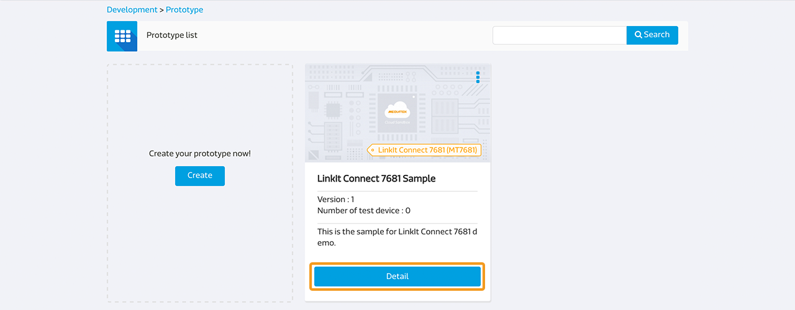
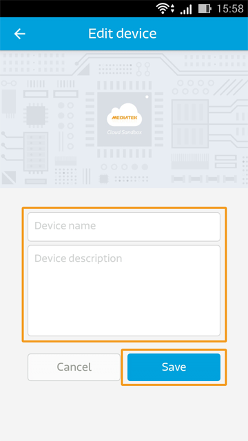
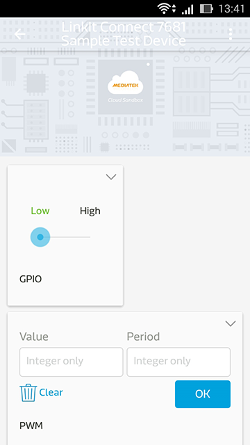

# Develop with LinkIt Connect 7681 development board

This is a guide to setting up your LinkIt Connect 7681 development board to connect to MediaTek Cloud Sandbox (MCS).

## Scenario
The scenario for this setup is to enable your LinkIt Connect 7681 development board to connect to MCS and receive remote control commands from the MCS console or mobile app.


## Setup requirements

To complete this setup tutorial, you’ll need:

1. USB power source connected to the development board
2. A Wi-Fi connection available to the development board
3. MCS mobile app. It’s currently available for Android. Please scan the QR code below to download the APK:


No additional components need to be connected to the development board.

**(Please be noted that due to system upgrade to enhance security, you have to update the firmware of your 7681 devices to the latest version. Detailed update steps are listed in **[7681 Firmware Update Instruction](../7681_firmware_update/)**)**

## MT7681 controllers list and their corresponding MCS data channel IDs
The MT7681 chipset provides 5 GPIO pins that can implement PWM and 1 UART port. Below is a list of the pins and their corresponding data channel IDs to use on MCS.

|  | GPIO | PWM | UART |
| -- | -- | -- | -- |
| 00 | GPIO_00 | PWM_00 | UART |
| 01 | GPIO_01 | PWM_01 |
| 02 | GPIO_02 | PWM_02 |
| 03 | GPIO_03 | PWM_03 |
| 04 | GPIO_04 | PWM_04 |


## Step-by-step

### Step 1. Create a LinkIt Connect 7681 Prototype with GPIO, PWM and UART data channels.

You can create by finish Step 1 or [import from json](http://cdn.mediatek.com/tutorial/LinkIt_7681/LinkIt_7681_EN.json). If you import the prototype from json, you can skip Step 1 and start from Step 2.

a. On the upper navigator, click **Development**.

b. In the **Prototype List**, click **Create**, to create a new prototype.


c. Enter the prototype name, prototype version, and select your industry. In the **Hardware Platform** dropdown box select **MT7681** and click **Save**. Your Prototype is created.


d. Now you're going to add GPIO controllers to your prototype. Below the listing of the prototype you created, click **Detail** .




e. In **Data channel**, click **Add**.


f. To add a controller, in the **Add Data Channel** popup under the **Controller** data channel, click **Add**.


g. For MT7681 prototypes, the Data Channel Ids follow a defined format — GPIO_nn, where nn is the pin number starting from 00. Create the channel for the first pin, using "GPIO_00". Enter the data channel name ("GPIO 00"), Id ("GPIO_00") and add a description, then select **GPIO** as the data type. Click **Save** to create the Data Channel.


h. Now add the PWM controllers. Repeat Step e and f to open the **Add Data Channel** popup. Enter "PWM_00" as the data channel Id and in **Data Channel Type** select **PWM**. Click **Save** to create the Data Channel.


i. Another data channel type that MT7681 prototypes support is UART. To add a UART data channel, open the **Add Data Channel** popup as described in Step e and create a new Controller as described in step f. Enter the Data Channel Id as "UART" and in the **Data Channel type** select **String** or **Hex** depending on your needs. Click **Save** to create the Data Channel.


You’ve created all the controller Data Channel types that LinkIt Connect 7681 prototypes support. Please continue to Step 2.


### Step 2. Connect your development board to Wi-Fi
a. Open the MCS mobile app, sign in with your account and select the prototype you created in step 1.

b. After signing in, on the bottom right of the screen tap the add icon.


c. At the bottom of the screen, click **Smart Connection**. This provides an implementation of MediaTek Smart Connection, for more details see the MediaTek LinkIt Connect 7681 Developer’s Guide.


d. Enter the SSID and password of the Wi-Fi AP and click **Start**. The SSID should be automatically populated with the Wi-Fi access points the smartphone is connected to.


e. Wait for a few seconds, if Smart Connection was successfully, you should see your device on the list.

Tap **Cancel** to exit the add Smart Connection pop-up.

Now you can choose to register the device using the MCS mobile app (Step 3A) or to create a test device using the web console to complete registration. (Step 3B).


### Step 3A. Register a LinkIt Connect 7681 device from the MCS mobile app

a. Open the MCS mobile app and sign in. After signing in, on the bottom right of the screen, tap the add icon.


b. If your device’s Wi-Fi settings were provisioned by Smart Connection successfully, it should be shown on the list. You can see the device you'd like to rgister, tap the plus icon to add.


c. A list of prototypes will be shown on the screen after you add the device. Select the prototype you'd like to link with the device you just connected and tap **Next** button.


d. Enter the device name and description and tap **Save**.




After the device has registered, the device list will refresh and your device should now be on the list and the data channel you've created.


### Step 3B. Create a test device using the web console
a. In the MCS web console, in the navigation bar on the top, click **Development** and then click on the **Detail** button of the prototype (the one you created in Step 1) that you'd like to register a device for.


b. To the top right of the page, click **Create Test Device**.


c. Enter the **device name** and **description** you like and click **OK** button. A pop-up will display after your test device has been successfully created. Click **Go to detail** button.


d. You should be able to find the deviceId and deviceKey of the test device you just created.


e. Now you have to manually flash the id and key into MT7681. Open a terminal that is connected to the development board and enter the following command:

```
AT#FLASH -s0x180e9 -c[deviceId]
```
Then enter the following command to flash the deviceKey:
```
AT#FLASH -s0x180f1 -c[deviceKey]
```
Then enter the following commands to set the status to activated:
```
AT#FLASH -s0x18101 –v1
AT#FLASH -s0x18102 –v0
```
Your device should now be automatically connected to MCS.

### Step 4A Control your device from the mobile app

a. Open the MCS mobile app and sign in. Tap on the device you'd like to control.


b. You’ll see a list of controllers that were added in step 1. Switch a GPIO controller from high to low: the LED on development board should turn on. **Please note that when GPIO is set to high, the LED is turned off; when the GPIO is set to low, the LED is turned on**.



### Step 4B Control your device from the MCS web console

a. On the navigation bar click **Test devices** under Development, then below the device that has just been created and registered click **Details**.


b. Now you can see the device’s data channels and control their states using the MCS platform. To change the state for a particular data channel, drag that channel’s control bar. Switch a GPIO controller from high to low: the LED on development board should turn on.


