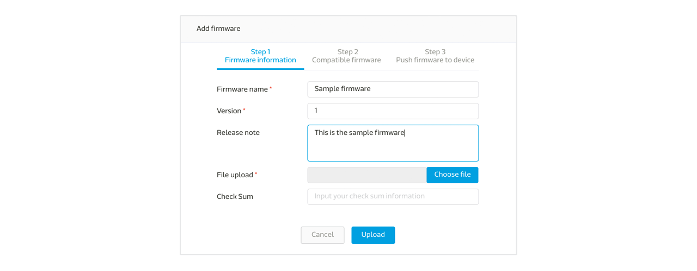
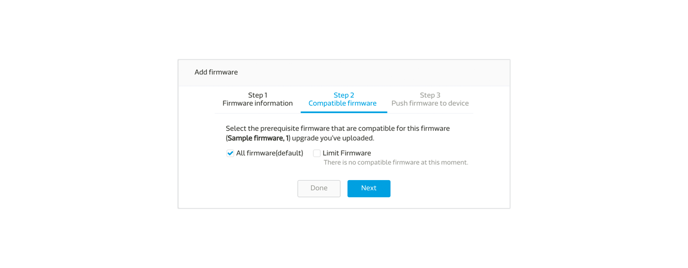
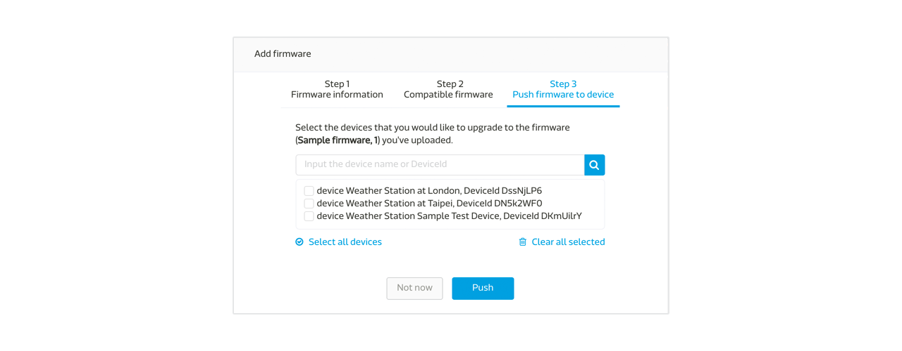
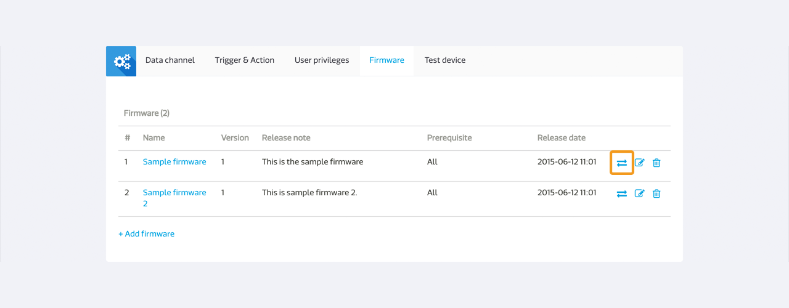
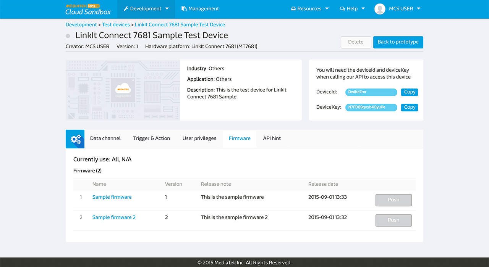

# Managing Firmware

MediaTek Clous Sandbox(MCS) enables the user to manage the firmware and provides firmware Over-The-Air (FOTA) update to the device.

## Uploading Firmware to Prototype

To use the Firmware service, go to the **Firmware tab** in the **Prototype detail** page.

Click **Add firmware** to first upload a new firmware,

Enter the Firmware name, version, and select a firmware file to upload and click the Upload button.

Next, select the compatible firmware of the fimrware you just uploaded.

Choose the prerequisite firmware that are compatible for this firmware you've uploaded.

The default option is all firmware selected or you can specify your own selection by click on the limited firmware. Only the firmware listed in the prerequisite list can be upgraded using the firmware you've uploaded.

If you do not want to further proceed to directly pushing the firmware upgrade to test devices, you can stop here by clikc on the Done button, or to click on the Next button to push the firmware to devices.

After selecting the devices you would like to upgrade, click the Push botton. You can also do this step by click on the first icon next to the firmware.

## Upgrading Firmware for Device

The user can also upgrade the firmware of a device in the **Device detail** page. In the Device detail page, click on the **firmware tab**, and you will see the current using firmware and the firmware that the device can be upgraded to.

Please be noted that the **Push** button will only be clickable when the device is connected. You can also tell the connection status of the device by the light signal in front of the device name. If the light is green, the device is connected; and if the light is grey, the device is offline.

Click on the **Push** button next to the firmware that you want the device to be upgraded to.

Please be noted, in the MCS platform, we only send the firmware upgrade information to the device, we do not handle the firmware upgrade in the device. Please code your device to receive the information and perform the download and upgrade. The MCS command server will pass the information in the following format to the device after clicking the Push button:

**deviceId, deviceKey, timestamp, FOTA, version, MD5, URL**

* deviceId: the deviceId of the device
* deviceKey: the deviceKey of the device
* timestamp: the timestamp when the firmware is pushed
* FOTA: a string
* version: the version of the firmware being passed
* MD5: the MD5 of the firmware being passed
* URL: the download url of the firmware being passed

Also, for 7681 device, we handle the upgradeprocess in the device, and you do not have to do any other coding. Just be noted that you have to set the firmware version properly. 7681 device can only upgrade to firmware with higher version.

## Calling APIs to report and download firmware from MCS

MCS provides various firmware APIs for you to report current firmware version of device, retrieve all available firmware for device, and to get the firmware information you would like to upgrade to. However, to use those function, you have to code those APIs in your device.

For the device to report its firmware version to the MCS platform, please use the **report device firmware** API [here](https://mcs.mediatek.com/resources/latest/api_references/) and code it in the device. Once the device starts to report its firmware version to MCS, it will be shown in the device firmware tab.

If you do not want to do the upgrade via the MCS platform, You can also use the **retrieve device available firmware** API [here](https://mcs.mediatek.com/resources/latest/api_references/) to get all the available firmware for the device.

After you retrieve the available firmware list, and you've decided which firmware you would like to upgrade to, you can use the **retrieve firmware URL** API [here](https://mcs.mediatek.com/resources/latest/api_references/) to get the download location of the firmware you'd like to upgrade to.

