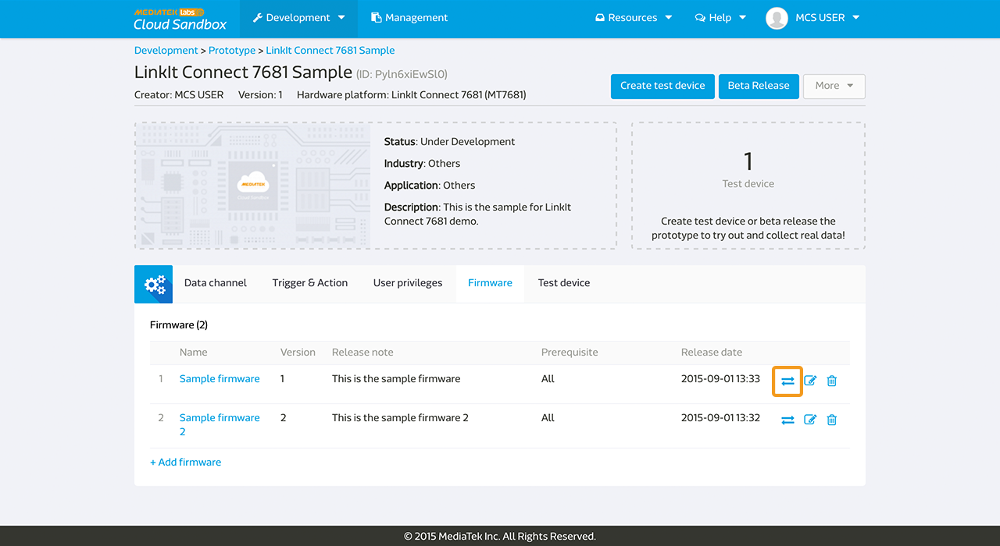

# Managing Firmware

MediaTek Clous Sandbox(MCS) enables you to manage the device firmware and supports Firmware Over-The-Air (FOTA) for upgrade.

MCS provides firmware repository services for prototypes and their test devices. The services provide basic firmware upload and download with version control, a web management console for firmware management as well as APIs that enable test devices to retrieve compatible firmware from MCS.

MCS does not handle the device firmware upgrade operation, you need to code the device or call the firmware APIs available from your development board's SDK.

## Uploading Firmware to the Prototype

To use the Firmware service, go to the **Firmware** tab in the **Prototype detail** page.

Click **Add firmware** to upload a new firmware,

Enter the Firmware name and version, select a firmware file and click **Upload**.

Next, select a firmware that's compatible with the firmware you've just uploaded.

Choose the prerequisite firmware that's compatible with the firmware you've uploaded.

The default option is **All firmware** or you can specify your own selection by clicking on the limited firmware. Only the firmware listed in the prerequisite can be upgraded using the firmware you've uploaded.

If you don't want to proceed to push the firmware to the test device, you can stop by clicking **Done**. Otherwise, click **Next** to push the firmware to the device.

After selecting the devices you'd like to upgrade, click **Push**. You can also do this by clicking on the first icon next to the firmware.

## Upgrading Firmware for Devices

You can also upgrade the firmware from the **Device detail** page. In the Device detail page, click on the **firmware** tab, and you will see the current firmware used and the available firmware that the device can use for upgrade.

Please note that the **Push** button will only be available when the device is connected. You can see the connection status of the device from the light signal in front of the device name. If the light is green, the device is connected; and if the light is grey, the device is offline.

Click **Push** button next to the firmware you want to use for device upgrade. After the upgrade process finishes, you will see a success message as shown below.

Please note, in the MCS platform, firmware upgrade information is sent to a device, howeverm the firmware upgrade process is not handled. Please create code for your device in order to receive the information and perform firmware download and upgrade.

The MCS command server will pass the code information to the device in the following format after clicking **Push**:

**deviceId, deviceKey, timestamp, FOTA, version, MD5, URL**

* deviceId: the deviceId of the device
* deviceKey: the deviceKey of the device
* timestamp: the timestamp when the firmware is pushed
* FOTA: a string
* version: the version of the firmware being passed
* MD5: the MD5 of the firmware being passed
* URL: the download URL of the firmware being passed

Or if you are using the MQTT to connect the device, the MCS MQTT Broker will pass the code information to the device in the following format after clicking **Push**:

**timestamp, FOTA, version, MD5, URL**

* timestamp: the timestamp when the firmware is pushed
* FOTA: a string
* version: the version of the firmware being passed
* MD5: the MD5 of the firmware being passed
* URL: the download URL of the firmware being passed

Also, for devices based on LinkIt Connect 7681, the firmware upgrade process is handled by MCS, and you do not need to do any additional coding. However, you need to set a unique firmware version due to device limitation related to LinkIt Connect 7681, which is that it can only upgrade to a firmware with higher version.

## Calling APIs to Report and Download Firmware from MCS

MCS provides various firmware APIs to report current firmware version of the device, to  retrieve all available firmware for device, as well as to get the firmware information you would like to use for upgrade. However, to use the APIs, you need to code them into your device.

For a device to report its firmware version to the MCS platform, please use the **Report device firmware** API [here](https://mcs.mediatek.com/resources/latest/api_references/) and code it into the device. Once the device reports its firmware version to MCS, the information will be shown in the device firmware tab.

If you don't want to do the firmware upgrade through the MCS platform, you can use the **Retrieve device available firmware** API [here](https://mcs.mediatek.com/resources/latest/api_references/) to get all the available firmware for the device.

After you've retrieved the available firmware list and you've decided on the firmware version for upgrade, use the **Retrieve firmware URL** API [here](https://mcs.mediatek.com/resources/latest/api_references/) to get the download location of the firmware.

