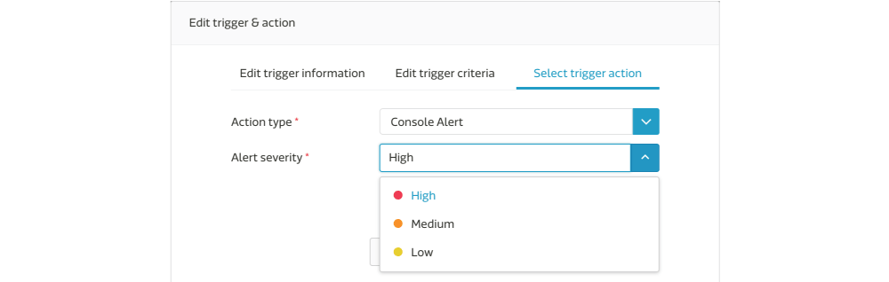
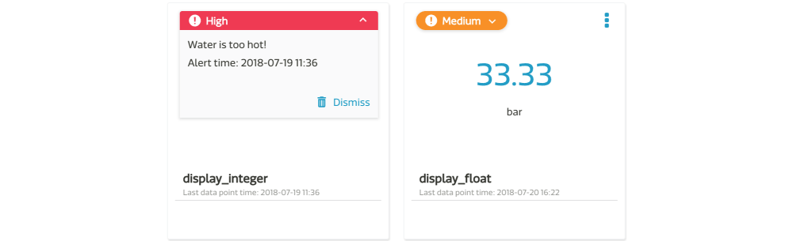
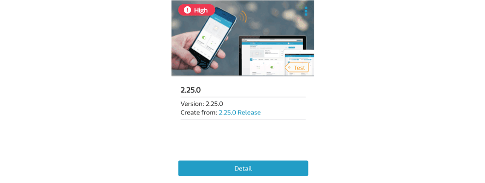

# Trigger & Action

The Trigger & Action feature is used when you would like to get a notification while the value of a data channel meets certain criteria.

You can set trigger rules on the following data channels

1. ON/OFF
2. Category
3. String
4. Hex
5. Integer
6. Float

and choose one of the following conditions to apply on that data channel

1. Greater than
2. Lower than
3. Equal to
4. Between
5. OnChange

The conditions which must be met before the trigger action executes and there are 4 trigger actions provided.

1. Email

	Users with access privilege to this device can receive the Email notification, including device owner, administrator and viewer.

2. Mobile Push

	Users with MediaTek Cloud Sandbox App installed on his mobile can receive the push notification.

3. Webhook

	MCS makes an HTTP request to the callback URL that user provided.

4. Console Alert

	When that trigger occurs, there is an alert message on web console directly.

## Defining a trigger & action

You can set **Trigger & Action rules** for a **prototype** and the rules will be applied to each device under this prototype. In addition, you can edit the **value in condition** at **device** level afterward.

Here are the steps:

1. In the **Prototype** detail page, click the **Trigger & Action** tab -> **Add trigger & action**.

	

2. Provide the necessary information in the **Add trigger & action** dialog.

	Step 1: The **trigger name** will display in the **console alert** when it is triggered.
	

	Step 2: The match condition is **AND** if there are multiple criteria set. That means you have to upload these data points **in one payload** and all of them match the conditions.
	

	Step 3: At least one action need to be selected. We will explain more about each action later.
	

The device inherits all the trigger & action rules from its prototype. However, you can still change the value of the trigger criteria and enable or disable trigger & action rules for a device.

Please note, only data points uploaded by the device (with **deviceKey in HTTP header** or via **MQTT**) can trigger the action. The action will NOT be triggered by the UI operation on the web console.

## More about Trigger Actions
### Configuring the Mobile Push

If you have multiple mobile devices, you can choose which mobile devices can receive the mobile push notification. You can find the setting in two places:

1. In the **User Profile** page, you can switch on or off **all the mobile push** to a mobile device.
2. In the **Test Device** page, you can switch on or off all **mobile push for a test device** to a mobile device.

In your **User Profile** page, there is a mobile list that includes all your mobile devices with MCS App installed. You can use the **Switch** to control which mobile device can receive mobile push from MCS.

In the **Trigger & Action** tab in the test device page, expand the **Manage your action** section and there is a mobile list that includes all your mobile devices with MCS App installed. You can use the **Switch** here to control which mobile devices can receive the mobile push for this test device.

### Configuring the Webhook

The webhook action allows you to compose a custom HTTP request to send to a server.

To use webhook trigger, you only need select the **webhook** as the action type in the trigger & action setting and then specify the server **URL**, **request method**, **HTTP headers** and **HTTP body**. You can use the pre-defined variables in URL, value of HTTP header and Body fields.

There is a Send webhook button for you to test if this HTTP request is able to sent to the destination along with the correct settings.

### Configuring the Console Alert

You have to specify the severity level while configuring console alert in Trigger & Action.

When that trigger occurs, the console alert with severity information will show on the web console immediately. It is displayed on the following page.

1. Data Channel Card

	You can expand the alert message bar to see more information, including **trigger name** and **alert time**. In this case, a data was uploaded on "2018-07-19 11:36" and triggered a rule named "Water is too hot".

	After you click **Dismiss**, this alert will be cleared. You won't see this alert until the new data is uploaded and the trigger rule is matched.

	

2. Test Device List

	It always displays the alert with **highest severity** right this moment.

	Take the previous case for example. You will see "High" alert on the card, if "High" alert is dismissed, and then it shows "Medium" alert instead.

	

3. Scene

	The presentation logic is the same as Device List.

	

## Use variables in notification message

MCS provides pre-defined variables which can be used in both Title and Content fileds. These variables will be replaced with real values when the action is triggered. The pre-defined variables include:

* **${deviceId}**: The ID of device
* **${deviceName}**: The name of device
* **${value}**: The value of this data channel

For example:

You can set Email content as

	The temperature of ${deviceName} is now ${value}.

The message delivered to users will be replaced with real value, like

	The temperature of My Living Room is now 30.

