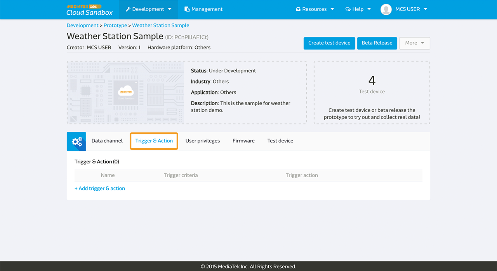
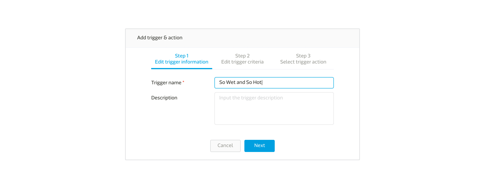
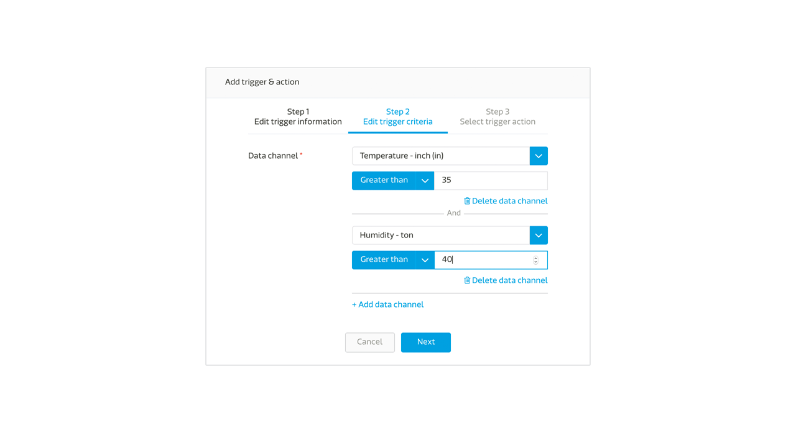
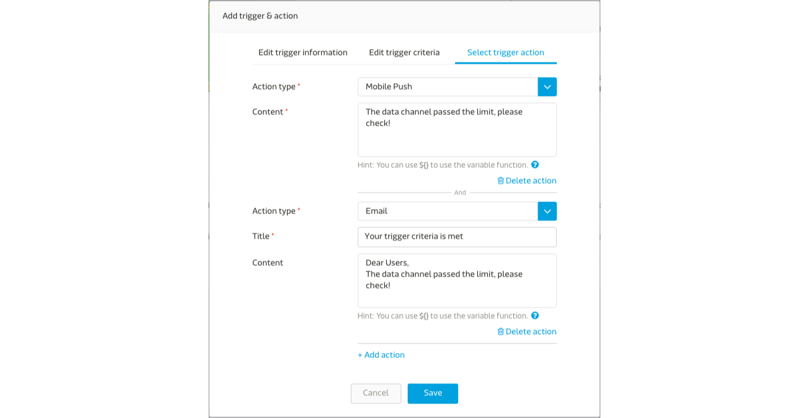
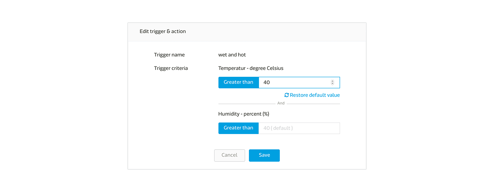
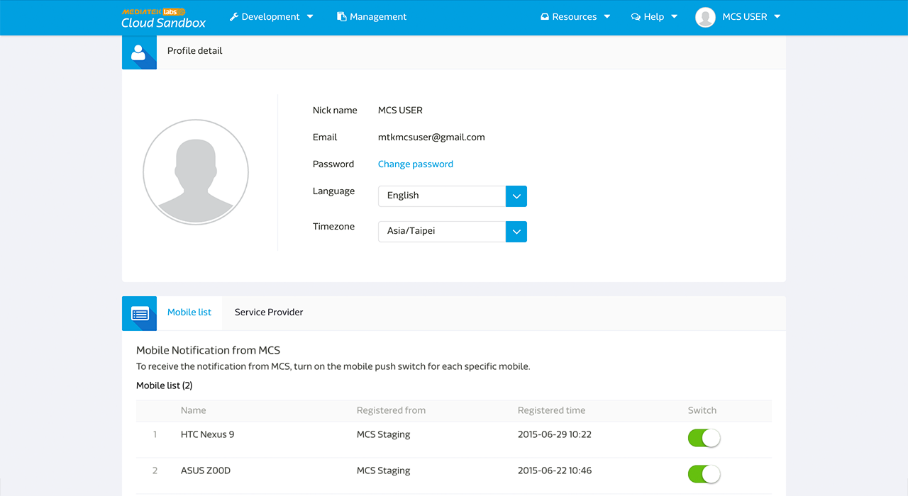
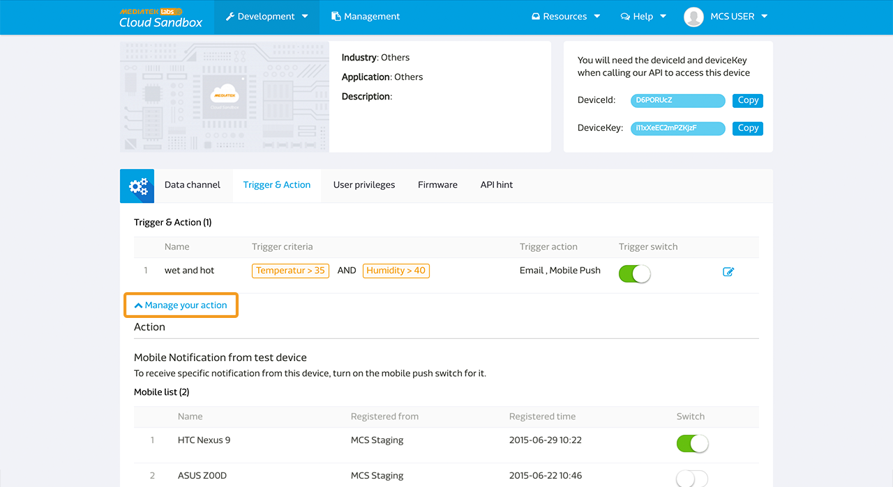
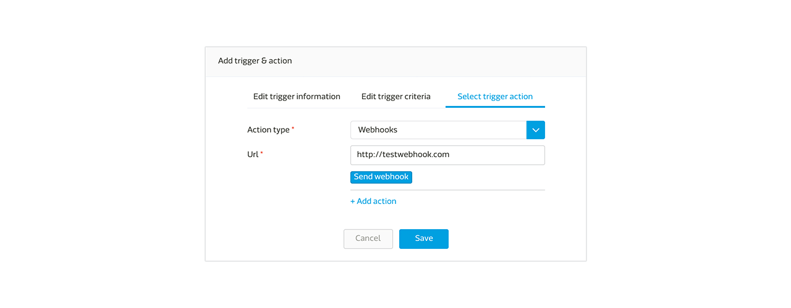
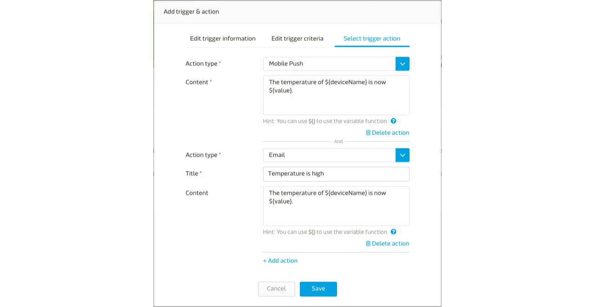

# Using Trigger and Action

## How to add trigger and action

You can set the trigger and action value for a data channel. When the value passes the limit of the defined range, you will get an email or a Mobile Push notification based on the trigger and action settings. In addition, MCS supports webhook trigger, you can input the URL that you would like to recieve this trigger.

Please note that MCS only supports trigger and action for integer and float data channel types at the time of writing. Also, only data points uploaded by the device (data points uploaded with deviceKey) will trigger the action. The data points uploaded by user (via web using authentication) will not be triggered.

In the **Prototype** detail page, click the **Trigger & action** tab.

Click **Add trigger & action** to enter the trigger name and description.

Then click **Next** to set the trigger criteria by selecting the data channel you would like to set alert for and enter the value. The rules include greater than, lower then, equal to, and between.

If there are more than one data channel rules in the trigger criteria, all data channel rules need to be satisfied in order to trigger the action('AND' logic). You can create separate trigger and action rules to use the 'OR' logic.

Click **Next** to select the trigger action. You can select to get email or Mobile Push notification when the trigger criteria are met. The email and Mobile Push notification will be sent to anyone with the access to the test device.

Furthermore, you are allowed to use MCS pre-defined variables in **Title** and **Content** fileds to capture the real value when the action was triggered. You can find more detail under this page.

The test device will inherit all the trigger and action from its parent prototype. In a test device, you can only change the value of the trigger criteria or select to switch on or off a specific trigger and action.

## Setting trigger and action for different mobile devices

If you have multiple mobile devices, MCS allows you to set which mobile devices will receive the mobile push notification. You can find the setting in two places:

1. In the **User Profile** page, you can switch on or off all the notification from MCS to a specific mobile device.
2. In the **Test device** page, you can switch on or off all notification from a specific test device to a specific mobile device.

In the **User Profile** page, you can see a mobile list that includes all user's mobile devices with MCS app installed. You can use the **Swith** to control which mobile device will receive notifications from MCS.

In the **Trigger & action** tab in the test device page, expand the **Manage your action** section and you will see a list of all user's mobile devices with MCS app installed. You can use the **switch** here to control which specific mobile device will receive the notification from this test device.

# Set up a webhook trigger

To set up a webhook trigger, you have to select the **webhook** as the action in the Trigger & action tab in the prototype. And input the url that you would like to get the webhook trigger.

There is a Test button for you to test if the trigger has been sent to the url. The device name, deviceId and the triggered value will be sent to the triggered url.

# Use variables in notification message

MCS provides pre-defined variables which can be used in both Title and Content fileds. These variables will be replaced with real values when the action is triggered. The pre-defined variables include:

* **${deviceId}**: The ID of device
* **${deviceName}**: The name of device
* **${value}**: The value of this data channel

For example:

You can set Email content as

	The temperature of ${deviceName} is now ${value}.

The message delivered to users will be replaced with real value, like

	The temperature of My Living Room is now 30.

