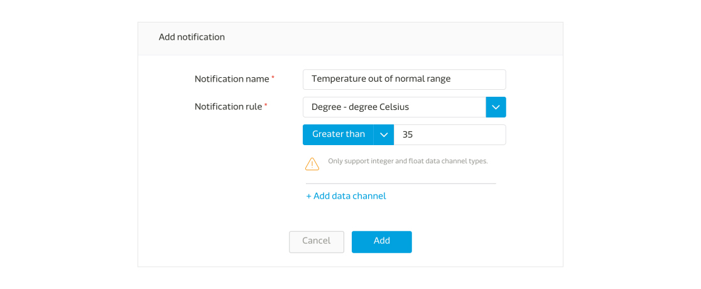
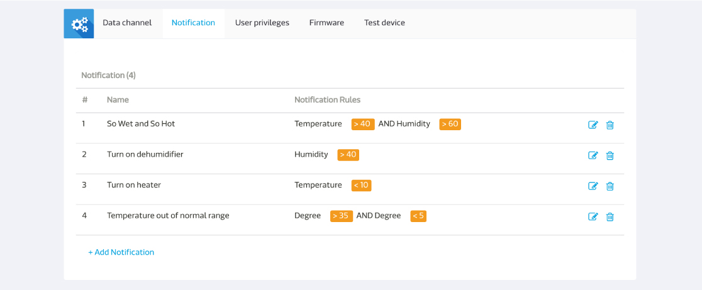

# Using trigger and action

The user can set the trigger and action for a data channel when its value passes the limit of the defined range. The user will get email notification or the GCM notification based on the trigger and action setting. Please be noted that MCS currently only support trigger and action for integer and float data channel types.

On the Prototype detail page, click on the **Trigger & action** tab.

Click on the **Trigger & action** to see the popup dialog to enter the trigger name and description.

Then click Next button to set the trigger criteria by selecting the data channel you would like to set alert for and give the value. The rules include greater than, lower then, equal to, and between.

To have more than one data channel rules in trigger criteria, all data channel rules need to be satisfied to trigger the action(AND logic). The user can create separate trigger and action rules to have the OR loigic.

Click Next button to select the trigger action. You can select to get email or GCM notification when your trigger criteria is met. The email and GCM notification will be sent to anyone who has the access to the test device.

The test device will inherit all the trigger and action from its parent prototype. In the test device, user can only change the value of the trigger criteria or select to turn on or turn off specific trigger and action.

