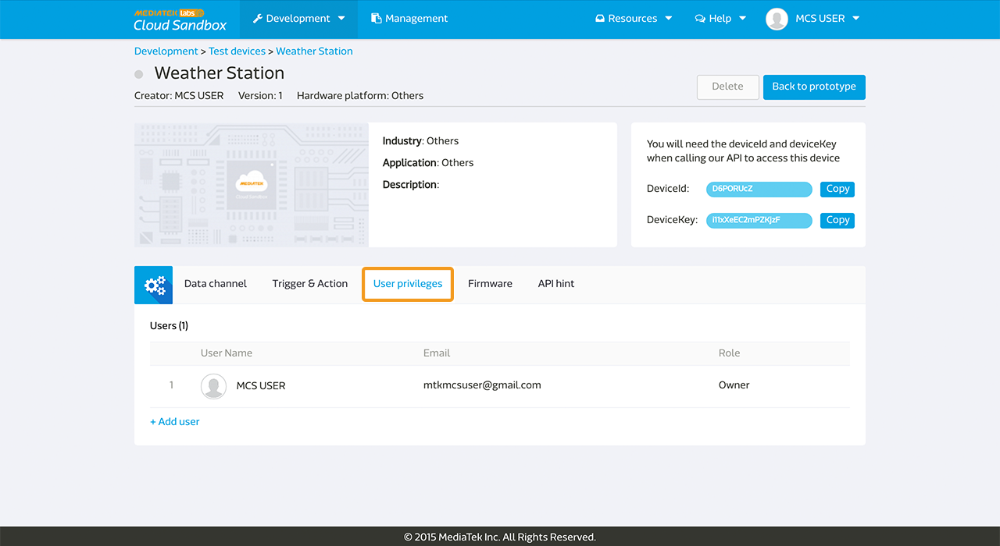

# Setting user privilege

MediaTek Cloud Sandbox(MCS) allows the user to configure the access level for different prototypes and test devices. The user can find this setting in the **User Privivlege** tab in the Prototype detail or the Device detail pages.

MCS provides three roles:

1. The **owner**, with the access to add, update, read, and delete a prototype, test device, and released device.
2. The **administrator**, with the accesss right to add, update, and read a prototype or a test device.
2. The **viewer**, with only the access right to view a prototype or a test device.

## Prototype and device

As a prototype or device owner, or an administrator, you can add other registed MCS user to access the prototype or the test device by click on the privilege tab in the **Prototype** or **Device** detail pages.

Click Add user to add other MCS registered user to access the prototype.

Enter the user email and select the rols as administrator or viewer, and click Save button.

Please be noted that the test device will not inherit the user privilege setting from its parent prototype. Only the owner or the administrator of the prototype can create a test device for the prototype. The user who create the test device will be the owner of the test device. The test device owner can then modify the user privilege of the test device separately from the parent prototype.

## Beta-release and management

MCS locks the user role to the **prototype owner** to beta-release the prototype. And after beta-release, only the prototype owner can create device with serial number and able to see and manage the released devices in the Management page.

The prototype administrator and viewer cannot beta-release the prototype neither to create device for it. However, the prototype administrator can still create test device for the beta-released prototype.

