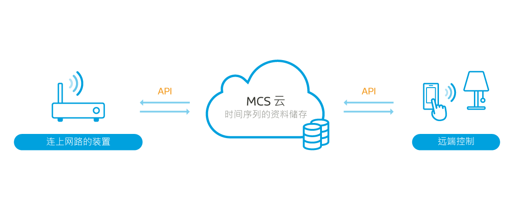
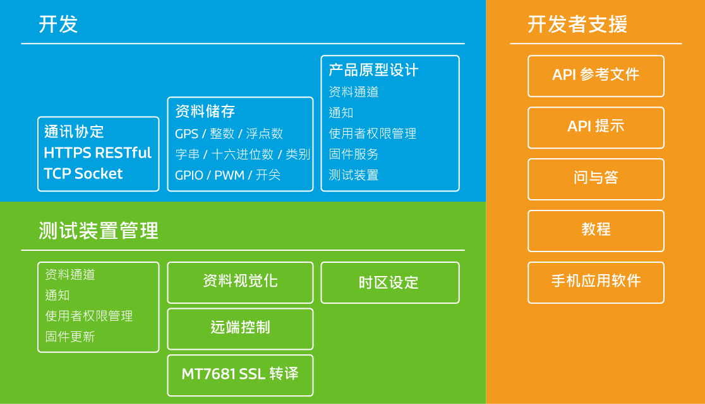

# **MediaTek Cloud Sandbox 介紹**

MediaTek Cloud Sandbox(MCS) 提供您打造准备商转前的穿戴式和物联网装置所需要的数据和装置管理服务。它支持您专心的开发产品原型，不必烦恼建立一套自己的云端基础设施。
您可以在我们提供的强大的网页仪表板介面上，看到使用我们提供的RESTful API从装置搜集回来的图形化的资料。之后，您可以通过从仪表板发出命令控制您的穿带式和物联网装置。此外，我们提供附属的手机应用程式让您能查看收集到的数据，并从任何地方控制您的装置。

您可以在我们提供的强大的网页仪表板介面上，看到使用我们提供的RESTful API从装置搜集回来的图形化的资料。之后，您可以通过从仪表板发出命令控制您的穿带式和物联网装置。此外，我们提供附属的手机应用程式让您能查看收集到的数据，并从任何地方控制您的装置。

以下是您可以透过MediaTek Cloud Sandbox做的事情:

- 定义专属于您的穿带式和物联网产品原型以及个人化装置。
- 随时在装置和MCS平台间推播各式数据点，例如GPS资料点，温度，或是湿度。
- 远端控制您的装置。
- 图形化的资料点介面。
- 当资料点超过特定触发条件预设范围时，执行动作。
- 管理所有的装置。
- 使用附属的手机应用程式远端控制装置。
- 建立产品原型，装置，和搜集来的资料报表。
- 空中（Over the air）硬件更新。
- 使用者权限管理。

为了让您更通行无阻的使用MCS，我们提供了API，API使用说明文件，问与答，和一系列的教成让您能够快速上手我们所提供的功能和服务。

## **事前准备**
要使用MediaTek Cloud Sandbox，您必须先：
1. [注册成为MediaTek Labs使用者] (http://labs.mediatek.com/dpRegister/create)
2. [登入MediaTek Cloud Sandbox] (http://mcs.mediatek.com/v2console)
3. 取得装置的DeviceId (API Key)来做API呼叫使用
