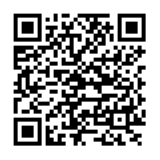

# 问与答

**1. 如果没收到帐号激活邮件，我该怎么做?**

若您注册后没有收到帐号激活邮件，请您先检查是否在垃圾邮件匣内。若不在，您可至 MCS 平台登入，并要求重新寄发激活邮件。

**2. 哪些装置可以和 MCS 平台相连?**

几乎任何具有互联网连接功能的设备都可以连接到 MCS ，装置须能够支持 RESTful 或 TCP Socket。

**3. 我能在 MCS 平台上做什么呢?**

您可以使用 MCS 开发者平台和 RESTful API 来快速开发您的产品原型，并连接装置来实现您的应用。

**4. 我该如何上手?**

我们提供的详细步骤和图示的教程获协助您快速开发您的第一个产品原型。您亦可点击画面右上方资源内的教程。

**5. 我能分享我的产品原型或是装置给其他使用者吗?**

您可以在开发或是我的装置页面中的使用者权限分页来设定您要赋予权限的使用者。若使用者只需读取资料，您可以赋予浏览者权限；若使用者需要控制装置状态或是变更设定，您则可赋予系统管理者权限。

**6.我能变更资料显示时区吗?**

系统目前会侦测您的所在地时区。您亦可点击画面又上方的使用者配置页面来更改您想要显示的时区。

**7. 我要去哪里下载手机应用程式呢? **

若您是使用MCS 全球版本，请点击此连结 [here](https://play.google.com/store/apps/details?id=com.mediatek.iotcloud) 或用此 QR code 来下载手机应用程式:

若您是使用 MCS 中国版本，请点击此连结[here](https://s3.cn-north-1.amazonaws.com.cn/mtk.linkit/mcs-latest-production-release.apk) 直接下载手机应用程式。

目前只支援安卓（Android）手机。

**8. 我已经有了 MediaTek Labs 帐号了，是否能用此帐号登入 MCS 平台呢? **

是的，您可以不须注册，直接在登入页面点击"使用 MediaTek Labs 帐号登入"来登入 MCS 平台。

**9. MCS 支援哪些浏览器?**

我们建议您可以使用 Chrome, Firefox, 或是 Safari 来浏览 MCS 网站。

**问与答的内容没有您想要问的问题吗? 您可以直接写信和我们联络。若您使用 MCS 全球网站，请寄信至<mtkcloudsandbox@mediatek.com>；若您使用 MCS 中国网站，请寄信至<mcs_cn.mail@mediatek.com>。 **
