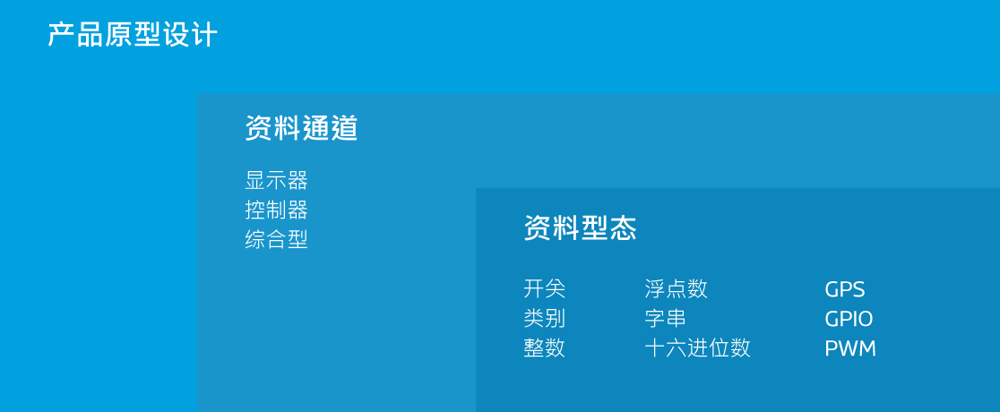
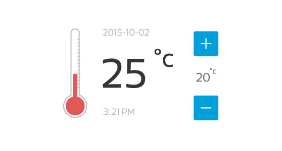

# 核心慨念

在这个章节，我们将介绍有关于 MediaTek Cloud Sandbox  的一些基本概念，帮助您打造您的穿戴式和物联网装置。您可以在 MCS 的**开发**页面，操作所有关于产品原型的开发的功能和服务。此外，您亦可在 MCS 的**管理**页面，看到所以您建立的或是有授权使用的装置。此外，使用者可以在**仪表板**中查看关于他在此平台内的重点资讯，例如快速上手指南、概观、以及使用率。

# 仪表板

每当使用者登入MCS 平台时，将会直接被导引至仪表板页面。在仪表板页面中，使用者可以查看以下资讯：

* **快速上手指南** 使用者能利用此指南快速熟悉MCS 平台。
* **概观** 使用者可以再次查看最新更新的产品原型和测试装置。
* **使用率** 使用者能在此查看平台使用率。
* **资源快速连结** 提供最常用的资源连结。
* **最近的活动** 显示相关的产品原型或测试装置动态。

# 开发

在开发页面中，您可以建立一个或是多个的产品原型，并且为您的产品原型建立多个测试装置来和您的实体装置连结。每个产品原型内含有以下内容：

- **资料通道**，您可以替每个资料通道选择一种资料型态类型来传输。
- **触发条件和动作**，当装置状态改变到达预设时，执行动作。
- **使用者权限管理**，您可以管理您个别的产品原型和装置的使用者权限，让其他使用者能共同开发或浏览。
- **固件管理**，您可以管理您产品原型的所有固件，并决定是否更新至个别装置。
- **测试装置**，您可以将测试装置和实体装置连结，来实现您的产品原型设计。

当您开发完产品原型后，就可以开始建立测试装置与您的实体装置连结了。

## 产品原型

**产品原型**是您开发装置的蓝图。每个产品原型都具有独特的 Id 和 Key。

### 资料通道

一个**资料通道**代表:
- 由 MCS 所储存的由装置的感应元件搜集而来的资料
- 或是透过 MCS 传送给装置的指令

这些资料通道可以分为以下几类：
- 显示器
- 控制器
- 综合型显示控制器

### 资料通道类别

#### 显示器

此类型的资料通道是专门储存和显示由装置的感应元件搜集而来的资料。例如从装置感应元件上传而来的温度，MCS 会将此资料以时间序列方式储存。

#### 控制器

此类型的资料通道是专门用来传递指令至装置，以控制装置内元件的状态。例如控制灯的开或关。

#### 综合型显示控制器

此类型的资料型态能同时为显示器和控制器。例如冷气机的温度显示器，并且同时能控制冷气的开关或是调整温度。

### 资料型态

MCS 提供了以下多种资料通道，以供使用者操作远程设备或显示其资料点。

- **开/关**— 此类型的资料型态用来表示装置的两种状态，使用者能选择开启或是关闭装置的状态。例如　一盏灯的开或关。

- **类别**— 此类型的资料型态能用来表示一个任意的类别。您能定义任何您想要的类别和此类别相对的内容。例如您能用来储存星期，月份，或是风扇的状态（关、慢速、中速、高速）。

- **整数**— 此类型的资料型态能用来表示任意的整数，例如某一个使用者一天走了多少步的数值。

- **浮点数**— 此类型的资料型态能用来表示任意的浮点数，例如气温。

- **字串**— 此类型的资料型态用来表示字串，例如装置回传的讯息。

- **十六进位数**— 此类型的资料型态用来表示十六进位数值，例如 LED 灯的显示颜色。

- **GPS** — 此类型的资料型态用来表示地理位置，包含经度、纬度、和高度。

- **GPIO** — 此类型的资料型态用来表示GPIO的数位讯号。例如在 Pin 4 位置为 High 的讯号状态。

- **PWM** — 此类型的资料型态用来表示传递到GPIO的PWM数位讯号, 例如在 Pin 3 位置的 level 15 讯号。

- **类比** — 此类型的资料型态所代表的是一个整数，其数值的区间需由使用者自行定义。类比控制器适合需要微调或是比例控制等应用，像是音量控制器。

- **游戏控制器** — 这是一个专为控制方向设计的资料通道，此操作面板上有四个方向按钮。您可以藉由此操作面板快速的操作机器人或遥控车等设备。

- **图片** — 此资料通道主要用来显示图片。上传的图片皆会以 PNG 格式储存。

- **视频流** — 此资料通道可播放视频串流的应用，像是家庭监控影像系统。

### 触发条件和动作

此功能可让您定义触发电子邮件或基于云的通报标准，您身为装置的拥有者，除了会无条件的收到通知外，还能透过设定使用者权限来使其他使用者也收到相同的通知。

触发器可用于以下情况:

- 当某一个资料通道回传的资料超过或是低于预设值，将会触发通知条件，并且通知有权限的使用者。同时，资料值能然会被保存。

- 当控制器型态的资料通道的值被改变时，执行触发动作。

### 使用者权限管理

此功能让您能够给予其他 MCS 用户各种访问产品原型或是测试装置的权限，如查看或是更改产品原型设置或是创建一个新的测试装置。

### 固件服务

使用此功能，您可以上传并管理特定产品原型的固件。每当一个测试装置被新增时，MCS 都会从原产品型中检测能够兼容的固件，并提供用户通过空中更新设备固件的服务。

## 测试装置

此功能使您能够从产品原型的详细信息页面中建立测试装置。您创建的每个装置都会有一个 **DeviceId ** 和 **DeviceKey** ，此讯息当您在呼叫 MCS 所提供的 API 时将会需要用到。您亦可于***测试裝置**頁面中查看装置的 DeviceId 以及 DeviceKey 等详细信息。

在正式发布您的产品原型前，您可建立测试装置来测试您的产品原型。需要注意的是，测试装置内的资料通道和触发条件，将会随着产品原型的变更儿跟着改变。您可以随时使用测试装置来测试您开发中的产品原型。

在这个页面中，您可以查看资料通道，使用者权限，以及从产品原型继承过来的触发条件和动作。您亦可以在此修改特定装置的通知条件和使用者权限设置。除了在产品原型页面的测试装置标签页中查看 DeviceId 和 DeviceKey 之外，您也可以在此页面中查看关于这些装置的细节。

此页面除了列出所有您所创建的和您有被授权访问的装置。不同的授权等级能决定您所能对此装置的操作。例如，如果你是该装置的浏览者，你只能读取数据，不能对装置设定进行任何的修改和更新。

# 管理

当您已经充分的测试您的产品原型后，您可以发布您的产品原型，并建立正式装置来实际体验一下了。您可以使用我们的**管理**页面来轻松的管理并追踪您所发布隶属于不同产品原型的装置状态，包括装置激活比例，装置上线状态，以及上传资料点时间。

## Beta-release

您可以 beta-release 您的产品，来将您的产品原型构思分享给小群组的开发者。使用此 beta-release 功能让您可以在产品正式发布之前，模拟实际情境并搜集使用者回馈。

一旦您 beta-release 产品原型后，此产品原型将会被冻结，您将无法对此产品原型做任何修改，包括产品原型详情，资料通道，以及触发条件与动作。不过，您依然可以新增其他开发者一同管理此产品原型，亦或是新增新的韧体给正式或测试装置更新。

## 装置

装置和测试装置是不同的。测试装置会随着产品原型变更而跟着改变，而装置则不会。使用者只有在产品原型被 beta-release 之后，方能建立装置。使用者可以根据需求，选择一次或是分次建立装置。

装置建立后，使用者可以在**管理**页面中管理这些依照产品原型分类的装置。每个装置都有独特的激活码，装置需要先被激活，才可以正式被启用。

