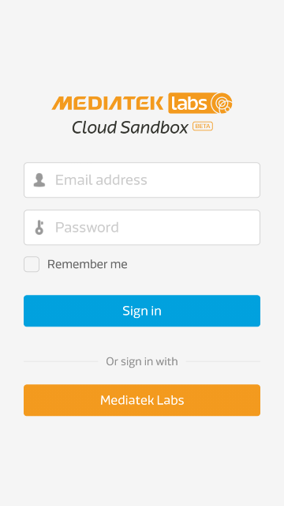
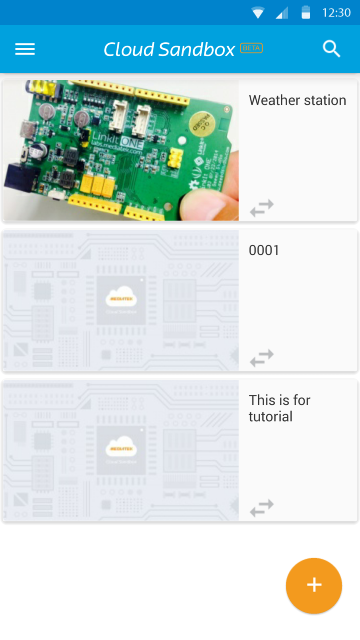
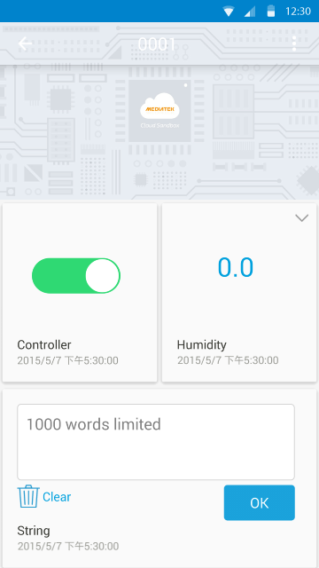
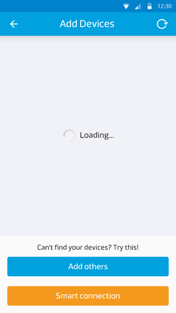

# 手机应用程序

您可以使用以下连结 [here](https://play.google.com/store/apps/details?id=com.mediatek.iotcloud) 或是QR码来下载我们提供的手机应用程序：

Also, please update the firmware of your 7681 devices to the latest version. Detailed update steps are listed in **[7681 Firmware Update Instruction](../7681_firmware_update/)**

**(请注意：为了增加效能和安全性，我们将系统全面升级。旧版本的手机应用程式将不再能使用，请于Google play 商店下载最新版本的手机应用程式来连结您的手机与MCS平台)**

目前此手机应用成是只提供安卓（Android）版本。

您必须确保您的安卓（Android）手机版本为v4.0以上，并且使用您的手机浏览器打开此下载页面。

一旦登入后，您将可以看到所有您建立的，或是有访问权限的装置。

您可以点击装置的详细资料按钮，来检视您的装置状态：

您可以对控制器类型的资料通道下达指令，以改变他的最新状态。目前手机无法和网页板一样显示图形化的资料。

您可以对控制器类型的资料通道下达指令，以改变他的最新状态。目前手机无法和网页板一样显示图形化的资料。

此外，在画面的左下方，您会看见一个加号，您可以点击此加号来新建测试装置。您亦可以使用Smart Connection功能来来接您的LinkIt Connect开发板。如欲查看更详细的LinkIt Connect使用方式，您可以参考以下教程[2.Tutorial 2.7 Implementing using Linkit Connect 7681 development board](https://mcs.mediatek.com/v2console/supports/implementing_using_mt7681_development_board)

