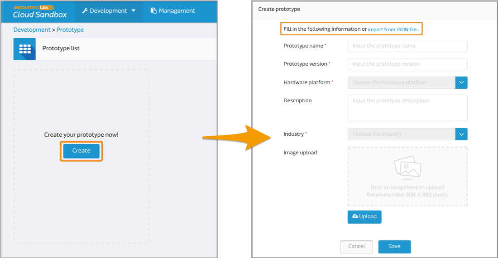
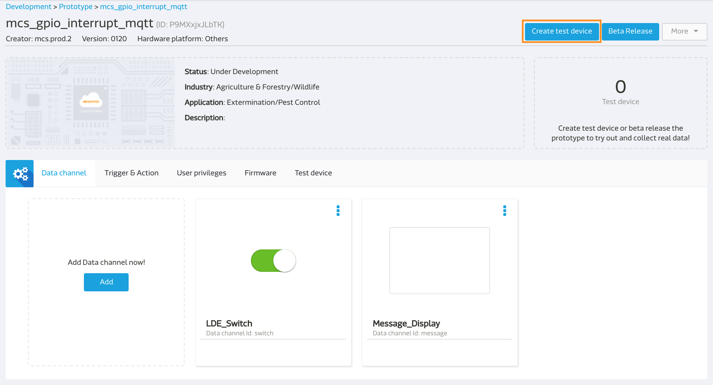
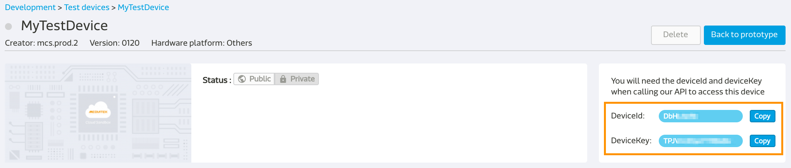

# 控制 LinkIt 7687 上的 LED 灯

这个范例中，我们将会展示如何使用 GCC 将 LinkIt 7687 与 MCS 连线。让您可以从 MCS 网页上远程控制 LinkIt 7687 LED 灯的明灭，并且在网页上看到由 LinkIt 7687 传回来的时间字串。

## 轻松上手
1. 首先，下载我们预先准备好的[范例程序](https://github.com/Mediatek-Cloud/mcs.c-examples/archive/master.zip)。在本篇范例中，我们使用的是 **mcs\_gpio\_interrupt\_mqtt** 这个专案，所以下载完成后请将此资料夹复制到 **app** 这个路径下。

	```
	{SDK_Root}/project/mt7687_hdk/apps/mcs_gpio_interrupt_mqtt
	```

2. 接着在 MCS 网页上建立您的产品原型与资料通道。您可以透过汇入我们预先准备好，附带在范例中的 **mcs\_gpio\_interrupt\_mqtt\_prototype.json** 档案直接建立相同的原型。

	```
	{SDK_Root}/project/mt7687_hdk/apps/mcs_gpio_interrupt_mqtt/mcs_gpio_interrupt_mqtt_prototype.json
	```
	
	这个产品原型包含了两个资料通道：
	
	* 开关控制器: 资料通道 ID 為 "switch"
	* 字串显示器: 资料通道 ID 為 "message"
	
	
	
	> **如果您需要更详尽的步骤与说明，请参考[建立您的第一个产品原型](https://mcs.mediatek.com/resources/latest/tutorial/getting_started#create-your-first-prototype)。**
	
3. 在 MCS 网页上建立您的测试装置。

	
	> **如果您需要更详尽的步骤与说明，请参考[创建您的第一个测试装置](https://mcs.mediatek.com/resources/latest/tutorial/getting_started#create-your-first-test-device)。**
	
4. 建立测试装置后，页面上会显示一组装置的 ID 与 key，请将这组资料资讯更新到 **mcs.h** 档案中。

	
	
	```
	/* Modify mcs_gpio_interrupt_mqtt/inc/mcs.h according to your MCS configuration */ 
	
 	#define DEVICEID "DbH****"
 	#define DEVICEKEY "TPJVm3Dy********"
 	#define HOST "com"
	```
	
5. 更改 **main.c** 档案中的产品原型与环境设定变数。

	* LinkIt 7687 开发板的网路连线设定：
		* AP_SSID: 无线网路连线的 SSID。
		* AP_PWD: 无线网路连线的密码。

	* 资料通道的相关资讯：
		* GPIO_ON: "switch,1" (switch 是步骤 2 建立的资料通道 ID)
		* GPIO_OFF: "switch,0" (switch 是步骤 2 建立的资料通道 ID)

	```
	#define AP_SSID "your_SSID"  
	#define AP_PWD "your_pwd"
	#define GPIO_ON "switch,1"
	#define GPIO_OFF "switch,0"
	```
	
6. 在更改完 **mcs.h** 与 **main.c** 档案后，您就可以开始使用 GCC 命令列工具编译并建置这个专案啰。

	* 切换目录到此专案的 GCC 资料夹下。
		
		```
		$ cd <sdk_root>/project/mt7687_hdk/app/mcs_gpio_interrupt_mqtt/GCC
		```
	* 执行 make 指令。
		
		```
		$ make
		```
	* 建置后的档案会产生在此专案的 **GCC/build** 资料夹下。		
		```
		<sdk_root>/project/mt7687_hdk/app/mcs_gpio_interrupt_mqtt/GCC/build  
		```
		
	> **如果您需要更详尽的步骤与说明，请参考[建置范例专案](https://docs.labs.mediatek.com/resource/mt7687-mt7697/en/get-started-linkit-7687-hdk/gcc-arm-embedded-command-line-tools-free/build-an-example-project)。**
	
7. 最后，就可以直接将建置后的档案下载到您的 LinkIt 7687 HDK 里了。下载时所需要的 scatter 与二进制 (binary) 档案都位于先前产生出来的 **GCC/build** 资料夹下。

	> **如果您需要更详尽的步骤与说明，请参考[下载二进位档案至开发板](https://docs.labs.mediatek.com/resource/mt7687-mt7697/en/get-started-linkit-7687-hdk/gcc-arm-embedded-command-line-tools-free/download-a-pre-built-binary-example)。**

在以上所有的步骤都顺利完成后，您便可开启浏览器，前往 MCS 网页 > 测试装置详情页面远程开关 LinkIt 7687 HDK 上的 **D12** LED 灯泡。

此外，如果你按下 LinkIt 7687 HDK 上的 **EINT (External Interrupt Button)** 按钮，便会触发 LinkIt 7687 HDK 将当前的系统时间上传到 MCS 上。


