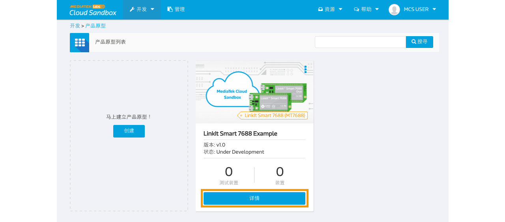

# Updating the firmware on 7688 development board using MCS

Firmware Over the Air (FOTA) is a wildly used function nowadays. You can push the new firmware to connected devices using the MCS FOTA function.

In this tutorial, we will first go through the following steps:
1. how to generate the firmware file (.hex file) in the Arduino IDE
2. what you need to prepare for the 7688 development board
3. how to use the MCS console to push the firmware to the devices.


## How to generate a .hex file in the Arduino IDE

We will need to prepare two firmware files for this tutorial, one is for the LED to blink once evey second, and the other one is to blink every 100 miliseconds. You can also use the example on the Arduino IDE by click on File -> Example to select the code you would like to try.

### Prepare the arduino code for the firmware
1. Open the Arduino IDE and start coding.
2. After finish coding, click the **Sketch** on the menu bar.
3. Click **Export compiled Binary** to export the **.hex** firmware file.


The exported .hex file is the one you are going to upload to the MCS.

Here is the two firmware files we will use in this tutorial.

[Blink every second](http://cdn.mediatek.com/1s.hex)

[Blink every 100 milisecond](http://cdn.mediatek.com/100ms.hex)


## Prepare the LinkIt Smart 7688 development board

1. Make sure your LinkIt Smart 7688 is connected.
2. using command `ssh` to go into to the command console.
3. Create a folder using the following command:
```
mkdir app && cd app
```
4. Install the following modules.
```
npm install mcsjs
npm install superagent
```
5. Create the app.js file.
```
vim app.js
```

6. Type **i** and copy/paste the following code in the editor

```

var mcs = require('mcsjs');
var spawn = require('child_process').spawn;
var fs = require('fs');
var request = require('superagent');
var fwName = 'fw.hex';

var myApp = mcs.register({
  deviceId: 'Input your deviceID',
  deviceKey: 'Input your deviceKey',
  host: 'api.mediatek.com'
});

var download = function(url, dest, cb) {
  var file = fs.createWriteStream(dest);
  var sendReq = request.get(url);
  // verify response code
  sendReq.on('response', function(response) {
    if (response.statusCode !== 200) {
      return cb('Response status was ' + response.statusCode);
    }
  });
  // check for request errors
  sendReq.on('error', function (err) {
    fs.unlink(dest);
    if (cb) {
      return cb(err.message);
    }
  });
  sendReq.pipe(file);
  file.on('finish', function() {
    file.close(cb);  // close() is async, call cb after close completes.
  });
  file.on('error', function(err) { // Handle errors
    fs.unlink(dest); // Delete the file async. (But we don't check the result)
    if (cb) {
      return cb(err.message);
    }
  });
};

myApp.on('FOTA', function(data, time) {
  console.log(data);
  var Data = data.split(',');
  var firmwareUrl = Data[2];
  download(firmwareUrl, fwName, function(){
    var update = spawn('avrdude', ['-p', 'm32u4', '-c', 'linuxgpio', '-v', '-e', '-U', 'flash:w:/root/'+ fwName, '-U', 'lock:w:0x0f:m']);
    update.stdout.on('data', function(data) { console.log(data) });
    update.stderr.on('data', function(data) { console.log(data.toString()) });
  });
});
```

You are now ready to execute the Node.js program. In the system console, type the following command:(# is command prompt and is not part of command.)

```
# node app
```


## How to MCS FOTA function to updating the firmware in devices

### Step 1. Create a new Prototype

a. After login, select "Prototype" under Development at the navigator bar, click "Create" to create a new prototype or [import from json](http://cdn.mediatek.com/tutorial/7688/7688_FOTA_CN.json). If you import the prototype from json, you can skip Step 1 and start from Step 2.


b. Fill in the detail information as per screen to give a basic profile of this prototype:


c. Click "Detail" for the prototype created.



d. Click Firmware tab and click the Add firmware link.


f. Input the following information and select the firmware you just exported from the Arduino IDE:


g. Click Upload and select the pre-requiste firmware for this new firmware. In this tutorial, we select the All firmware.


h. Click Next and Done


Please upload the two firmwares you've prepared.

### Step 2. Create test device

a. Click on the test device tab and click add test device link to create a test device


b. After Test device is created, click "Go to detail" to open the created device detail page:


c. Click the firmware tab and you will see the uploaded firmware and the Push button.


### Step 3. Pushing firmware to devices

When the 7688 development board is connected, you will see the Push button turn green. And you can click to push the firmware to the 7688 development board.


