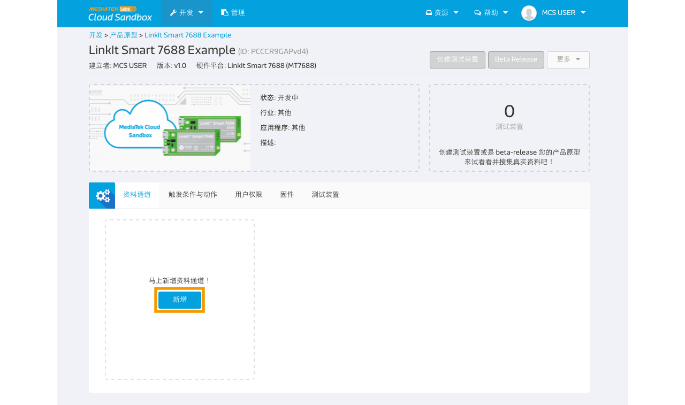
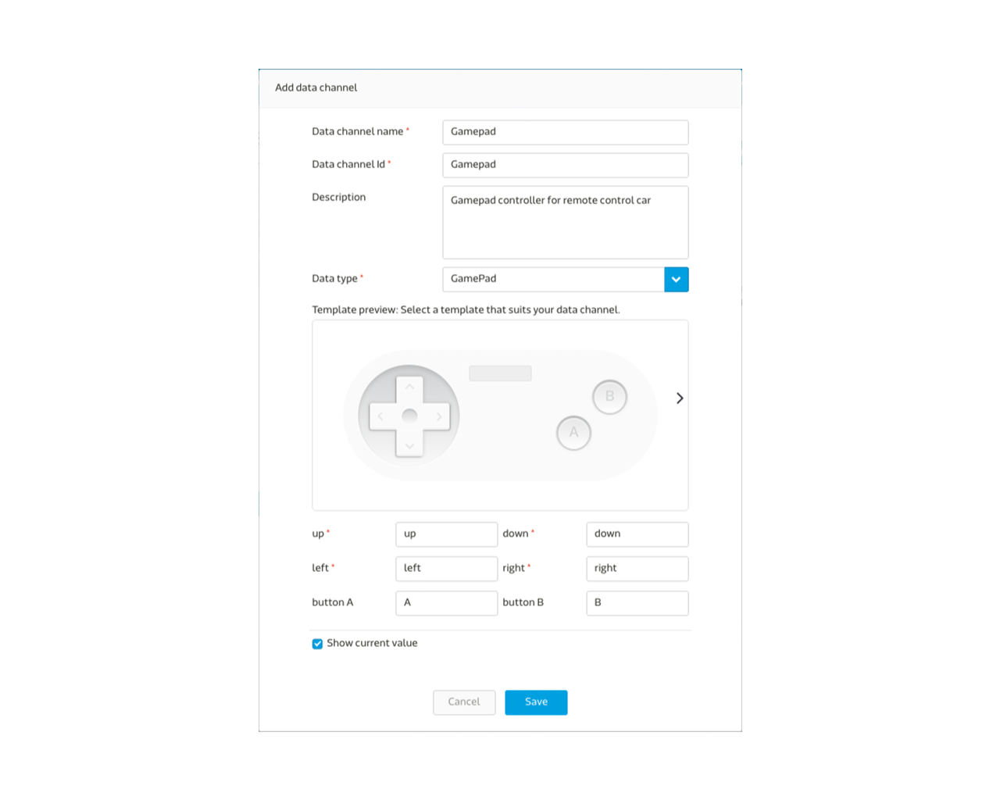
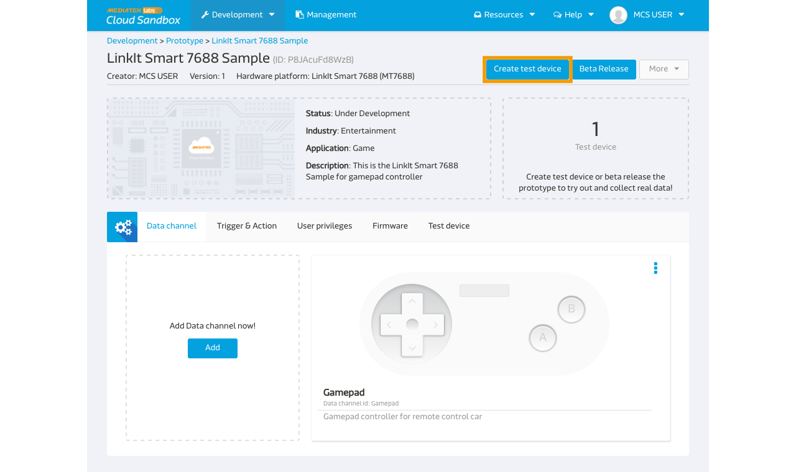
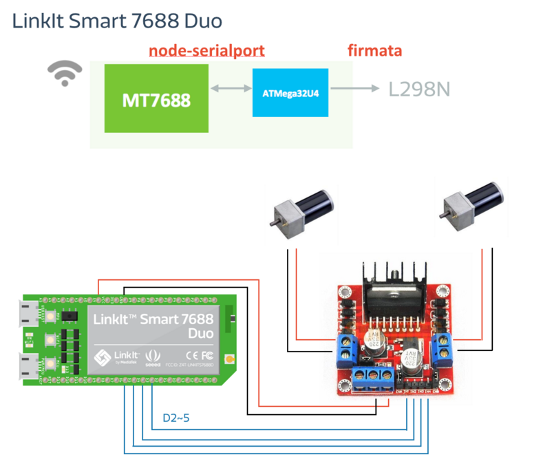
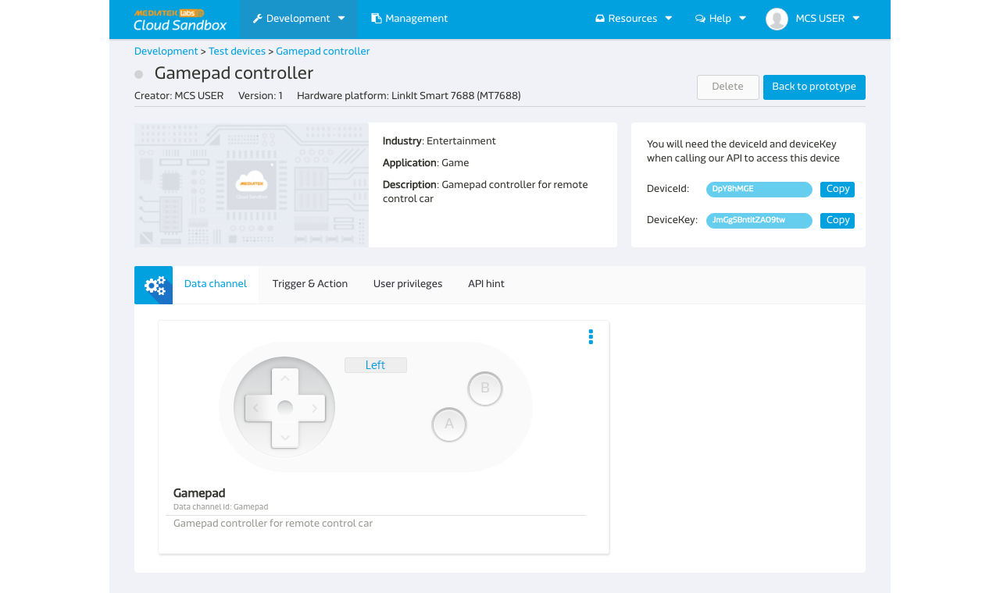

# Gamepad controller tutorial

Here is a simple example demonstrating how to use gamepad data channel controller on a LinkIt 7688 development board to control a remote control car.


## Creating a new prototype for LinkIt Smart 7688

### Step 1. Create a new prototype with gamepad controller type data channel
a. After login, select "Prototype" under Development at the navigation bar, click "Create" to create a new prototype or [import from json](http://cdn.mediatek.com/tutorial/7688/7688_gamepad_CN.json). If you import the prototype from json, you can skip Step 1 and start from Step 2.


b. Fill in the detail information as per screen to give a basic profile of this prototype:


c. Click "Detail" for the prototype created


d. In the prototype Detail Page, select "Data Channel" TAB and click "Add" to create new Data Channel:



We are going to create one **Gamepad** controller type data channel for this tutorial which will issues command to the board to control the direction of the remote control car.


e. Select "Controller" Data Channel and key in the following information




Please take note of the Data Channel Id, this is the unique identifier when calling API later in the tutorial.

### Step 2. Create Test Device

a. Click "Create Test Device" in the upper-right corner of the page



b. Fill in the name and description of the test device:


c. After Test device is created, click "Go to detail" to open the created device detail page:


Please take note of the deviceId and deviceKey for calling API later in the tutorial.

### Step 3. Obtain Device ID, Device Key, Data Channel ID
Here is the summary of the neccessary information we have obtained in interacting with this test device:

| Name | Value | Remark |
| -- | -- | -- |
| deviceId | Dsre1qRQ | Unique Identifier for this Test Device |
| deviceKey | DFbtsNWg4AuLZ30v  | Unique API Key for this Test Device |
| dataChannelId | Gamepad | Data Channel Id for gamepad controller |

Note 1: The deviceId and deviceKey shown here will be differet to yours, please use your obtained value instead.

Note 2: The deviceId is case sensitive.


# Creating a program to connect to MCS and run the application

## Pre-requisite
* L289 driver
* a remote control car (can be found here: http://goods.ruten.com.tw/item/show?21438261771967) or a similiar one.

## Architecture



The four pins on L298N should be connected to the D2, D3, D4, D5 pints on LinkIt Smart 7688 Duo.

## Creating a Node.js program to connect to MCS

### MCU set up steps
1. Open Arduino IDE.
2. Click Tools -> board -> Select LinkIt Smart 7688.
3. Click Port -> select the port that LinkIt Smart 7688 is connected.
4. Upload the code [here](https://github.com/Mediatek-Cloud/MCS/blob/master/source_code/GamePad7688Sample) to the LinkIt Smart 7688 development board.

### MPU set up steps
1. Make sure your LinkIt Smart 7688 Duo is connected.
2. using command `ssh` to go into to the command console.
3. Create a folder using the following command:
```
mkdir app && cd app && npm init
```
4. Install the MCSjs modules.
```
npm install mcsjs
```
5. Edit the app.js file.
```
vim app.js
```

6. Type **i** and Copy/paste the following code in the editor

```
  var mcs = require('mcsjs');

  // regist your device to mcs.
  var myApp = mcs.register({
      deviceId: 'Input your deviceId',   // Input your deviceId.
      deviceKey: 'Input your deviceKey', // Input your deviceKey.
  });

  var SerialPort = require("serialport").SerialPort;
  var serialPort = new SerialPort("/dev/ttyS0", {
      baudrate: 57600
  });

  // communicate with Arduino chip (32U4).
  serialPort.on("open", function () {
      // listen the mcs command.
      myApp.on('gamepad', function(data, time) { // gamepad is your datachannel.
          serialPort.write(data); // send message to Arduino chip.
      });
  });
```

Next, run the Node.js example program.

### Run your application
You are now ready to execute the Node.js program. In the system console, type the following command:(# is command prompt and is not part of command.)

```
# node app
```

Go to MediaTek Cloud Sandbox and use the controller panel to control the remote control car to go to the left.



