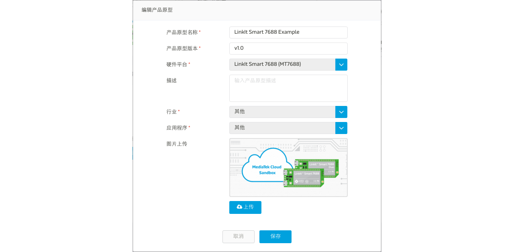
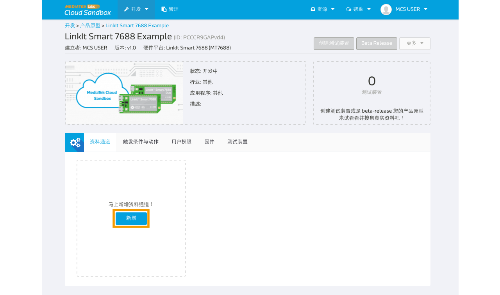

# Image Display Tutorial

Here is a simple example demonstrating how to use display type of image data channel on a LinkIt 7688 development board to upload screenshot to MCS.


## Creating a new prototype for LinkIt Smart 7688

### Step 1. Create a new prototype with image display type data channel
a. After login, select "Prototype" under Development at the navigation bar, click "Create" to create a new prototype.


b. Fill in the detail information as per screen to give a basic profile of this prototype:



c. Click "Detail" for the prototype created


d. In the prototype Detail Page, select "Data Channel" TAB and click "Add" to create new Data Channel:



We are going to create one **Image** display type data channel for this tutorial which will saved and display the screenshot uploaded from the 7688 development board.


e. Select "Display" Data Channel and key in the following information


Please take note of the Data Channel Id, this is the unique identifier when calling API later in the tutorial.

### Step 2. Create Test Device

a. Click "Create Test Device" in the upper-right corner of the page


b. Fill in the name and description of the test device:


c. After Test device is created, click "Go to detail" to open the created device detail page:


Please take note of the deviceId and deviceKey for calling API later in the tutorial.

### Step 3. Obtain Device ID, Device Key, Data Channel ID
Here is the summary of the neccessary information we have obtained in interacting with this test device:

| Name | Value | Remark |
| -- | -- | -- |
| deviceId | Dsre1qRQ | Unique Identifier for this Test Device |
| deviceKey | DFbtsNWg4AuLZ30v  | Unique API Key for this Test Device |
| dataChannelId | Image | Data Channel Id for image display data channel|

Note 1: The deviceId and deviceKey shown here will be differet to yours, please use your obtained value instead.

Note 2: The deviceId is case sensitive.


# Creating a program to connect to MCS and run the application

## Pre-requisite
* LinkIt Smart 7688 or LinkIt Smart 7688 Duo
* an USB OTG line
* a web camera (in this tutorial, we use the Logitech C310)
* Connect the power line to PWR on 7688 development board.
* Connect web camera to USB OTG then plug in to the HOST on 7688 development board.


## Creating a Node.js program to connect to MCS

### Set up the device
1. Make sure your LinkIt Smart 7688 Duo is connected.
2. using command `ssh` to go into to the command console.
3. Install the `fswebcam`.
```
opkg update
opkg install fswebcam
```

4. Try to capture a screenshot.
```
fswebcam -i 0 -d v4l2:/dev/video0 --no-banner -p YUYV --jpeg 95 --save /tmp/test.jpg
```

Then you will see a test.jpg file in your root directory.

**Hint:** Some of you may wonder why we need to store the file to /tmp/test.jpe. The reason is bebause the limitation of the flash on the LinkIt Smart 7688 development board. If we frequently write data to the flash, it will reduce the lifetime of the flash. That is why we suggest to store in the memory where /tmp folder is under. Also, please be reminded that the flash will be reset once no power supplied.

Now we are ready to upload the Node.js example code to the 7688 development board.

1. Create a file app.js using an editor, vi is used in this example:

```
vim app.js
```

2. Type **i** and Copy/paste the following code in the editor

```
var mcs = require('mcsjs');
var exec = require('child_process').exec;
var Promise = require('bluebird');
var fs = Promise.promisifyAll(require("fs"));

var myApp = mcs.register({
  deviceId: 'Input your deviceId',
  deviceKey: 'Input your deviceKey',
});

child = exec('fswebcam -i 0 -d v4l2:/dev/video0 --no-banner -p YUYV --jpeg 95 --save /tmp/test.jpg', function (error, stdout, stderr) {
    console.log('stdout: ' + stdout);
    console.log('stderr: ' + stderr);
    if (error !== null) {
        console.log('exec error: ' + error);
    }
    fs.readFileAsync('/tmp/test.jpg')
    .then(function(data) {
        myApp.emit('album01','', new Buffer(data).toString('base64'));
    });
});
```


Next, run the Node.js example program.

### Run your application
You are now ready to execute the Node.js program. In the system console, type the following command:(# is command prompt and is not part of command.)

```
# node app
```

Go to MediaTek Cloud Sandbox and you will see the uploaded image in the image shown in the image display dat channel.


