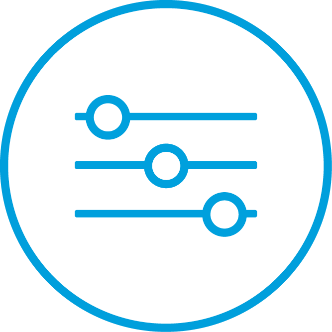

# LinkIt Smart 7688 Tutorial

In this guide you’ll learn the steps to create some application to control the LinkIt Smart 7688 from the web console of MCS using Node.js or python.

1. a simple remote switch that allows you to turn on and off the on-board Wi-Fi LED.
2. a somple remote analog controller allows you to control the brightness of the LED.

# Set up your development environment

Full details on setting up the necessary LinkIt Smart 7688 development environment can be found in Get Started. Complete this before you continue, if you haven’t already set up your development environment.


## Set up MCS account

To sign up for a free MCS account if you haven't done so alreay. Click [here](https://mcs.mediatek.com/oauth/en/signup) to sign up or click [here](https://mcs.mediatek.com/oauth/en/login) to sign in. You will then be able to define prototypes for your own devices and applications.

## Set up the modules

MCS supports node.js and python. You can choose base on your preference and select to install the module you prefered.

### MCSjs modules

To uses MCSjs module. It is an easy-to-use HTTP request library. You can install it using npm.The steps are:

1. Make sure your LinkIt Smart 7688 is connected to the Internet (station mode)
2. Open a system console using SSH
3. Create a folder app and initialize it
```
mkdir app && cd app npm init
```

4. Press enter to all the prompts when you see several questions, this is the application set up process
5. Use npm to install module, for example:
```
npm install mcsjs
```

### Python modules

To use python requests module. It is an easy-to-use HTTP request library. You can install it using pip in the system console.The steps are:

1. Make sure your LinkIt Smart 7688 is connected to the Internet (station mode)
2. Open a system console using SSH
3. Use pip to install module, for example:
```
pip install requests
```


# Building the LinkIt Smart 7688 MCS Hardware
Here describes the hardware needed to build this tutorial provides details on how to put them together.

## What you need
To build the tutorial hardware, you need the following components:

* A LinkIt Smart 7688 development board
* A micro-USB cable
* A host computer

## Putting the components together

This section provides step-by-step instructions on putting the (tutorial) hardware together.
1. Connect the micro USB cable to the power connector of LinkIt Smart 7688 and a host computer.
2. Change LinkIt Smart 7688 to Station mode and connect to Internet. Please check LinkIt Smart 7688 Get Started Guide on using the web-based configuration tool to change to Station mode.

# Create the prototype and test device in MCS
Here you’ll create a prototype device in MCS and connect it to LinkIt Smart 7688.

## Sign in to MCS console
Click [here](https://mcs.mediatek.com/oauth/en/login) to sign in.


Choose the application you would like to start with:

| [Simple Switch tutorial](../tutorial/7688_led_tutorial) | [Analog Controller tutorial](../tutorial/7688_analog_tutorial) |
| -- | -- |
|[](../tutorial/7688_led_tutorial)|[](../tutorial/7688_analog_tutorial)|
