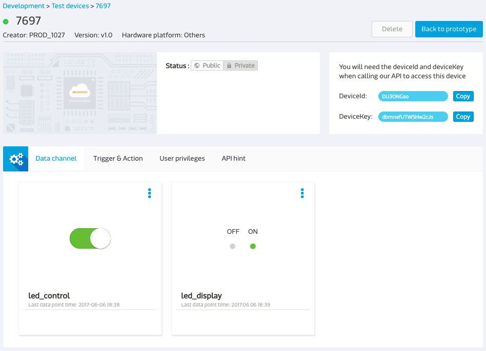

# 控制 LinkIt 7697 上的 LED 灯号

这个范例讲述如何透过使用 MCS 函式库让您的装置连上 MCS 云端服务，并且在 MCS 网站上开关 LinkIt 7697 开发板上的 LED 灯。

## 建立您的 MCS 测试装置

首先，使用浏览器开启 [MCS 主控台页面](https://mcs.mediatek.com)，并且建立产品原型，资料通道与测试装置。在这个范例中，您需要定义以下两个资料通道：

1. 一个**控制器**，其资料型态为**开关**
2. 一个**显示器**，其资料型态为**开关**

如果您想了解更多有关于如何建立产品原型，资料通道与测试装置的方法，请参考 [MCS 入门导览](http://mcs.mediatek.com/resources/latest/tutorial/getting_started)。

## 使用 MCS 函式库开发

要将装置连上 MCS 云端服务，首先需要建立一个 **MCSDevice** 物件，并给定測試裝置的 ID 與 key 资讯，然后再建立对应的资料通道。

1. 在 Arduino IDE 中, 选择 **File** > **Examples** > **MCS**，然后选择 **LED_control** 范例。

	

2. 接着，开始修改范例代码。要使用 MCS 云端服务，装置并须先能连上 Wi-Fi，因此先将您正在使用的 Wi-Fi 热点的资讯设定到 **SSID** 与 **password** 参数中。

	```arduino
	// Assign AP ssid/password here
	#define _SSID "your_ssid"
	#define _KEY  "your_password"
	```
	
3. 在 **MCSDevice** 建构子中带入 MCS 测试装置的 **device ID** 与 **device key**。

	```arduino
	// Assign device id/key of your test device
	MCSDevice mcs("your_device_id", "your_device_key");
	```
	
	
4. 在初始化资料通道物件时，带入 **data channel IDs**。 

	```arduino
	// Assign data channel ID 
	MCSControllerOnOff led("your_channel1_id");
	MCSDisplayOnOff    remote("your_channel2_id");
	```
	
	

	
## 执行应用程序

1. 点击 **Upload** 将修改后的程式上传到 LinkIt 7697 开发板上并等待 **Done Uploading** 上传完成的讯息。

	

2. 点击工具列中的 **Serial Monitor** 图示，并且将 Serial Monitor 的**资料传送的速率(Baud rate)** 改成 **9600**。

	

3. 接着，您就可以在 MCS 网站的装置详情页面操作**开关控制器**来控制开发板上 LED 灯号的明灭了。同时，开发板在收到开关指令时，也会将收到的数据再上传回到 MCS 的**开关显示器**资料通道。

	

4. 观察开发板上的 **LED PIN 7** 灯号。这颗 LED 灯泡会随着您在 MCS 网站上操作的产生明灭的效果。 

	


## 代码解说

在这个范例中，我们使用了 **MCS 函式库**来实作 LinkIt 7697 与 MCS 云端服务的连线与互动，因此第一步就是先宣告载入 MCS 函式库。

```arduino
#include <MCS.h>
```

宣告 **MCSControllerOnOff** 与 **MCSDisplayOnOff** 两个资料通道的物件，他们分别代表了先前您在 MCS 网页上建立的**开关控制器**与**开关显示器**，在宣告物件的时候，需要将对应的资料通道 ID 带入。

```arduino
MCSControllerOnOff led("your_channel1_id");
MCSDisplayOnOff    remote("your_channel2_id")
```

接着，我们要将这个实体装置与 MCS 网页上建立的测试装置连结。因此在宣告 **MCSDevice** 物件时带入您在 MCS 网页上建立的测试装置的 ID 与 key。

```arduino
MCSDevice mcs("your_device_id", "your_device_key");
```

透过 **addChannel()** 函式将先前宣告的资料通道加入 **MCSDevice** 物件底下。呼叫 **MCSDevice** 物件的 **connect()** 函式建立装置与 MCS 云端服务的 TCP 连线。


```arduino
  // setup MCS connection
  mcs.addChannel(led);
  mcs.addChannel(remote);
  while(!mcs.connected())
  {
    Serial.println("MCS.connect()...");
    mcs.connect();
  }
```

在 loop() 回圈当中，透过资料通道物件的 **update()** 函式来检查此开关控制器是否有接受到新的资料，如果有，则将接收到的数值设定给 **LED_PIN**，以此来控制 LED 灯号的明灭。


```arduino
if(led.updated())
  {
    Serial.print("LED updated, new value = ");
    Serial.println(led.value());
    digitalWrite(LED_PIN, led.value() ? HIGH : LOW);
    if(!remote.set(led.value()))
    {
      Serial.print("Failed to update remote");
      Serial.println(remote.value());
    }
  }
```
