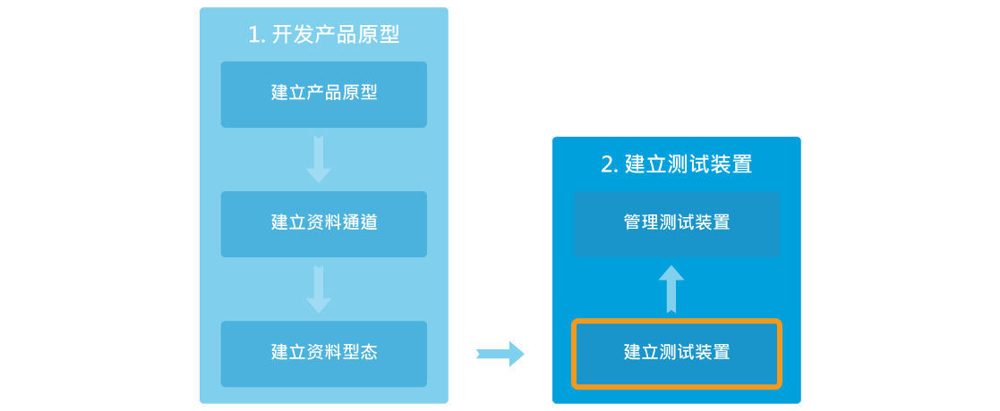

# 创建您的第一个测试装置

## 创建测试装置逐步导引

[事前准备] 您必须先完成开发产品原型

步骤一，点选产品原型的详情按钮。

步骤二，点选画面上方的创建测试装置按钮。

步骤三，再跳出来的创建测试装置对话窗中，输入测试装置名称和描述，然后点击确定按钮。

步骤四，您将会看到创建成功的讯息。您可以直接点击详细资料按钮连接至测试装置详情页面。

步骤五，您亦可于产品原型页面中的测试装置分页内查看属于此产品原型的测试装置。

请注意，您测试装置中所有的资料通道都是由产品原型继承而来的。如果您在产品原型中更新了资料通道，此更新亦会同时反映至所有属于此产品原型的测试装置。

## 如何取得装置的DeviceId和DeviceKey

当您创建好测试装置后，您可以查看或是控制您的装置来确保在正式商转前产品的功能稳定性。

您能够在两个地方找到测试装置的DeviceId和DeviceKey：

1. 产品原型页面中的**测试装置分页**。

2. 测试装置详细资料页面中。

测试装置的DeviceId和DeviceKey是用来呼叫API时必须使用到的参数。在测试装置详细资料页面中，您会看到蓝色字体的DeviceId和DeviceKey编号，单击蓝色编号，将会立即复制至您的剪贴布。

