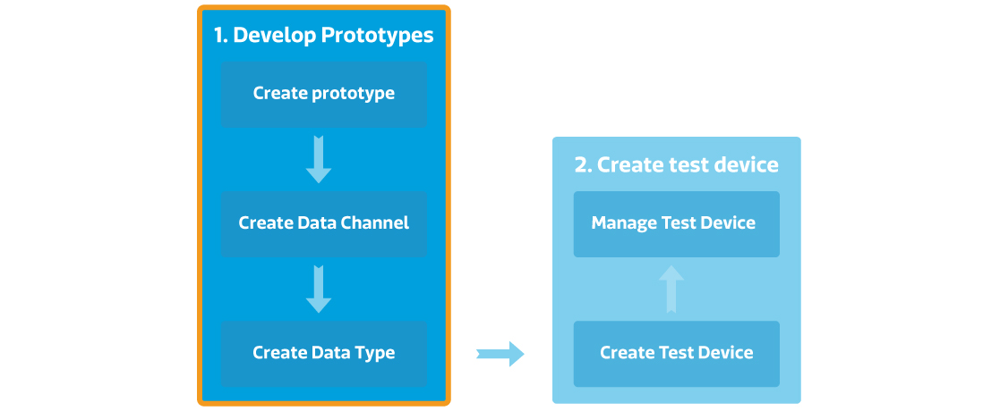

# 建立您的第一个产品原型

## 建立产品原型逐步导引

步骤一，点击画面上方的开发连结 。

步骤二，点击创建按钮。

步骤三，输入产品原型名称，版本，并选择硬体平台，产业，之后点击储存按钮。您的产品原型已建立。

步骤四，点击您刚建立的产品原型内的详情按钮。

当您建立好产品原型后，您可以开始建立资料通到，通知，设定使用者权限，并且新增测试装置了。

步骤五，点击新增资料通道分页中的新增按钮。

步骤六，选择资料通道型态。例如控制器，显示器，或是综合型控制显示器。之后点选新增按钮。

步骤七，输入资料通道名称，资料通到ID，描述，并选择资料型态。

步骤八，点击储存按钮。您现在可以为您的产品原型建立测试装置了！

如果您需要了解更多关于资料通道或是资料型态的详细信息，您可以参考资源中的核心概念章节。

