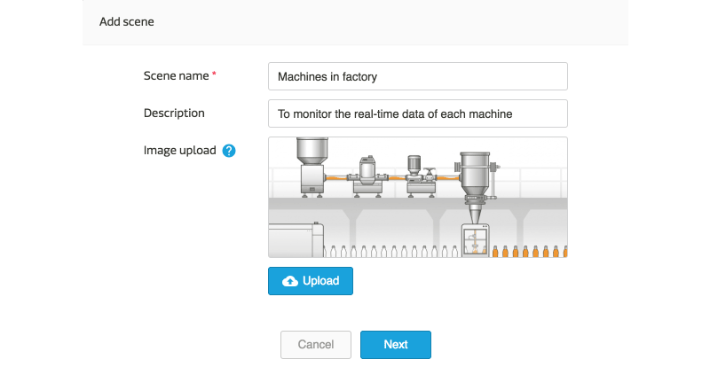
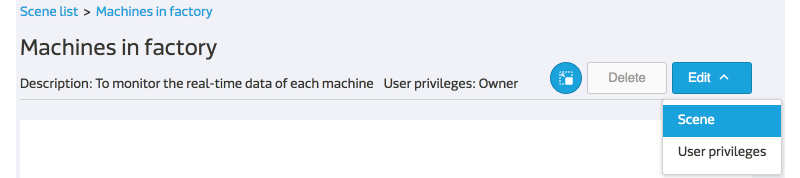
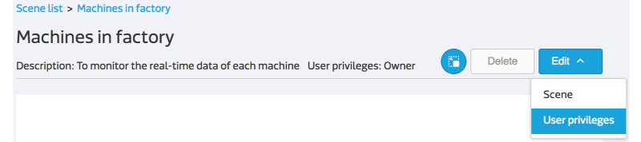
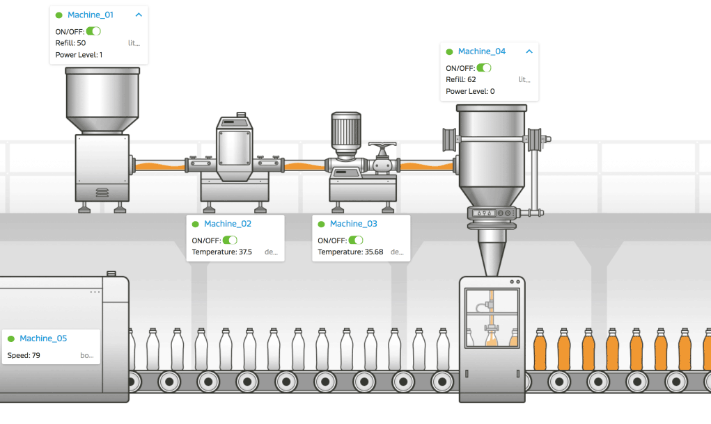

# 打造您专属的场景图

在本篇教学文章中，您将学会如何建立一个场景图，并且将装置、资料通道与网页连结加入此场景图当中，以方便后续的监控并落地到实际的工作场域中。

## 新增场景图

在装置详情页面中，您可以看到此装置底下所有的资料通道以及通道的即时数据。但若想要同时监控多个装置呢？此时，您可以透过场景图来达到即时监控并操作多个装置的需求。

操作步骤：

1. 点击网站上方导览列中的 **场景** 前往场景列表页面。

2. 点击列表下方的 **+ 新增场景**。
3. 输入您自订的 **场景名称**、**描述** 并上传 **图片**，这里的图片就是场景的背景图，也就是您工作场域的平面格局图。
4. 当您按下 **下一步** 后，此场景已经新增完成。

5. 新增后，页面会停留在 **场景编辑模式**，您可以在此编辑页面继续进行新增装置等进阶设定，完成后，点击 **返回** 回到场景详情页面。

## 将装置与资料通道加入场景图中

您可以选取您有权限读取的装置并将其加到场景图中，并选择所要监控的资料通道。

操作步骤：

1. 您可以藉由以下两个动作进入 **场景编辑模式**
	* 新增场景图
	* 在场景详情页面点击 **编辑** -> **场景** 
	

2. 点击左方操作面板的 **测试装置** 或 **装置** 按钮。
3. 在下拉选单中选取您所要监控的装置。
4. 您也可以自订此装置在场景图上的显示名称，若不修改预设使用原本的装置名称。
5. **可显示于场景的资料通道** 会显示在下方的区块，您可以按照您期望的显示顺序选取需要被监控的资料通道。**可显示于场景的资料通道**包含：

	* 除了影像串流与图片之外的所有显示型资料通道。
	* 控制型的开关。

6. 点击 **储存** 后，您新增的装置会出现在场景图的左上角。

7. 可透过滑鼠长按装置显示区块进行拖拉，将装置摆放到想要的位置。
8. 在编辑模式中的修改会即时地被储存，因此你可以随时点击**返回** 回到场景详情页面。
9. 随后，您可透过 **编辑** 或 **删除** 选单来调整装置显示区块。

## 将网站连结加入场景图中

操作步骤：

1. 在 **场景编辑模式** 点击 **网址** 按钮。
2. 输入您自订的 **显示文字** 与 **网址连结**。请注意，网址连结的格式必须包含连接协定，例如：**http://**mcs.mediatek.com or **https://**mcs.mediatek.com
3. 随后，您可透过 **编辑** 或 **删除** 选单来调整网站连结。

## 将场景图分享给其他 MCS 使用者

您可以针对某一个场景图赋予其他 MCS 使用者 **管理者** 或 **一般检视** 的权限，分享此场景图，与之共同协作。但同时，您也必须手动将场景内的 **装置权限** 赋予给此使用者，否则使用者将无法看到没有权限的装置。

操作步骤：

1. 点击 **编辑** -> **使用者权限** 进入 **权限编辑模式**。

2. 点击使用者列表下方的 **+ 新增使用者**。 
3. 输入您想分享的使用者在 MCS 注册的 **Email** 帐号。
4. 选择 **角色**。
5. 按下 **确定** 则完成所有设定。
6. 若您尚未将场景内的装置权限开放给该名使用者，请务必在装置详情页面 -> **使用者权限** 中补上对应的设定。

**场景的使用者权限**

| 角色 | 观看场景 | 变更场景设定 | 删除场景| 设定权限 |
|:---:|:---:|:---:|:---:|:---:|
|**管理者**|可|可|否|可|
|**一般检视**|可|否|否|可|

## 观看场景并监控装置

在场景列表中，您可以看到您有权限读取的所有场景。点击场景名称，则可进入场景详情页面。在此，您可以观看并控制你工作场域中的所有装置，其功能包括：

1. 观看所选装置的即时数据。
2. 观看所选装置的连线状态。
3. 操作控制型开关。
4. 透过点击装置名称，访问装置详情页面。
5. 透过点击网站连结，访问自定义的网站页面。

