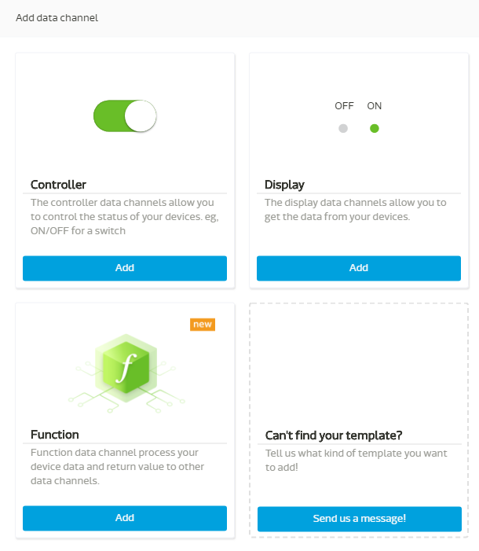
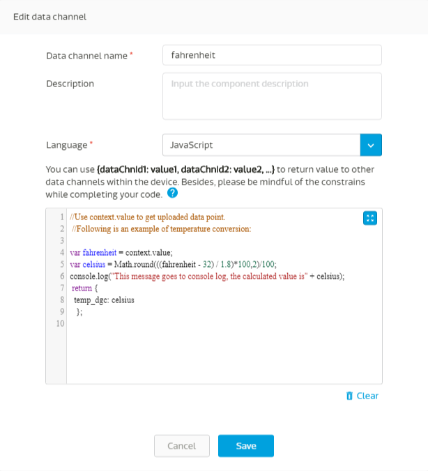

#资料运算通道教程

数据运算通道允许您在数据点上传到此通道时执行您自己的JavaScript代码段，允许代码段对此资料点执行简单计算，并能够将处理后的值传递到同一装置中的其他数据通道。此功能使物联网设备开发人员能够将一些装置上的运算委任给MCS数据运算通道，对以下使用场景也许会有帮助：

1.为电池供电的物联网设备节省电量
2.对IoT设备收集的不同传感器资料执行自定义计算。
3.对MCS数据运算通道上的代码更新部分取代FOTA更新到装置的功能。

以下是一个简单教程，说明了一个采用华氏温度传感器值的数据通道，利用数据运算通道转换为摄氏温度并将该值转发到另一个数据通道：

##定义数据运算通道

建立原型后，通过单击“创建”按钮，您可以通过单击左下角图标添加功数据运算通道：



在“创建数据运算通道”窗体中，您可以填写数据运算通道名称和数据运算通道ID，如屏幕截图所示，下半部分是代码编辑区域，您可以通过单击蓝色方块图标将其展开到全屏幕右手边。


窗体的中间部分有一个描述，描述如何将计算值返回到同一设备中的其他数据通道。通过点击问号，您将看到使用此代码的使用限制


将JavaScript代码附加到代码编辑区中，然后单击“储存”



以下是本教程的代码：

```
//Use context.value to get uploaded data point.
//Following is an example of temperature conversion:

var fahrenheit = context.value;
var celsius = Math.round(((fahrenheit - 32) / 1.8)*100,2)/100;
console.log("This message goes to console log, the calculated value is" + celsius);
 return {
  temp_dgc: celsius
   };
```
请注意：

1.	上传到此数据通道的数据点可以第1行中的contex.value来做引用
2.	第2行是计算华氏温度到摄氏温度
3.您可以在第6行中输出到控制面板日志作为示例
4.将摄氏温度转发到temp_dgc数据通道

##建立浮点数数值行数据通道和建立测试装置

储存后，您还应建立一个浮动数数值型数据通道，数据通道ID分别为temp_dgc，如下所示：


完成后，原型应该有两个数据通道，如下所示：


然后，您将从该原型中建立一个测试装置进行测试。

##上传资料点进行测试

现在让我们使用POSTMAN将数据点上传到数据运算通道，如下所示：


您将观察到一个值“42”到达至数据运算通道，下面带有“最后一个资料点状态：OK”，表明该资料点已成功处理。 Celsius数据通道中的值显示为“5.56”，同时确保代码已执行且返回值成功。
如果某个代码未成功执行，将显示“FAILED”讯息。


您可以单点数据通道右上角，然后单击“显示历史记录”以查看此资料点处理过程的详细信息：

 

您将看到显示值为“42”的列表，点击右侧的向下箭头以展开详细信息，您可以在其中看到控制面板日志选项，其中显示在代码的第6行中组成的信息。如果在代码执行期间生产生系统相关的错误消息，系统日志将显示在系统日志选项中。


以上是使用数据运算通道的简单教程。


