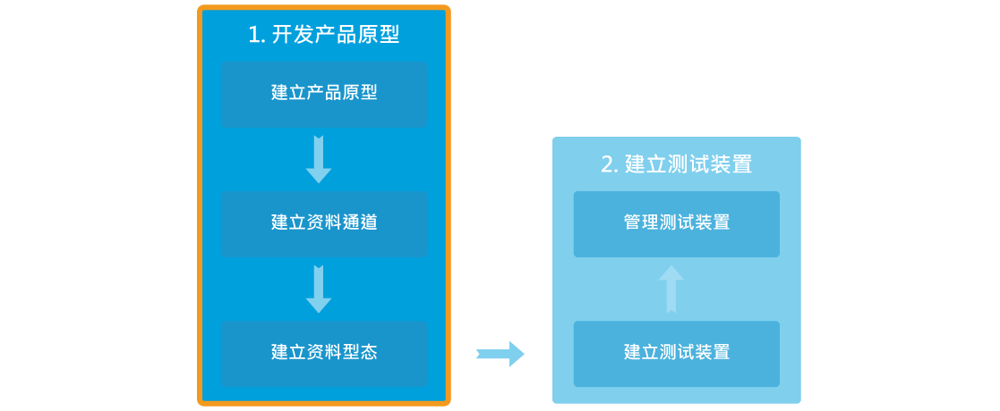
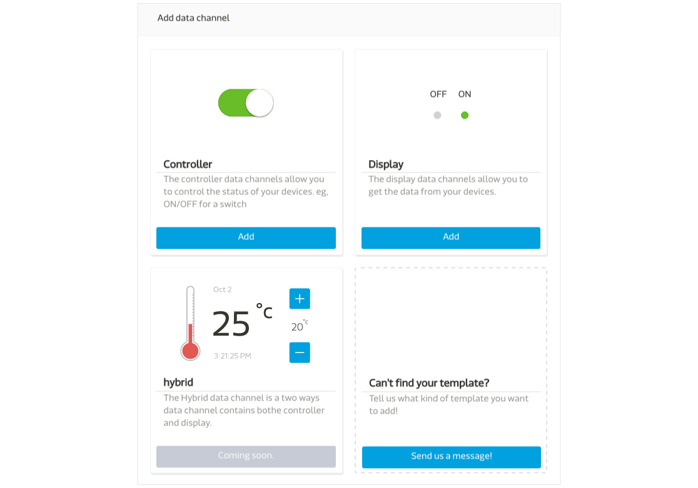
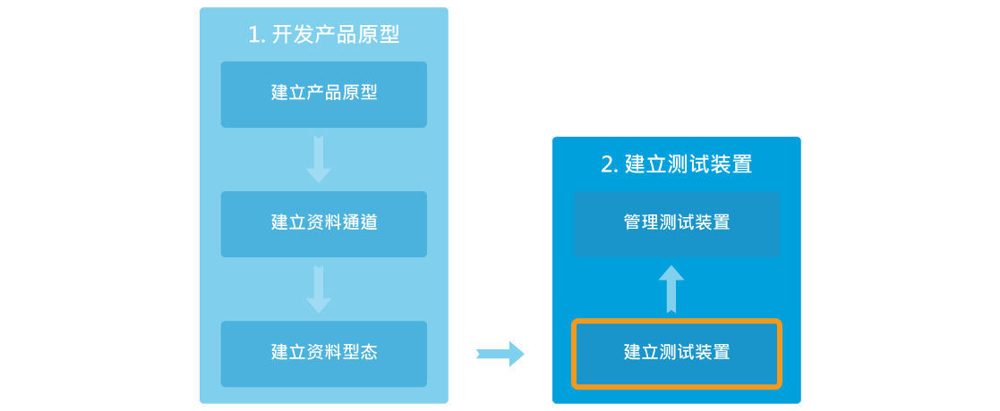

# 入门指南

透过以下的四个步骤，您能快速使用 MediaTek Cloud Sandbox 开发您的物联网专案:

1. 开发产品原型
2. 创建测试装置
3. 管理已部署的测试装置
4. 配置您的用户设定

[开发产品原型]

开发者能在**开发**页面建立产品原型。产品原型内，会包括多个能传替各种形态资料的资料通道。

[建立测试装置]

当建立好产品原型后，开发者能建立测试装置来和实际装置连结。开发者亦可以在**我的装置**页面浏览所有的测试装置状态，并且对装置下达指令。

[管理已部属的装置]

开发者能够在**开发**页面中的测试装置分页看到所有在特定产品原型下的测试装置。开发者亦可在**我的装置**页面中看到所有由他所建立的或是有访问权限的装置。

将来，当您的产品原型商转后，消费者亦能登入平台，在**我的装置**页面中查看所以关于他的装置的设定和状态，例如查看装置搜集的资料，设定通知，或是分享给其他使用者。

[配置您的用户设定]

您可以点击画面右上角您的名字的用户设定来更改您的帐户设置。您可以为您的帐户更改密码，并选择您当前的国家改变时区。所有的产品原型和测试设备将会套用您在此处的时区设置。

# 建立您的第一个产品原型

## 建立产品原型逐步导引

步骤一，点击画面上方的开发连结。

步骤二，点击创建按钮。

步骤三，输入产品原型名称，版本，并选择硬体平台，产业，之后点击储存按钮。您的产品原型已建立。

步骤四，点击您刚建立的产品原型内的详情按钮。

当您建立好产品原型后，您可以开始建立资料通到，通知，设定使用者权限，并且新增测试装置了。

步骤五，点击新增资料通道分页中的新增按钮。

步骤六，选择资料通道型态。例如控制器，显示器，或是综合型控制显示器。之后点选新增按钮。

步骤七，输入资料通道名称，资料通到ID，描述，并选择资料型态。

步骤八，点击储存按钮。您的资料通道已建立。您可以在资料通道名称下方查看您的data channel Id 。您将会在未来呼叫测试装置取得资料或是下达指令时，需要此资讯。

如果您需要了解更多关于资料通道或是资料型态的详细信息，您可以参考资源中的核心概念章节。

# 创建您的第一个测试装置

## 创建测试装置逐步导引

[事前准备] 您必须先完成开发产品原型

步骤一，点选产品原型的详情按钮。

步骤二，点选画面上方的创建测试装置按钮。

步骤三，再跳出来的创建测试装置对话窗中，输入测试装置名称和描述，然后点击确定按钮。

步骤四，您将会看到创建成功的讯息。您可以直接点击详细资料按钮连接至测试装置详情页面。

步骤五，您亦可于产品原型页面中的**测试装置**分页内查看属于此产品原型的测试装置。

请注意，您测试装置中所有的资料通道都是由产品原型继承而来的。如果您在产品原型中更新了资料通道，此更新亦会同时反映至所有属于此产品原型的测试装置。

## 如何取得装置的 DeviceId 和 DeviceKey

当您创建好测试装置后，您可以查看或是控制您的装置来确保在正式商转前产品的功能稳定性。

您能够在两个地方找到测试装置的 DeviceId 和 DeviceKey：

1. 产品原型页面中的**测试装置分页**。

2. 测试装置详细资料页面中。

测试装置的DeviceId 和DeviceKey 是用来呼叫API时必须使用到的参数。在**测试装置**详情页面中，您会看到蓝色字体的DeviceId 和DeviceKey 编号，单击右方的复制按钮，将会立即复制至您的剪贴布。

此外，您亦会需要data channel Id 当您欲存取特定测试装置中的资料通道值。您可以在**测试装置**详情页面中，查看每个资料通道的data channel Id 。请注意，一旦测试装置已连接并开始传送资料，此data channel Id 将会被最后更新的资料点时间取代。

# 管理已部署的测试装置

## 如何管理已部署的测试装置

您可以在产品原型页面的**测试装置**分页，或是我的装置页面中查看和管理您所有的测试装置。将来，当您的产品原型商转后，消费者亦能登入平台，在**我的装置**页面中查看所以关于他的装置的设定和状态。

### 从开发者的观点

如果您是开发者，您可在**开发**或是**我的装置**页面做以下操作：

1.  开发或是查看资料通道
2.  设定通知
3.  设定使用者权限
4.  管理韧体和对任体做更新
5.  管理测试装置

### 从使用者观点
将来，当您的产品原型商转后，消费者亦能登入平台，在**我的装置**页面中查看所以关于他的装置的设定和状态。 。

如果您是使用者，您可在**我的装置**页面做以下操作：

1.  查看资料通道
2.  设定通知
3.  设定使用者权限
4.  更新韧体

# 配置您的用戶設定

用戶可以通過點擊畫面右上方自己的名字來編輯修改您的用戶配置文件。

用戶也可以在這裡更改您的密碼和時區。

您裝置內的資料通道的時間序列圖將根據你的時區設置。

