# LinkIt ONE 实际操作

下面是一个简单的指南来快速设置您的LinkIt One 开发板（Aster 2502 ）连接到MediaTek Cloud Sandbox。

## 情境
此教程的情境为，替您的LinkIt One开发板建立一个测试装置，替您的板子上传一段Arduino code，且使用RESTful API来使您的开发板能上传位于D13的LED灯光状态至MCS，同时也可以使用MCS透过TCP Socket来远程控制LED状态。

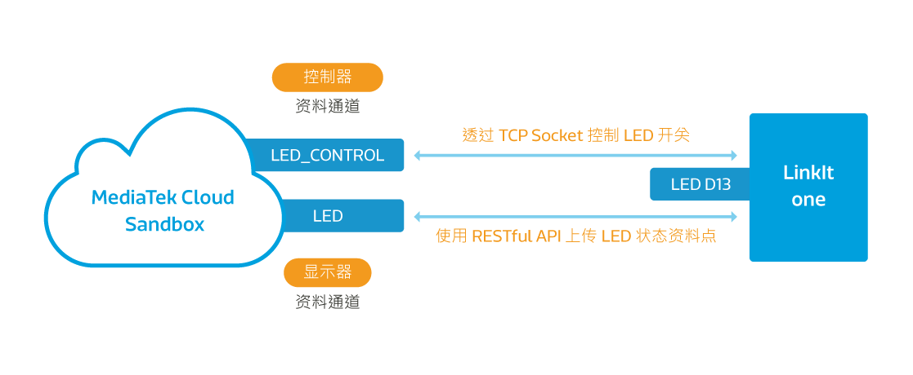

## 设置准备

为了要完成此设置，您必须先：

1. 您的开发板必须有电源连接，电源可来自电池或是micro-USB。
2. 您的开发板必须有Wifi连结。

此外，您不需要额外的电子组件，就可以连接到开发板了。

### 步骤一　替您的产品原型新增一个开关类型的资料通道

a. 登入平台后，点选上方的"开发"，并且点击新增按钮，来新增一个新的产品原型。

b. 请跟着画面只是填入产品原型的基本资讯：

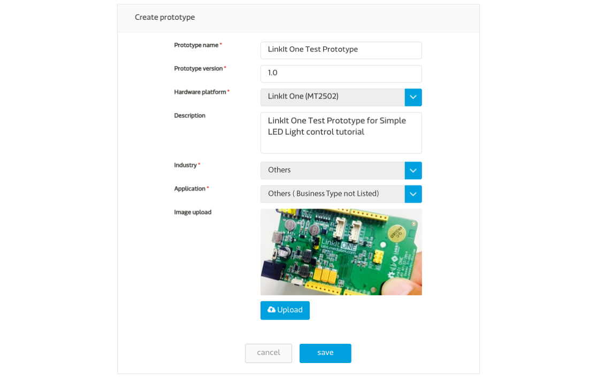

c. 点击您刚建立的产品原型下方的"详情"按钮

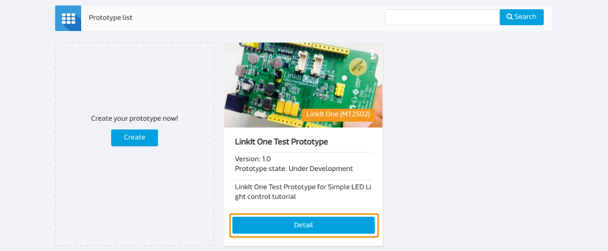

d. 在产品原型详情页面中，点击"资料通道"分页，并且点击新增按钮来新增一个资料通道：

在此教程中，我们需要建立两格资料通道，一个是显示器类型的，用来表示开发板上LED灯光的状态；另一个则为控制类型的，用来对您的开发板LED灯光状态下指令:

e. 点击在"显示器"下方的新增按钮，并输入已下资讯：

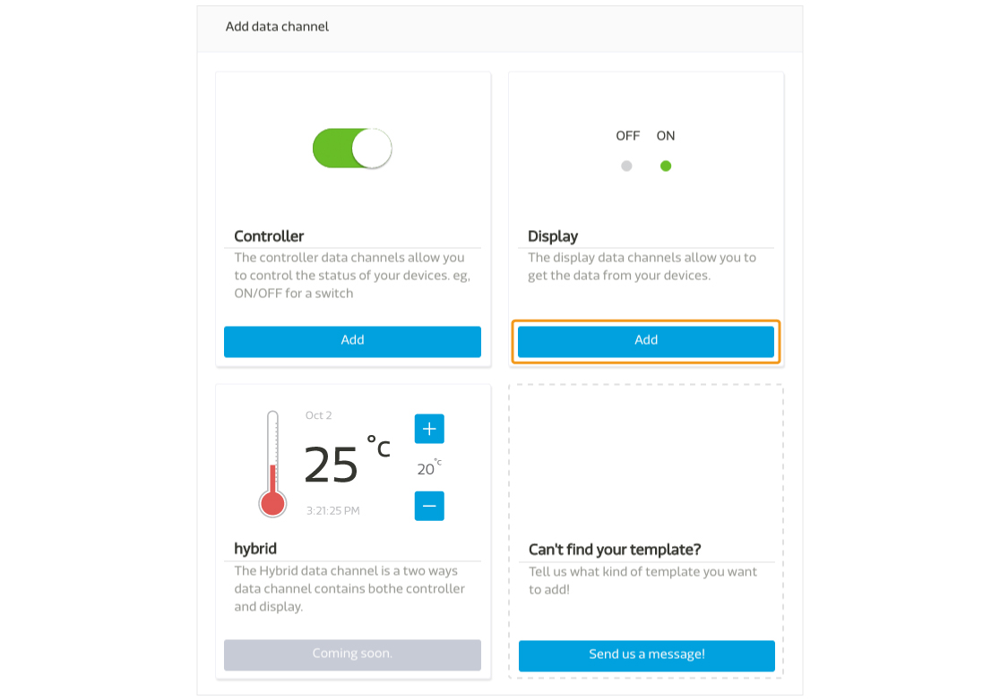

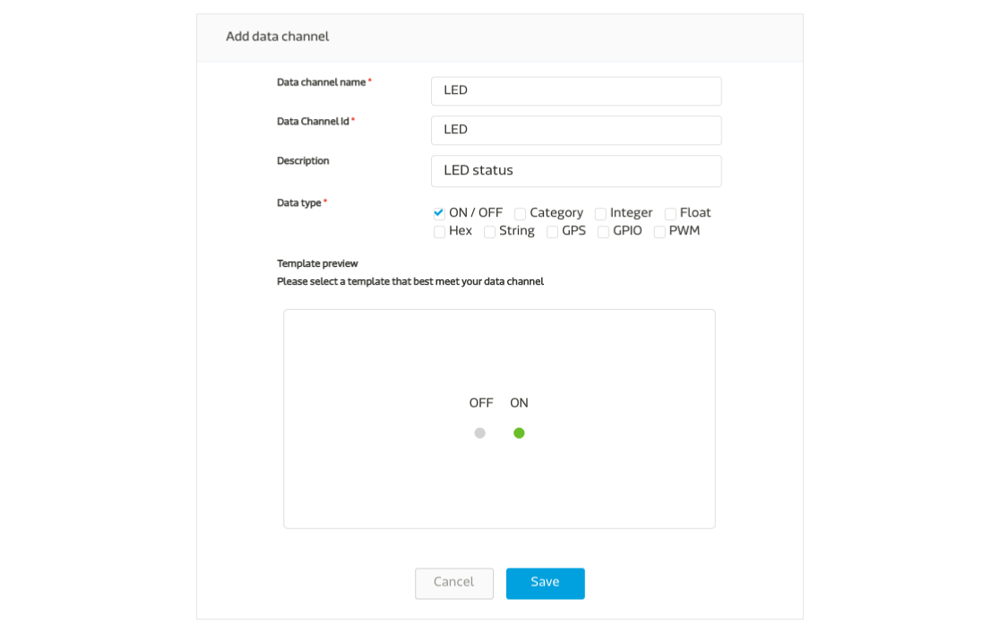

请注意，您在此输入的资料通道Id是独特不可重复的，之后将会在呼叫API时使用到。

f. 重复步骤e，但是把显示器改成"控制器"，并且输入以下资讯：

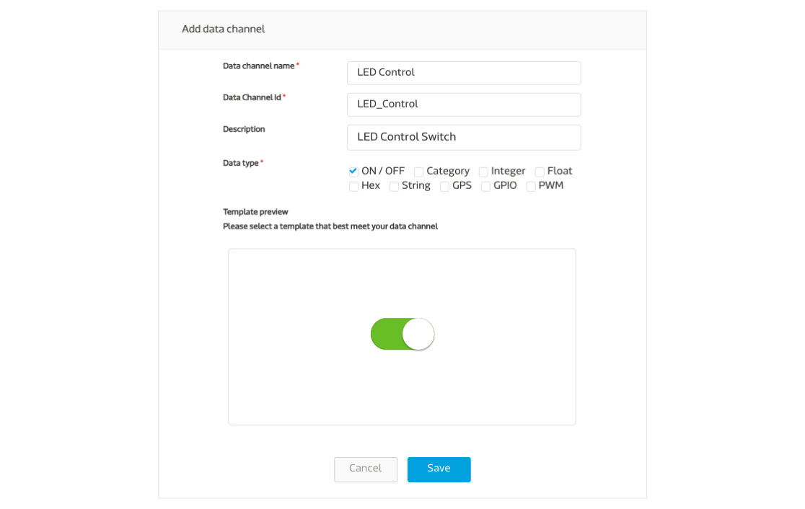

请注意，您在此输入的资料通道Id是独特不可重复的，之后将会在呼叫API时使用到。

g. 完成后，您将会有以下的资料通道：

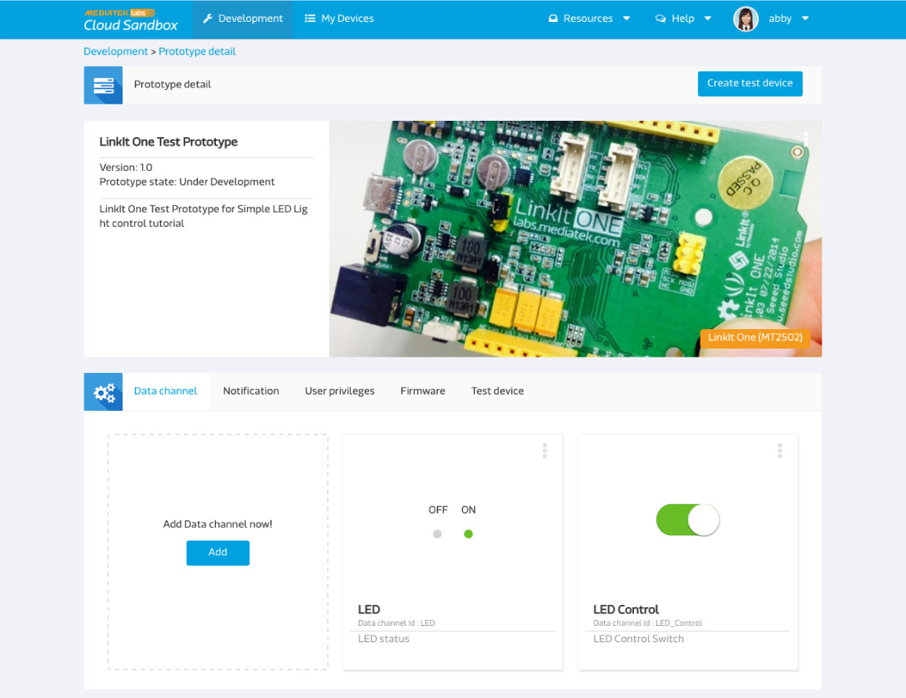

### 步骤二　建立测试装置

a. 点击画面右上方的"创建测试装置"。

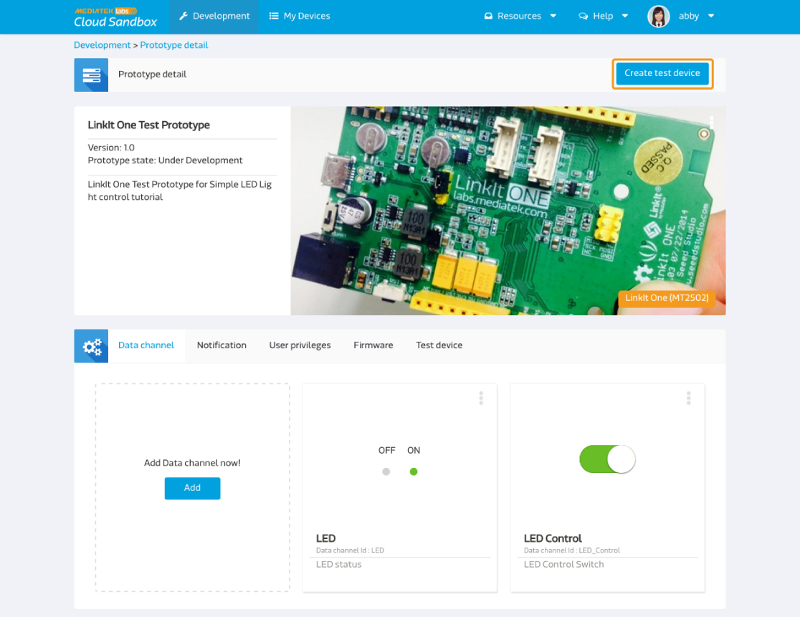

b. 输入测试装置名称和描述：

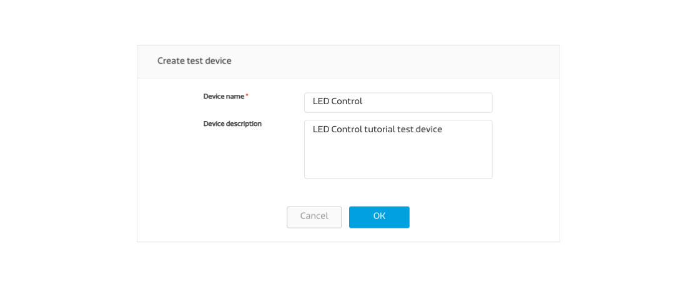

c. 测试装置建立后，点击"详细资讯"连结至测试装置详情页面:

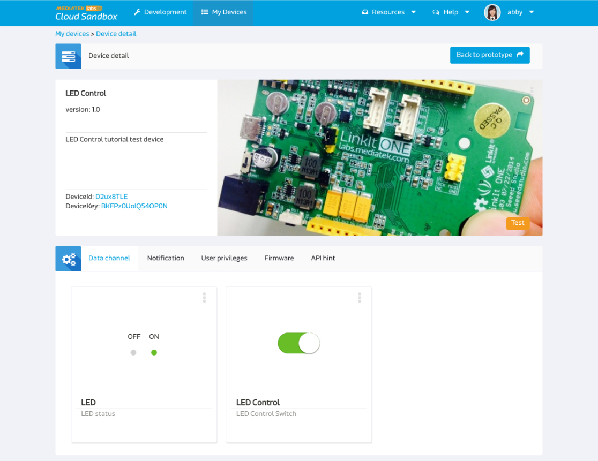

请注意，deviceId和deviceKey是独特不可重复的，之后将会在呼叫API时使用到。

### 步骤三　取得DeviceId，DeviceKey，以及资料通道ID
下方的摘要讯息为我们与测试装置沟通时所需要的必要栏位：

| 名称 | 值 | 备注 |
| -- | -- | -- |
| deviceId | Dsre1qRQ | 测试装置的独特识别码 |
| deviceKey | DFbtsNWg4AuLZ30v  | 测试装置的API Key |
| dataChannelId | LED | 此教程中所需显示器类型LED灯号的资料通道识别码 |
| dataChannelId | LED_CONTROL | 此教程中所需控制器类型LED灯号的资料通道识别码 |

请注意，此教程中图片所显示的deviceId 和deviceKey会和您实际操作时取得的不一样，请使用您所取得的值。

### 步骤四　替您的开发板编程
操作流程如下：

a. 呼叫RESTful API： GET api.mediatek.com/mcs/v2/devices/{deviceId}/connections.csv 来取得Socket Server IP 和连接阜的值。

b. 和Socket server建立TCP connection

c. 呼叫RESTful API: POST api.mediatek.com/mcs/v2/devices/{deviceId}/datapoints.csv 每五秒上传一次位于开发板D13位置的LED灯状态

d. 并且保持TCP connection连线随时可以接收来自MCS的指令

e. 每90秒更新一次TCP connection的heartbeat连线

请点击此连结来下载Arduino范例程式 [here](https://raw.githubusercontent.com/Mediatek-Cloud/MCS/master/source_code/linkit_sample_ino.ino)

请注意: 使用此范例程式需要HttpClient，您可使用此连结下载
[here](https://github.com/amcewen/HttpClient/releases)

### 步骤五　让您的开发板开始动作吧！

当您将范例程式上传至开发板后，请确保开发板有Wifi网路连线，并且有定时传送讯号显示装置已连接并正在待命中：

您现在可以去装置详情页面，并看到您刚建立的LED控制器，当您将控制器状态设成开，开发板上的LED灯即会打开，同时，您将可以看到您所建立的LED显示器的状态也改变为开了。反之亦然，若控制技设为关，灯即会关闭，并显示器状态改为关。

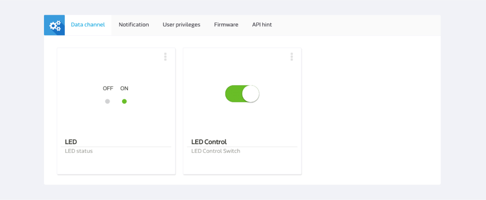

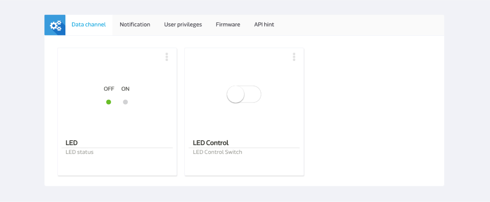

恭喜！您已完成此教程！

