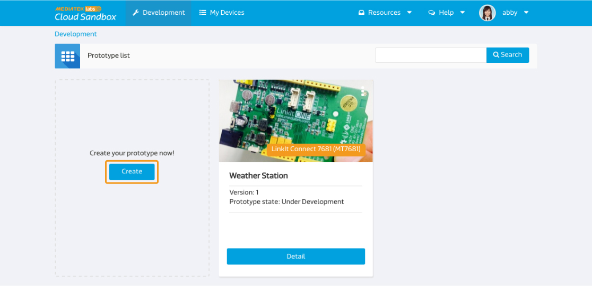
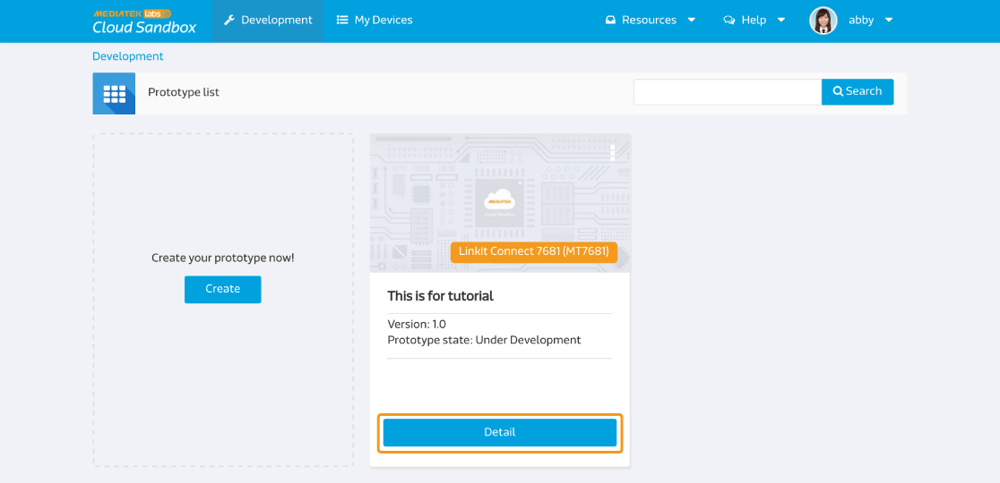
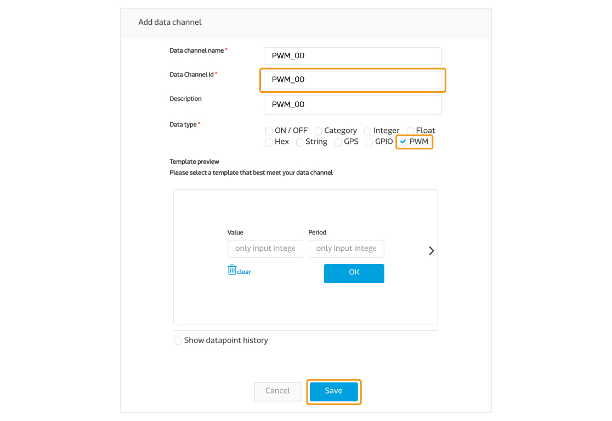
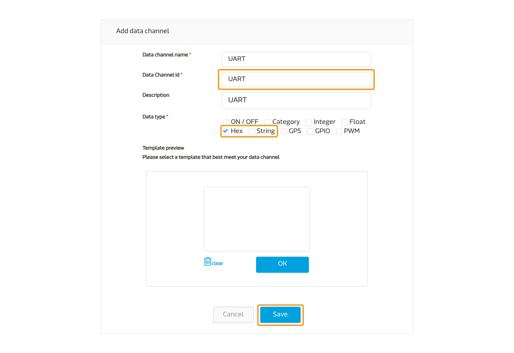
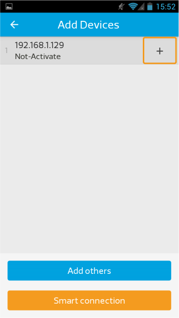
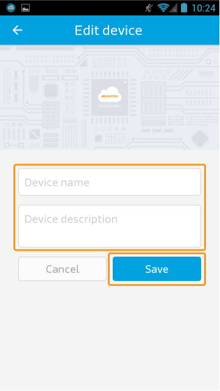
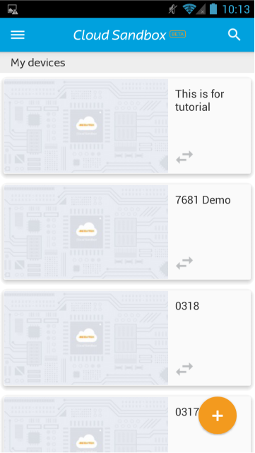
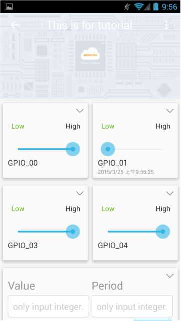
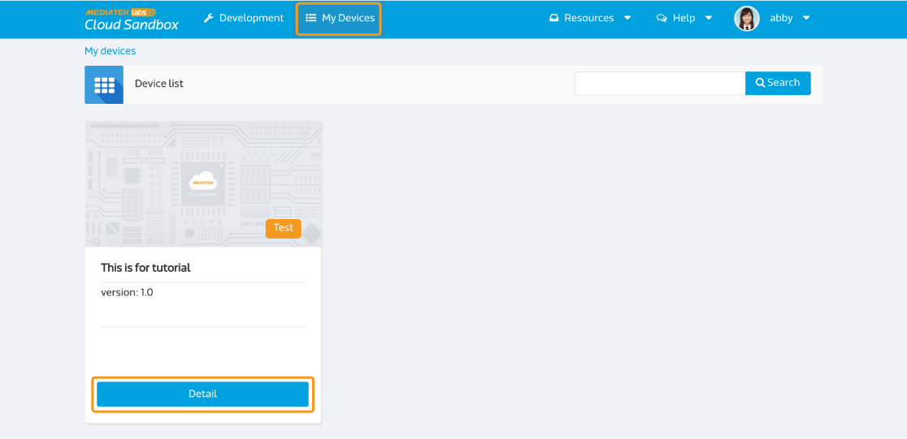

# LinkIt Connect 7681 实际操作

下面是一个简单的指南来快速设置您的LinkIt Connect 7681 开发板（MT 7681 ）连接到MediaTek Cloud Sandbox。

## 情境
此教程的情境为，将您的LinkIt Connect 7681开发板与MCS平台相连，并可从MCS网页端或手机端接收或传送指令。


## 设置准备

为了要完成此设置，您必须先：

1. 您的开发板必须有micro-USB电源连接。
2. 您的开发板必须有Wifi连结。
3. MCS 手机应用程式。此程是目前只支援安卓(Android)系统。请使用此QR code下载最新的手机安装档：


此外，您不需要额外的电子组件，就可以连接到开发板了。

## MT7681　控制器清单以及相对的MCS资料通道ID
MT7681晶片组提供了五组GPIO针脚，您亦可使用PWM资料型态和一组UART阜。以下是MT7681的针脚和对应的资料通道ID。

|  | GPIO | PWM | UART |
| -- | -- | -- | -- |
| 00 | GPIO_00 | PWM_00 | UART |
| 01 | GPIO_01 | PWM_01 |
| 02 | GPIO_02 | PWM_02 |
| 03 | GPIO_03 | PWM_03 |
| 04 | GPIO_04 | PWM_04 |


## 逐步指引

### 步骤一　建立有GPIO，PWM，以及UART资料通道的产品原型。

a. 点击画面上方的**开发**

b. 在产品原型清单页面中，点击**创建**按钮来新增一个新的产品原型。




c. 输入产品原型名称，版本，并选择产业别。硬体平台请选择**MT7681**，之后点击储存案。您的产品原型已建立。


d. 现在您已准备好替您的产品原型新增一组控制器类型的GPIO资料通道了。点击您刚新建好的产品原型下方的**详情**按钮。




e. 点击**资料通道分页**，并点击**新增**按钮。


f. 请点击**控制器**下方的**新增**按钮来新增一个控制器类型的资料通道。


g. MT7681类型的产品原型，资料通道ID的格是如以下定义- GPIO_nn, nn代表从00开始的脚号。替第一个脚号建立资料通道，您可使用"GPIO_00"。输入资料通道名称(GPIO_00)(GPIO_00)，输入描述，并且选择**GPIO**资料型态。点击**储存**来新增您的资料通道。


h. 增加更多的GPIO脚号控制器，重复步骤e，f，和g。并注意需使用正确的资料通道ID(GPIO_01 to GPIO_04)。

i. 现在您已经准备好控制器类型的PWM资料通道。重复步骤e和g来打开新增资料通道视窗。输入"PWM_00"为您的资料通道ID，并选择PWM为您的资料通道类型。点击**储存**来新增您的资料通道。




j. 增加更多的PWM脚号控制器，重复步骤i。并注意需使用正确的资料通道ID(PMW_01 to PMW_04)。

k. 另一个您需要替MT7681产品原型所新增的资料通道为UART。要新增UART资料通道，重复步骤e和f，新增一个控制器类型的资料通道。输入资料通道名称为"UART"并根据您的需求选择**字串**或是**十六进位数**资料型态。点击**储存**来新增您的资料通道。




您现在已建立好所有LinkIt Connect 7681产品原型教程所支持的资料通道。请继续至步骤二。


### 步骤二　将您的开发板连上无线网路

a. 使用手机打开MCS手机应用程式，使用您的帐号密码登入。

b. 登入后，点击画面又下方的新增按钮。


c. 点击画面下方的**Smart Connection**按钮。此功能是使用MediaTek Smart Connection，如欲知更多细节，请参考ediaTek LinkIt Connect 7681开发者手册。


d. 输入无线网路的SSID和密码，之后点击**开始**。正常情况下，SSID会自动带入您手机所连线至的无线网路。


e. 等待几秒后，如果Smart Connection成功，您将会看到您的装置在列表上。

点击**取消**来退出Smart Connection 视窗。

现在，您可以透过MCS手机应用程式(步骤3A)，或是MCS网页版(步骤3B)来注册您的测试装置。


### 步骤3A　使用MCS手机应用程式来住测LinkIt Connect 7681 测试装置

a. 打开MCS手机应用程式并登入。登入后，点击画面又下方的新增按钮。


b. 如果您的装置已透过无线网路Smart Connection成功，您可以在清单中看见您的实体装置。点击装置右方的加号，来新增测试装置。



c. 之后您将会看到产品原型列表。选择您要新增测试装置的产品原型，然后点击**下一步**按钮。


d. 输入测试装置名称和描述，然后点击**储存**按钮。




当测试装置注册后，您即可在测试装置清单中看见您刚才所建立的测试装置以及测试装置内的资料通道。



### 步骤 3B　使用MCS网页版建立测试装置
a. 在MCS网页版中，点击画面上方的**开发**，之后点击您在步骤一所建立的产品原型的详情按钮来新增一个测试装置。


b. 点击画面右上方的**创建测试装置**按钮。


c. 输入**测试装置名称**和**描述**，之后点击**确定**按钮。您将会看到一个跳出视窗显示您已成功建立测试装置。点击**详细资讯**来查看测试装置详情。


d. 在测试装置页面中，您可以查看此测试装置的deviceId和deviceKey。


e. 现在您可以手动将此测试装置的deviceId写入您的实体装置。打开任意终端机，并输入已下指令：

```
AT#FLASH -s0x180e9 -c[deviceId]
```
接下来，将deviceKey写入您的实体装置
```
AT#FLASH -s0x180f1 -c[deviceKey]
```
之后，输入以下指令来注册此装置：
```
AT#FLASH -s0x18101 –v1
AT#FLASH -s0x18102 –v0
```
您的实体装置已和MCS平台相连了。

### 步骤4A　透过手机应用程式来控制您的装置

a. 打开MCS手机应用程式并登入。点击您欲操作的测试装置。


b. 您将会看到您在步骤一所建立的资料通道。将GPIO控制器状态从低更改至高：您将会看到开发板上的LED灯打开。



### 步骤4B　透过MCS网页版来控制装置

a. 点击网页版上方的**我的装置**，在您新增病注册的装置下方的，点击**详情**。



b. 您可以看到装置内的资料通道，并可透过MCS传送指令。您可以透过托拉控制器来更改装置状态。将GPIO控制器状态从低更改至高：您将会看到开发板上的LED灯打开。


