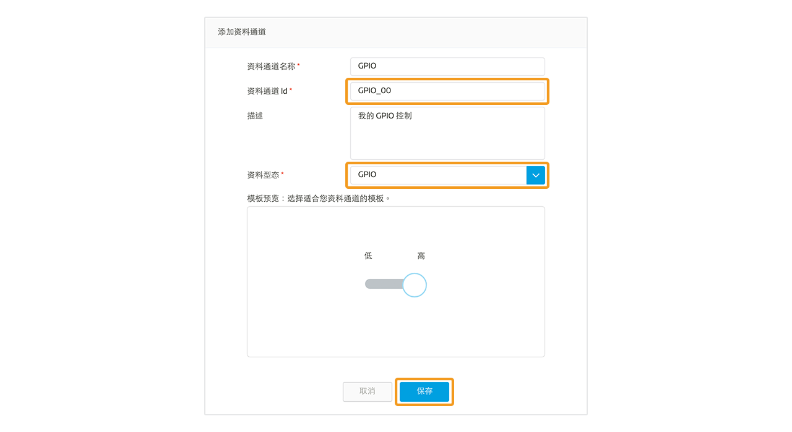
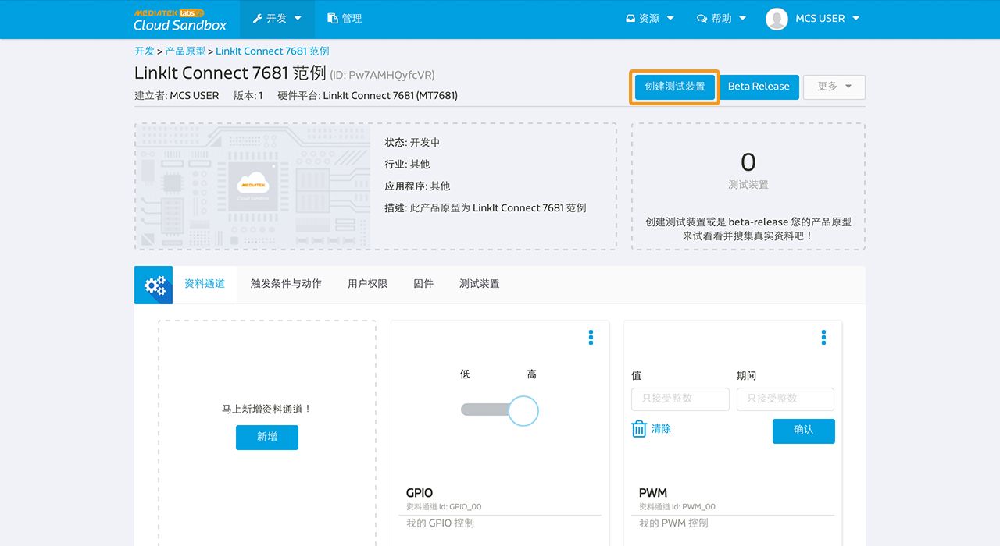
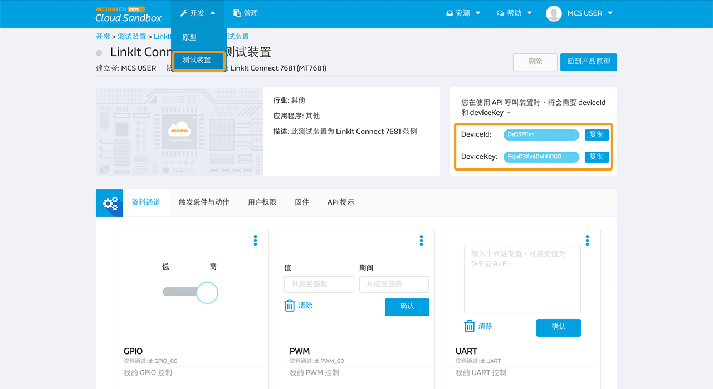
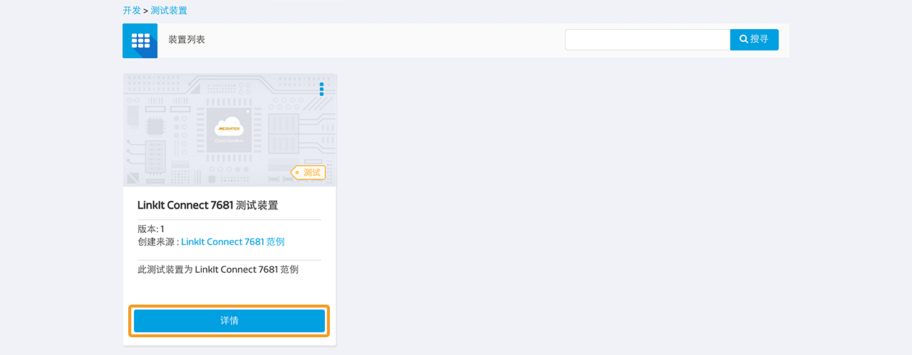
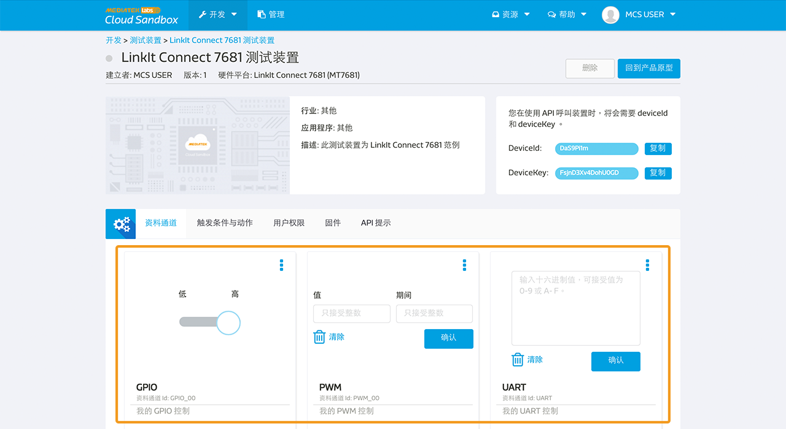

# LinkIt Connect 7681 实际操作

下面是一个简单的指南来快速设置您的 LinkIt Connect 7681 开发板（MT 7681）连接到 MediaTek Cloud Sandbox。

## 情境
此教程的情境为，将您的 LinkIt Connect 7681 开发板与 MCS 平台相连，并可从 MCS 网页端或手机端接收或传送指令。


## 设置准备

为了要完成此设置，您必须先：

1. 您的开发板必须有 micro-USB 电源连接。
2. 您的开发板必须有 Wifi 连结。
3. MCS 手机应用程式。此程是目前只支援安卓 (Android) 系统。请使用此 QR code 下载最新的手机安装档：


此外，您不需要额外的电子组件，就可以连接到开发板了。

**(请注意：请将固件新至最新版本才可继续使用，请参考以下更新连结** [7681 Firmware Update Instruction](../7681_firmware_update/)**。)**

## MT7681　控制器清单以及相对的 MCS 资料通道 ID
MT7681晶片组提供了五组 GPIO 针脚，您亦可使用 PWM 资料型态和一组 UART 阜。以下是 MT7681 的针脚和对应的资料通道 ID。

|  | GPIO | PWM | UART |
| -- | -- | -- | -- |
| 00 | GPIO_00 | PWM_00 | UART |
| 01 | GPIO_01 | PWM_01 |
| 02 | GPIO_02 | PWM_02 |
| 03 | GPIO_03 | PWM_03 |
| 04 | GPIO_04 | PWM_04 |


## 逐步指引

### 步骤一　建立有 GPIO，PWM，以及 UART 资料通道的产品原型。

a. 点击画面上方的**开发**

b. 在产品原型清单页面中，点击**创建**按钮来新增一个新的产品原型。您亦可直接汇入此[范例产品原型](http://cdn.mediatek.com/tutorial/LinkIt_7681/LinkIt_7681_CN.json)，若您选择直接汇入产品原型，您可以跳过步骤一，直接从步骤二开始。


c. 输入产品原型名称，版本，并选择产业别。硬体平台请选择 **MT7681** ，之后点击储存按钮。您的产品原型已建立。


d. 现在您已准备好替您的产品原型新增一组控制器类型的 GPIO 资料通道了。点击您刚新建好的产品原型下方的**详情**按钮。


e. 点击**资料通道分页**，并点击**新增**按钮。


f. 请点击**控制器**下方的**新增**按钮来新增一个控制器类型的资料通道。


g. MT7681 类型的产品原型，资料通道 ID 的格式如以下定义- GPIO_nn, nn代表从00开始的脚号。替第一个脚号建立资料通道，您可使用"GPIO_00"。输入资料通道名称(GPIO 00)，输入描述，并且选择 **GPIO** 资料型态。点击**储存**来新增您的资料通道。




h. 现在您已经准备好控制器类型的 PWM 资料通道。重复步骤 e 和 g 来打开新增资料通道视窗。输入"PWM_00"为您的资料通道 ID，并选择 PWM 为您的资料通道类型。点击**储存**来新增您的资料通道。


i. 另一个您需要替 MT7681 产品原型所新增的资料通道为 UART。要新增 UART 资料通道，重复步骤 e 和 f，新增一个控制器类型的资料通道。输入资料通道名称为"UART"并根据您的需求选择**字串**或是**十六进位数**资料型态。点击**储存**来新增您的资料通道。


您现在已建立好所有 LinkIt Connect 7681 产品原型教程所支持的资料通道。请继续至步骤二。


### 步骤二　将您的开发板连上无线网路

a. 使用手机打开 MCS 手机应用程式，使用您的帐号密码登入。

b. 登入后，点击画面又下方的新增按钮。


c. 点击画面下方的 **Smart Connection** 按钮。此功能是使用 MediaTek Smart Connection，如欲知更多细节，请参考 MediaTek LinkIt Connect 7681 开发者手册。


d. 输入无线网路的 SSID 和密码，之后点击**开始**。正常情况下，SSID 会自动带入您手机所连线至的无线网路。


e. 等待几秒后，如果 Smart Connection 成功，您将会看到您的装置在列表上。

点击**取消**来退出 Smart Connection 视窗。

现在，您可以透过 MCS 手机应用程式(步骤3A)，或是MCS网页版(步骤3B)来注册您的测试装置。


### 步骤3A　使用 MCS 手机应用程式来注册 LinkIt Connect 7681 测试装置

a. 打开MCS手机应用程式并登入。登入后，点击画面又下方的新增按钮。


b. 如果您的装置已透过无线网路 Smart Connection 成功，您可以在清单中看见您的实体装置。点击装置右方的加号，来新增测试装置。


c. 之后您将会看到产品原型列表。选择您要新增测试装置的产品原型，然后点击**下一步**按钮。


d. 输入测试装置名称和描述，然后点击**储存**按钮。


当测试装置注册后，您即可在测试装置清单中看见您刚才所建立的测试装置以及测试装置内的资料通道。


### 步骤 3B　使用 MCS 网页版建立测试装置
a. 在MCS网页版中，点击画面上方的**开发**，之后点击您在步骤一所建立的产品原型的详情按钮来新增一个测试装置。


b. 点击画面右上方的**创建测试装置**按钮。



c. 输入**测试装置名称**和**描述**，之后点击**确定**按钮。您将会看到一个跳出视窗显示您已成功建立测试装置。点击**详细信息**来查看测试装置详情。


d. 在测试装置页面中，您可以查看此测试装置的 deviceId 和 deviceKey。




e. 现在您可以手动将此测试装置的 deviceId 写入您的实体装置。打开任意终端机，并输入已下指令：

```
AT#FLASH -s0x180e9 -c[deviceId]
```
接下来，将 deviceKey 写入您的实体装置
```
AT#FLASH -s0x180f1 -c[deviceKey]
```
之后，输入以下指令来注册此装置：
```
AT#FLASH -s0x18101 –v1
AT#FLASH -s0x18102 –v0
```
您的实体装置已和 MCS 平台相连了。

### 步骤 4A　透过手机应用程式来控制您的装置

a. 打开 MCS 手机应用程式并登入。点击您欲操作的测试装置。


b. 您将会看到您在步骤一所建立的资料通道。将 GPIO 控制器状态从高更改至低：您将会看到开发板上的 LED 灯打开。

请注意，GPIO 状态为低时，LED 状态为亮; GPIO 状态为高时，LED 状态为灭。


### 步骤 4B　透过 MCS 网页版来控制装置

a. 点击网页版上方开发下方的**测试装置**连结，在您新增并注册的装置下方的，点击**详情**。



b. 您可以看到装置内的资料通道，并可透过 MCS 传送指令。您可以透过拖拉控制器来更改装置状态。 将 GPIO 控制器状态从高更改至低：您将会看到开发板上的 LED 灯打开。





