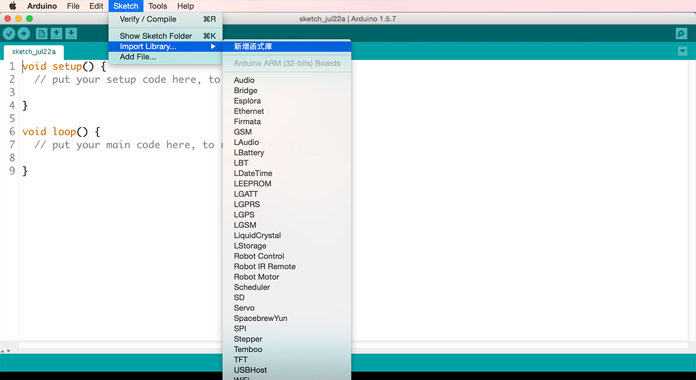

# LinkIt ONE 教程

在您准备好把范例程式码放入您的 LinkIt ONE 开发板并连结至 MCS  云端前，您需要确认您的开发环境与开发版是有正确设置的。

# 电脑开发环境与开发板设定

1. 下载 Arduino IDE 和 LinkIt ONE SDK

    [Mac](http://labs.mediatek.com/site/global/developer_tools/mediatek_linkit/get-started/mac/install/)

    [Windows]( http://labs.mediatek.com/site/global/developer_tools/mediatek_linkit/get-started/windows/install/)
2. 替您的 LinkIt ONE 开发板更新韧体

    [Mac](http://labs.mediatek.com/site/global/developer_tools/mediatek_linkit/get-started/mac/update/)

    [Windows](http://labs.mediatek.com/site/global/developer_tools/mediatek_linkit/get-started/windows/update/)

3. 在您的 Arduino IDE 内设置好 SDK, 并透过正确的连接阜连上 Wi-Fi。

    [Mac](http://labs.mediatek.com/site/global/developer_tools/mediatek_linkit/get-started/mac/configure/)

    [Windows](http://labs.mediatek.com/site/global/developer_tools/mediatek_linkit/get-started/windows/configure/)

您亦可访问此[连结](http://labs.mediatek.com/site/global/developer_tools/mediatek_linkit/get-started/index.gsp)来查看所有需要设置的步骤。您可以在完成后，再度访问我们的网站。或是直接透过以上的三个步骤也可完成。

**请注意：现有的LinkIt ONE SDK 只能使用版本为1.5.6-r2 BETA 或1.5.7 BETA 的Arduino IDE**。

# 增加 Libraries

现在，您的电脑与开发环境都已设置完成，我们准备将一些library 也一起放入吧！以此教程来说，为一需要新增的library 为HttpClient，您可以在此[连结]((https://github.com/amcewen/HttpClient/releases))下载。下载zip 档案，然后打开您的Arduino IDE。

在"Sketch" 下拉选单中，选择汇入librart，并选择您刚才所下载的zip 档案。

# MCS 云端设定
就快完成了！现在您可以开始设定 MCS，并透过云端来控制您的开发板。我们已经替您准备好所有所需的范例代码和逐步导引。

现在，选择您想要尝试的范例吧：

| 基本的开关教程 | 类比控制器教程 |
| -- | -- |
|||
