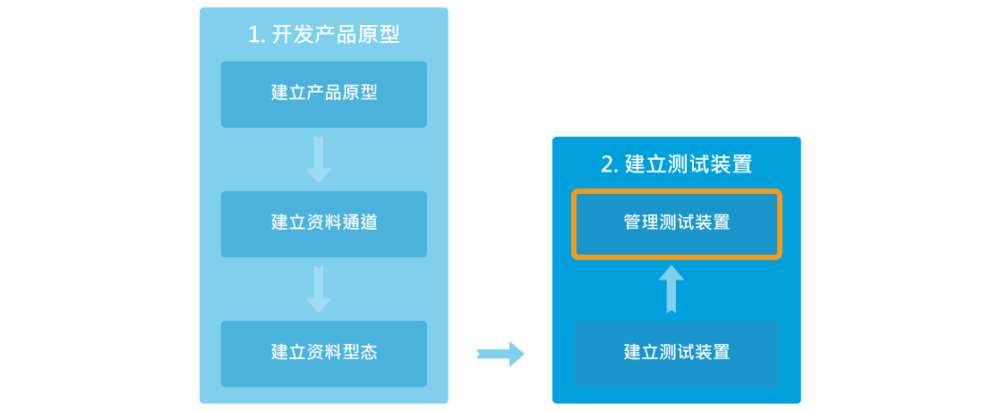

# 管理已部署的测试装置

## 如何管理已部署的测试装置

您可以在产品原型页面的测试装置分页，或是我的装置页面中查看和管理您所有的测试装置。将来，当您的产品原型商转后，消费者亦能登入平台，在我的装置页面中查看所以关于他的装置的设定和状态。

### 从开发者的观点

如果您是开发者，您可在开发或是我的装置页面做以下操作：

1.	开发或是查看资料通道
2.	设定通知
3.	设定使用者权限
4.	管理韧体和对任体做更新
5.	管理测试装置

### 从使用者观点
将来，当您的产品原型商转后，消费者亦能登入平台，在我的装置页面中查看所以关于他的装置的设定和状态。 。

如果您是使用者，您可在我的装置页面做以下操作：

1.	查看资料通道
2.	设定通知
3.	设定使用者权限
4.	更新韧体
